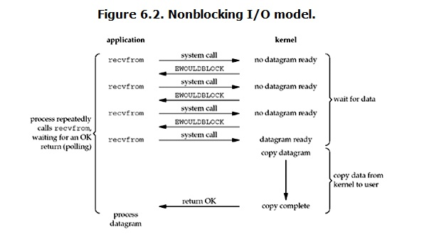

* content
{:toc}


# 基础语法

## 基础数据类型

### int

```python
a = 10
a.bit_length # 4 有效的二进制长度
#10进制转2进制
bin_a = bin(a) # 0b100
# 2进制转10进制
a_2_10 = int("0b100",2)
# 10进制转8进制
oct_a = oct(a) # 0o12
# 8进制转10进制
a_8_10 = int("0o12",8)
# 10进制转16进制
hex_a = hex(a) #0xa
# 16进制转10进制
a_16_10 = int("0xa",16)

```


### str

```python
s1 = "asd高兴qqe"
s1.strip("asdqe") # 高兴
s2 = "1 2 3"
s2_list = s2.split() # ["1", "2", "3"]

s3 = "1:2:3"
s3_list = s3.split(":") # ["1", "2", "3"]
s3_str = ":".join(s3_list)  "1:2:3"

s4 = "aaabbbcdefff sdf"
s4.count("a")  # 3

s4.isalnum() # 是否全部由 字母 或数字  组成
s4.isalpha() # 是否全部由 字母 组成
s4.isdecimal() # 是否只由十进制（数字）组成

s4.capitalize() # 首字母大写，其余小写
s4.swapcase()  # 大小写反转
s4.title() # 每个单词首字母大写，空格分隔
s4.center(100,"3") #  center(width,filer) 居中，宽度，填充字符
s4.find("a")  # 找不到返回-1
s4.find("a",1,4) # find(target, start, end)
s4.index("a") # 找不到抛异常
```


### bool

```python
s1 = " "
b_s1 = bool(s1)  # True
s2 = ""
b_s2 = bool(s2) # False

# 强制转化
# False: 0，"",(),[],{},set(),None
# True : 其他
```


### list

```python
item = list.pop()  #  默认删最后，有返回值
list.remove("aaa")  # 指定元素删除，如果有重名元素，默认删除从左边第一个，无返回值
list.clear() # 全部删除
del list[-1]
del list[0:6:1]
list[2:] = "asdf"  # [x,x,"a","s","d","f"] #迭代修改

list1 = [11,22,33,44,55]
#删除奇数index元素
# 1、del
del list1[1::2]
# 2、 倒序删除
for index in range(len(list1)-1,-1,-1)
	if index % 2 == 1:
        list1.pop(index)
# 3、 新建列表，取奇数
temp = []
for index in range(len(list1)):
    if index %2 ==0:
        temp.append(list1[index])
list1 = temp
```


### tuple

```python
a,b = (1,2)  # 元组的拆包  a==1,b==2
a,b = 1,2   

tup = (1,) # 无逗号非元组，type为原数据对应的类型
```


### dict

* key

  必须是不可变类型   int、str、bool、tuple 

* 顺序

  * 3.5版本之前是无序的；
  * 3.6版本会按照初次建立字典的顺序排列，学术上认为无序；
  * 3.7以后的版本是有序的

> ### 旧结构
>
> python3.7之前的字典结构，经典粗暴的hash表实现方式，这样的话每次hash表的扩容和缩容都可能导致hash值的改变。
>
> hash表容量更新的前后，它的键之间的相对顺序是会变化的，因此字典的元素是无序的。旧结构类似下面
>
> ```
> --+-------------------------------+
> | 哈希值 (hash)  键 (key)  值 (value)
> --+-------------------------------+
> 0 |    hash0      key0    value0
> --+-------------------------------+
> 1 |    hash1      key1    value1
> --+-------------------------------+
> 2 |    hash2      key2    value2
> --+-------------------------------+
> . |           ...
> __+_______________________________+
> ```
>
> ### 新结构
>
> ```
> Indices
> ----------------------------------------------------
> None | index0 | None | None | index2 | None | index1 ...
> ----------------------------------------------------
> 
> Entries
> --------------------
> hash0   key0  value0
> ---------------------
> hash1   key1  value1
> ---------------------
> hash2   key2  value2
> ---------------------
>      ...
> ---------------------
> ```
>
> 新结构由 Indices(索引，数组实现) 和 Entries(实体，PyDictObject类型) 两种结构组成。
>
> - 当插入一个数据时，先计算数据对应的hash值并映射成 Indices 数组的一个下标，没有冲突的话就将另一个值 Entries_index(暂时这么叫吧) 填入Indices数组中下标对应的位置。并在Entries后面追加一行记录，类似 `hash值, key值, value值` 。如果冲突的话可以用基本的解决冲突的办法，这里不赘述了。
>
> 这种方法，字典 **增删改查**的时间复杂度 会有以前的O(1) 变为O(2)，因为多了一步查找的过程。而且字典扩容和缩容时要按照Indices的顺序来保持字典始终有序。
>
> 但是至少有两个优化。
>
> - 字典占用的内存变小了。旧的字典总会预留大于 1/3的容量的hash位置，防止hash碰撞过多影响效率。现在则不必预留。
>
> - 字典有序了。
>
> - in方法的效率变高
>
>   ```python
>   for key in 字典
>   for value in 字典.values()
>   for key, value in 字典.items()
>   ```

```python
#创建
d1 = dict((("one",1), ("two",2),("three",3)))
d2 = dict(one=1,two=2,three=3)
d3 = dict({"one":1,"two":2,"three":3})
d4 = dict.fromkeys("abc",100) # {"a":100,"b":100,"c":100}
d4 = dict.fromkeys([1,2,3],100) # {1:100,2:100,3:100}
d5 = dict.fromkeys([1,2,3],[]) # {1:[],2:[],3:[]} # 可变类型值共用同一地址
d5[1] = ["a","b"]   # d5 == {1:["a","b"],2:["a","b"],3:["a","b"]}

d1.setdefault("three",44) # 有则不变，无则增加

#删
ret = dic.pop("one")  # ret = 1  返回的是value ;不存在则会抛异常
ret2 = dic.pop("ten","查无此键") # 不存在则返回备用值
ret3 = dic.popitem()

dic.clear() # 清空
del dic["age"]  # 不存在会抛异常

dic.update(nine=9,ten=10) # 迭代添加或更新 
dic.update(("nine",9),("ten",10))
dic2 = {"eleven":11,"thirteen":13}
dic.update(dic2)

# 查
value = dic.get("key","else")

dic.keys()  #type :  <class "dict_keys"> ,可以强转为list： list(dic.keys())
dic.values()
dic.items() # [("one",1),("two",2),("three",3)] 

# 循环迭代时不能直接改变字典大小
dic = {"k1":1,"k2":2,"k3":3}
for key in dic:  # 或者dic.keys()
    if "k" in key:
        dic.pop(key)    # Exception dictionary changed size during iteration

# 强转为list可正常删除
for key in list(dic.keys()):
    if "k" in key:
        dic.pop(key)   
```


### set

```python
# 集合是无序的
# 内部元素只能是不可变类型；本身是可变类型；
t = {} # type(t) 为dict
set0 = set()  
set1 = set({1,3,"aaa","bbb"})

set1.add("ccc")
set1.update("asd") #迭代增加，类似于extend {1,3,"aaa","bbb", "a","d","s","ccc"}

set1.remove("aaa")
set1.pop() # 随机删除，不支持制定索引

# 去重
list_1 = [1,1,2,3,4]
unique_list_1 = list(set(list_1))

# 差集、并集、交集
set1 = {1,2,3,4,5}
set2 = {2,3,4,5,6}
set3 = {2,3,4}
set1 & set2 #交集 {2,3,4,5}
set1.intersection(set2)

set1 | set2 # 并集 {1,2,3,4，5,6}
set1.union(set2)

set1 - set2 # 差集 {1}
set1.difference(set2)

set1 ^ set2 # 反交集，异或集  {1,6}
set1.symmetric_difference(set2)

set3 < set2 # set3 是set2子集
set3.issubset(set2)

set2 > set3 # set2是set3 超集
set2.issuperset(set3)
```


## 执行流程

### while

```python
while condition:
	pass
    #break
else:
    print("3")
    
# 1 3
# 当break中断while时，else不执行
```

### for

```python
for variables in iterable:
    pass
	#break
else:
    pass
# 当break中断for时，else不执行
list = ["a","b","c"]
for i enumerate(list,start=100): # 默认start为0
    print(i)  
#(100,"a")   
#(101,"b") 
#(102,"c")
```


## 格式化

### % 

```python
# %占位符   s -->str   |   d ->int
# %% 转义 %
name = "a"
age = 11
msg = """
name: %s,
age: %s,
job: %s
进度: 1%%  
""" % (name, age, "hunter")
```

### {}

```python
msg = "我叫{}，今年{}岁，性别{}".format("大壮",15,"男")
msg2 = "我叫{0}，今年{1}岁，性别{2},so 我是{0}".format("大壮",15,"男")
msg3 = "我叫{name}，今年{age}岁，性别{sex}".format(name="大壮",age=15,sex="男")
```


### f"string"

```python
# 3.6特性
# 不能出现 ! , : {} ; 
name = "jack"
school = {"city":"beijing","grade":"2"}
# 支持多种数据类型
msg = f"我是{name}，今年在{school['city']}上学，已经{school['grade']}年级了"
msg2 = f"我的名字大写是{name.upper()}"
# 结合表达式或函数
def _sum(a,b):
    return a+b
msg3 = f"1 +2 = {_sum(1,2)}"
```


## 逻辑运算符

```python
# x or y   x为真，值就是x；x为假，值就是y
# x and y  x为真，值是y；x为假，值是x
print(1 and 2 or 3 and 4)
# 2
print(1>2 and 3 or 6)
# 6
```

## 编码

* ASCII
  * 只包含：英文字母、数字、特殊字符
  * 128个字符
  * 长度为8位，1字节（只占用7位即可表示，第8位全为0）
* GBK
  * 包含ASCII  + 中文
  * 一个英文  ：1个字节
  * 一个中文： 2个字节
* unicode：万国码
  * 起初一个字符用2个字节表示
  * 后来一个字符用4个字节表示
  * 内存中的数据(除byte外)均以unicode编码，网络传输或存储硬盘必须是以非unicode编码
* utf-8: Unicode升级版
  * 最少一个字符用1个字节表示（8位）
  * 欧洲文字2个字节表示
  * 中文3个字节表示

```python
#str -> byte  (unicode -> 非unicode)
str_1 = "中国"
byte_1 = str_1.encode("utf-8")    #编码 b'\xe4\xb8xxxxx' <class "bytes">
str_2 = byte_1.decode("utf-8")    # 解码

# gbk -> utf-8
b_gbk = b"\xerxxxxx"
s = b_gbk.decode("gbk")
b_utf8 = s.encode("utf-8")
```


##  代码块缓存机制

* 同一代码块缓存机制：

  int、str、bool引用的是同一对象  (is)

* 不同代码块的缓存机制：

  小数据池 （部分int/ 部分str/bool）

  * int: -5~256 缓存 （共用同一对象）
  * str:一定规则的字符串

```python
i1 =200
i2 = 200
i1 is i2 # True

i1 = 2000
i2 = 2000
i1 is i2  # False
```

* 浅拷贝和深拷贝

```python
l1 = [1,2,3,["a","b"]]
l2 = l1  
l1 is l2 # 两者对象id相等，对象变化两者皆变

import copy
l2 = l1.copy() # id不等，但是元素id相等，元素的可变类型变化均会变化
l2 = copy.copy(l1) # 浅拷贝另一个写法

l2 = copy.deepcopy(l1) # id不等，元素可变对象id不等，不可变对象沿用之前的；可变元素重新创建一份

```

## 文件操作

### 

```python
f1 = open("xxx",encoding="utf-8", mode="r")  
# encoding 不写默认使用系统编码 
# windows :GBK
# linux/macos : utf-8

# mode  r/w/rb/wb
# r 不存在报错，无法创建新文件
# w 不存在则创建;存在则先清空，后写入
# a  不存在则创建，存在则追加
# r+ 不存在报错，无法创建新文件；根据当前偏移量读取或写入
#
# 读  r /rb/r+/r+b
# 写 w/ wb/w+ /w+b
# 追加 a / ab/ a+ /a+b
content = f1.read() 
f1.readline() # 带换行符
f1.readlines() # list ,元素带换行符
f1.read(5) # 字符

for line in f:  # f 文件句柄为迭代器，适合大文件读取
    print(line)
f.close()

f1.tell() # 返回当前偏移量值,单位为字节
f1.seek(0) #  调整偏移量的值,单位为字节
f1.flush()  # 强制刷新

with open("a.txt") as f1,open("b.txt", "w") as f2:
    content = f1.read()
    f2.write(content)

```

## 函数

```python
def func(age,name="jack", *args, **kwargs): # 位置参数，默认参数，可变参数(元组)，关键字参数(字典)
#    return 1,2,3  # 返回多个值时以元组方式返回
	return "我喜欢%s、 %s 、%s" % args   

#必选参数–>可变参数–>默认参数–>命名关键字参数–>关键字参数
#默认参数也可以在可变参数之前，谁在前谁优先拿到值；
def foo(x,y=1,*args):
     pass
foo (1,2,3,4,5) // 其中的x为1，y=1的值被2替换，3,4,5都给args，即args=(3,4,5)

def foo(x,*args,y=1):  # y:命名关键字参数 （仅限关键字）
    print(x,args,y)
foo(1, 2, 3, 4, 5) # 其中的x为1，2, 3, 4, 5都给args，即args = (2, 3, 4, 5), y始终为1
#1 (2, 3, 4, 5) 1
foo(1, 2, 3, 4, y=5) # 其中的x为1，2, 3, 4都给args，即args = (2, 3, 4), y为5
#1 (2, 3, 4) 5


a,*b = (1,2,3,4,5,6,7) #或 [1,2,3,4,5,6,7]
# a= 1   b = [2,3,4,5,6,7]  列表
a,*b, c =  (1,2,3,4,5,6,7) #或 [1,2,3,4,5,6,7]
# a=1 b = [2,3,4,5,6] c=7

func([1,2,3],[5,6,7])  # ([1,2,3],[5,6,7])   {}
func(*[1,2,3],*[5,6,7])  # (1,2,3,5,6,7)    {}
func({"name":1},{"age":2}) #({'name': 1}, {'age': 2})   {}
func(**{"name":1}, **{"age":2}) # () {'name': 1, 'age': 2}
```

### 命名空间

1. 加载顺序： 内置名称空间 ->全局名称空间 ->局部名称空间

* 内置名称空间
  * builtins.py
* 全局名称空间
  * 当前py文件
* 局部名称空间
  * 函数，函数执行时才开辟

2. 取值顺序：就近原则

   ```python
   Python 在查找"名称"时，是按照 LEGB 规则查找的：
       Local-->Enclosed-->Global-->Built in
   Local    指的就是函数或者类的方法内部
   Enclosed 指的是嵌套函数（一个函数包裹另一个函数，闭包）
   Global   指的是模块中的全局变量
   Built in 指的是 Python 为自己保留的特殊名称
   ```

3. 作用域

   * 全局作用域：内置名称空间  + 全局名称空间
     * globals()：dict变量
   * 局部作用域：局部名称空间
     * locals()：dict变量

```python
count = 1
def func():
    count += 2
    print(count)
func()
# Exception:UnboundLocalError: local variable 'count' referenced before assignment
# 局部作用于无法改变全局作用域的变量；
# 当python解释器读取到局部作用域时，发现对一个变量进行修改的操作时，会认为在局部已经定义过这个局部变量了，但是在局部中无法找到该变量就报错

def func():
    count = 1
    def inner():
        print(count)  # 可以读取使用
        count += 1    # 无法改变，改变抛异常，异常原因同上
    inner()
func()
```

### 递归

* python默认最大递归深度1000次（实际998）
  * RecursionError 
* import sys; sys.setrecursionlimit(n) # 设置系统最大递归深度

## Builtin

### filter/map/reduce

```python
list_1 = [33,2,5,51,7,-4,-9]
filter(lambda x:x>3, list_1)  # 返回迭代器 ,可通过list转换

map(lambda x:x**2 ,list_1)   # 返回迭代器  ,可通过list转换

from functools import reduce  # python3
reduce(lambda x,y: x+y, list_1 ) # 返回迭代器,可通过list转换
```


### sorted

* 新生成一个排序对象

```python
list_1 = [("a",11),("b",2),("c",1)]
sorted(list_1,key=lambda x: x[1]) # [("c",1), ("b",2),("a",11)]
sorted(list_1,key=lambda x: x[1] ,reverse=True) # 降序
```


### min/max

* min(iterable, key=None) 

  > 自动的将可迭代对象中的每个元素按照顺序传入key对应的函数中，以返回比较大小

```python
list_1 = [33,2,5,51,7,-4,-9]
min(list_1,key=abs)  # 按绝对值取最小
min(list_1,key=lambda x: (x % 10)+1)  # 模10的余数 取最小

dic = {"a":3, "b":2, "c":1}
min(dic, key= lambda x: dic[x]) # 字典的值取最小的键   return   c

list_1 = [("a",11),("b",2),("c",1)]
min(list_1)  # ("a",11)  
min(list_1,key=lambda x: x[1])  #("c",1)
```


### zip

* 拉链方法 (长度为最短的一项)

```python
list_1 = ["a","b","c", "d"]
tuple_2 = (1,2,3)
str_3 = "qwe"
obj = zip(list_1, tuple_2, str_3)  # zip object
list(obj)  #  [("a",1,"q"), ("b",2,"w"), ("c",3,"e")]
```


### reversed

* 新生成一个反转后的迭代器

```python
list_1 = [1,2,3]
new_obj = reversed(list_1)   # new_obj 是个迭代器 generator
print(list(new_obj))  # [3,2,1]
```


### sum

```python
list_1 = [1,2,3]
sum(list_1, 100)  # 106
```


### print

```python
def print(self, *args, sep=" ", end="\n", file=None)
# sep 多个值之间的分隔符
# end 每一次直接的结尾自动添加（默认为换行符）
```


### all

* 可迭代对象中，全为True 则True

### any

* 可迭代对象中，任意一个True 则True

### repr

* 返回对象的string形式

```pyt
str = "中国"
print(str)  # 中国
print(repr(str))  # "中国"
```

### ord/chr

* ord:输入字符找到该字符在对应编码的位置
* chr: 输入位置找其在对应编码的字符

```python
ord("a") # 97  ASCII
ord("中")  # 20013 unicode

chr(97)
chr(20013)
```

### bytes

* 强制转化

```python
s1 = "不错"
b1 = s1.encode("utf-8")   # b'\xe4\xb8\x8d\xe9\x94\x99'
b2 = bytes(s1,encoding="utf-8") #b'\xe4\xb8\x8d\xe9\x94\x99'
b1 == b2  # True   
```

### pow

* x的y次幂,对z取余

```python
pow(2,3)  # 2**3 == 8
pow(2,3,4) # 2**3   % 4
```

### round

* 保留小数的位数

```python
round(3.1415)  # 3
round(3.1415926,2)  # 3.14
```


### divmod

* 除数与被除数的结果

```python
divmod(10,3)  # (3,1)  商3余1
```


### bin/oct/hex/int

```python
a = 10
bin_a = bin(a) # 0b100
# 2进制转10进制
a_2_10 = int("0b100",2)
# 10进制转8进制
oct_a = oct(a) # 0o12
# 8进制转10进制
a_8_10 = int("0o12",8)
# 10进制转16进制
hex_a = hex(a) #0xa
# 16进制转10进制
a_16_10 = int("0xa",16)
```


### complex

* 复数
* complex(1,2)  # (1+2j)

### callable

* 判断对象是否可调用

### eval

* 运算字符串的代码

### exec

* 运算字符串的代码流

### dir

* 将对象的所有方法名以列表的形式返回 

  > ["______add______","______class______","sort"...]

### global

* 关键字，声明为全局变量

### nonlocal

* 不能作用全局变量、
* 可以支持内层函数对外层函数的局部变量进行修改

```python
def wrapper():
    count = 1
    def inner():
        nonlocal count
        count += 1
    print(count)   # 1
    inner()
    print(count)   # 2
wrapper()
```

## 迭代器

### 可迭代对象

* 内部含有 ______iter______  方法的对象

  >  "______iter______" in dir(object)

### 迭代器

* 内部含有 ______iter______  和 ______next______方法的对象

```python
iterator = iter(obj) # 可迭代对象转化为迭代器   ,obj.______iter______()
item1 = next(iterator)  # iterator.______next______()
item2 = next(iterator)
throw StopIteration Exception
```

* 惰性机制、节省内存

## 生成器

生成器本质是迭代器

```python
def func():
    list_1 = [1,2,3]
    list_2 = [6,7,8]
    yield list_1   #list [1,2,3]
    yield from list_1 # 1,2,3 转化为迭代器
    yield from list_2 # 6,7,8
ret = func()
while 1:
    print(next(ret))
# [1, 2, 3]
# 1
# 2
# 3
# 6
# 7
# 8
# StopIteration Exception
```

## 列表推导式

* [变量(加工后的变量) for 变量  in iterable if 条件]

* 可迭代对象（一次性生成）

```python
list_1 = [i for i in range(1,11)]
list_2 = [item for iter2 in fisrt_iter for item in iter2 if item.count("e") == 2]
```

### 字典推导式

```python
list1 = ["a","b","c"]
list2 = [1,2,3]
dic = {list1[i]:list2[i] for i in range(len(list1))}
```

### 集合推导式

```python
lst = [1,2,3,-1,-3,9]
s = {abs(i) for i in lst}
```


## 生成器表达式

* (变量(加工后的变量) for 变量  in iterable if 条件)
* 迭代器（惰性生成）

## 匿名函数

lambda  形参: 返回值

## 闭包

* 嵌套函数中，内层函数对外层函数非全局变量的引用，就会形成闭包。
* 被引用的非全局变量也称为自由变量，这个自由变量会与内层函数产生一个绑定关系。
* 自由变量不会在内存中消失，通常用来保证数据的安全性

```python
def wrapper(a,b):
    def inner():
        print(a,b)
    return inner
ret = wrapper(1,2)
print(ret.__code__.co_freevars)  # 打印函数中的自由变量
```

## 装饰器

* 开放封闭原则

  > 对扩展开放；对修改封闭

```python
def wrapper(func):
    def inner(*args, **kwargs):
        ret = func(*args, **kwargs)
        return ret
    return inner
@wrapper
functions(a,b,c)

# 带参数的装饰器
def out(*args1, **kwargs1):
  def wrapper(func):
    def inner(*args2, **kwargs2):
        ret = func(*args2, **kwargs2)
        return ret
    return inner
  return wrapper

@out(args1=1,args2=2)
function(a,b,c)
```

## 常用模块

* import xxx as x      

  > as  是alias的缩写

* 定义模块的______all______  变量(列表)，可以限制from  x  import * 所导入的成员变量和方法 ；其余导入方法不生效
* 相对导入
  *  from ..x import y
  * from  ..x.y import *
  
* 被导入模块拥有独立的命名空间，global 无法跨越命名空间

### time

```python
# 时间戳  <=> 时间对象  <=> 字符串

time.time()  # 时间戳，从时间元年到现在经过的秒数   1970.1.1 0:0:0    java是毫秒数

# class time.struct_time   结构化时间对象  named tuple  
# time.struct_time(tm_year=2020, tm_mon=10, tm_mday=4, tm_hour=1, tm_min=16, tm_sec=6, tm_wday=6, tm_yday=278, tm_isdst=0)  tm_wday 0~6

# 时间戳 -> 结构化时间对象
time.gmtime() # 当前格林尼治时间的结构化时间对象，
time.localtime() # 当地时间的结构化时间对象 +8
time.localtime(timestamp) # 入参时间戳

# 结构化时间对象  -> 时间戳
time.mktime(time.localtime()) 

# 结构化时间对象  -> 字符串
time.strftime("%Y-%m-%d %H:%M:%S", time.localtime()) # 将时间对象转化为str，第二个参数为结构化时间对象
# 2020-10-04 10:27:15
"""
    %Y  Year with century as a decimal number.
    %y Year without century as a decimal number [00,99]. 
    %m  Month as a decimal number [01,12].
    %d  Day of the month as a decimal number [01,31].
    %H  Hour (24-hour clock) as a decimal number [00,23].
    %M  Minute as a decimal number [00,59].
    %S  Second as a decimal number [00,61].
    %z  Time zone offset from UTC.
"""
# 字符串  转为  结构化时间对象
time.strptime("2020 10 10", "%Y %m %d")  # 将str转化为 结构化时间对象
# time.struct_time(tm_year=2020, tm_mon=10, tm_mday=10, tm_hour=0, tm_min=0, tm_sec=0, tm_wday=5, tm_yday=284, tm_isdst=-1)

```


### datetime

* 时间运算

```python
from datetime import date, time, datetime, timedelta
#date  年月日
d = datetime.date(2020,10,11)  # 2020-10-11  <class 'datetime.date'>
d.year # 2020
d.month # 10
d.day # 11

#time  时分秒
t = datetime.time(11,12,13) # 11:12:13   <class 'datetime.time'>
t.hour # 11
t.minute # 12
t.second # 13

# datetime
dt = datetime.datetime(2020,10,11,12,13,14) # 2020-10-11 12:13:14  <class 'datetime.datetime'>

# timedelta
# 可以与 date,datetime,timedelta运算，  不能与time运算

td = datetime.timedelta(days=1) # <class 'datetime.timedelta'>
res = datetime.date(2020,10,1) - datetime.timedelta(days=1) # 2020-09-30 <class 'datetime.date'>
res2 = datetime.datetime(2020,10,1,8,59,59) + datetime.timedelta(seconds=3)  #2020-10-01 09:00:02  <class 'datetime.datetime'>
```


### random

```python
random.random() # [0.0,1.0) 范围内的浮点数
random.randint(a,b) #[a,b]  范围内的整数
random.uniform(a,b) # [a,b)范围内的浮点数
random.shuffle(x)  # 乱序排列 ，x必须是个可变类型
random.sample(x,k) # 从x中随机抽取k个数据（不重复），返回一个列表
random.choice(seq) # 从seq随机选一个
random.choices(seq,k=n) #从seq随机选k个（可重复），返回一个列表
```

### shutil

```python
shutil.copy2(src_file,dst_file) # 拷贝文件
shutil.copytree(src_path, dst_path,
                ignore=shutil.ignore_patterns("*.mp3"))  #拷贝目录（忽略部分）
shutil.rmtree(src_path ignore_errors=True) # 删除目录（可删除非空目录）！不进回收站
shutil.move(src_file, dst_file, copy_function=shutil.copy2) # 移动文件/目录（剪切）
total, used, free = shutil.disk_usage(".") # 查看磁盘空间
shutil.mack_archive("out_z","zip",src_path) # 压缩 将src_path压缩为 out_z.zip
shutil.unpack_archive(src_file, dst_path) # 解压到某路径，默认为当前路径
```


### os

```python
# 操作系统相关
# 1、文件操作相关
os.remove(filepath) # 删除文件，程序删除不进回收站
os.removedirs(path) # 删除文件夹，程序删除不进回收站  （必须是空目录）
import shutil
shutil.rmtree(path)  #删除目录

os.rename(src, dst)  # 将src改名为dst

# 2、路径相关
__file__  # 当前文件的绝对路径
os.path.dirname(__file__)  # 获取当前文件的父路径，不判断路径是否存在
os.path.basename(__file__) # 获取当前文件的文件名
os.path.split(path) # 将path的路径名和文件名切分，返回一个2元素元组  (路径名, 文件名)
os.path.join("d:\\","aaa","bbb")  # d:\aaa\bbb

os.path.isabs("a.txt")  # False 判断是否是绝对路径
os.path.isdir("E:\\work")  # True 判断路径是否存在，同时判断是否是路径
os.path.exists("E:\\work\\python.exe")  # True 判断文件是否存在，同时判断是否是文件

os.getpid()   #当前进程pid
os.getppid()  # 当前进程父进程pid
```

### sys

```python
# 解释器相关
sys.argv  # list， 第0个元素为当前执行文件的绝对路径， 其他为字符串类型的执行参数   ['E:/work/workspace/daily-work/test_pytest.py', "1", "a"]

# 解释器寻包路径： 内存-> 内置 -> sys.path
sys.path.append(os.path.dirname(__file__)+"/temp")# return list sys.path[0]为当前文件的路径
```

### json

```python
# 特点：部分python类型不支持；无法直接一次读写多个数据；跨语言通用

# 序列化： 从内存数据类型转化为 字符串，用于网络传输
# 反序列化:从 字符串 转化为内存数据类型
# json序列化  
#	列表，元组 ->列表(数组)   (反序列化时转为列表，无法还原为元组) ; 
#   set 不支持转化；
#   True/False -> true/false
#   None -> null
#   dict -> object

jsoned = json.dumps((1,2,3))  # "[1,2,3]"
jsoned = json.dumps((1,2,3,"中文"),ensure_ascii=False)  # "[1,2,3,'中文']"
json.loads(jsoned) # 反序列化时  

# 文本格式 
with open("a.txt",mode="w",encoding="utf-8") as f:
	json.dump((1,2,3), f)    # 序列化并写入文件
#  	json.dump((4,5,6), f)    # 可以写入，结果为[1, 2, 3][5, 6, 7]， 会导致无法直接load
# 如果需要一次性的对读写多个数据，需要写入时写入 分隔标识，读取时分隔读取；

with open("a.txt",encoding="utf-8") as f:
	content = json.load(f)   # 从文件反序列化

```

### pickle

```python
# 特点：所有python类型(包括变量和对象)都支持；可以直接一次读写多个数据；不能跨语言

# 序列化： 从内存数据类型转化为 字节串 ，用于网络传输
# 反序列化：从 字节串 转化为内存数据类型
# 支持任意python类型： 支持元组

pickle.dumps()
pickle.loads()

# 需要用二进制格式
with open("a.txt",mode="wb") as f:
	pickle.dump((1,2,3), f)    # 序列化并写入文件
  pickle.dump((4,5,6), f)    # 序列化并写入文件 ,支持连续写入
with open("a.txt", mode="rb") as f:
	content = pickle.load(f)   # 从文件反序列化  (1, 2, 3)
  content2 = pickle.load(f)   # 从文件反序列化 (4, 5, 6)，支持连续读取
```

### hashlib

```python
m = hashlib.md5() # 获取一个加密对象
m.update("abc中文".encode("utf-8")) # 对加密对象(只能字节类型)进行加密，可以多次加密
res = m.hexdigest() # 通过hexdigest获取16进制加密结果 1af98e0571f7a24468a85f91b908d335 32位

m = hashlib.md5("abc中文".encode("utf-8")) 
res = m.hexdigest()  # 1af98e0571f7a24468a85f91b908d335

m = hashlib.md5()
m.update("abc".encode("utf-8")) # 分段hash，与全部hash结果一致
m.update("中文".encode("utf-8"))
res = m.hexdigest() #  1af98e0571f7a24468a85f91b908d335 
```

### collections

```python
from collections import namedtuple #命名元组
from collections import defaultdict #默认值字典
from collections import Counter # 计数器

Rectangle = namedtuple("rectangle_class", ["length","width"])
r = Rectangle(10,5) # <class '__main__.rectangle_class'>
r.length # 10
r[0] # 10
r.width # 5
r[1] # 5

d = defaultdict(int, key1="value1", key2="value2")
d["key1"] #  value1
d["key2"]  # value2
d["key_not_exist"] # 0

c = Counter("abddccc") # Counter({'c': 3, 'd': 2, 'a': 1, 'b': 1})
c.most_common(2) # [('c', 3), ('d', 2)] 最多的n个元素及其个数 元组组成的列表
```

### re

* findall
* search
* split
* sub
* subn
* match
* compile
* finditer
* 分组命名

```python
#正则
# 贪婪算法、 回溯算法
# 非贪婪 .*?   \d??

# 分组： (?:) 取消分组获取（分组转义符）
#    findall 按照正则匹配规则，取所有符合条件的
#            如果有分组，则优先只获取括号中匹配到的内容
#    search 按照正则匹配规则，group()（等价于group(0)）获取匹配到的内容
#          如果有分组，则.group(n)...通过传参获取第n个分组的内容

ret1 = re.findall("2\d+","1234abc4321") # ["234“,”21“]
ret2 = re.search("2\d+","1234abc4321") #<re.Match object; span=(1, 4), match='234'>
ret2.group()  # 234

ret1_1 = re.findall("2(\d)\d","1234abc43211") # ['3', '1']
ret2_1 = re.search("2(\d)\d","1234abc43211") # <re.Match object; span=(1, 4), match='234'>
ret2_1.group() # 234 ret2_1.group(0) 
ret2_1.group(1) # 3
ret2_1.groups() # ("3",)

ret3_1 = re.search("2(\d)(\d)","1234abc4321") 
print(ret3_1) #<re.Match object; span=(1, 4), match='234'>
print(ret3_1.group()) #234 ret3_1.group(0)
print(ret3_1.group(1)) #3
print(ret3_1.group(2)) #4
print(ret3_1.groups()) # ('3', '4')


# split  注：会将正则规则也添加进数据中
ret = re.split("\d", "abc123efg")  # ["abc","123","efg"]

# sub  sub(regex, replace_str, origin, replace_count) 返回结果字符串
ret = re.sub("\d+", "H", "abc123efg456",1) # "abcHefg456"

# subn subn(regex, replace_str,origin)   返回元组 (结果，替换次数)
ret = re.sub("\d+","H", "abc123efg456")  # ("abcHefgH", 2)
 
# match  规定字符串必须是什么样，检测是否满足正则规则，具体用法同search
ret = re.match("\d", "abc123") #None
ret2 = re.match("\d", "123abc") # <re.Match object; span=(0, 1), match='1'>

# compile 避免重复编译，节省编译时间
#finditer 迭代器，节约空间
regex = re.compile("\d")
rets = re.finditer("\d","abc123efg456")
rets2 = regex.finditer("abc123efg456")
for i in rets:
  print(i.group()) # 123  \n   456
for j in rets2:
    print(j.group()) # 123  \n   456
   
# 分组 别名(?P<group_name>regex)
#     约束前后一致 (?P<group_name>regx)xxxx(?P=group_name) 
#     使用第N个分组 \1 \2 ，需要转义 r"(?P<group_name>regx)xxxx(\1)"
ret = re.search("(?P<first>\d+).*?(?P<second>\d+).*?(?P<third>\d+)","abc123efg456hij789")
ret.group()
ret.group(1) #123
ret.group(2) #456
ret.group(3) #789
ret.group("first") #123
ret.group("second") #456
ret.group("third") #789
```

### logging

```python
logging.debug()
logging.info()
logging.warning()
logging.error()
logging.critical()

from logging import handlers

fh = logging.FileHandler("log.log", encoding="utf-8")  # 文件输出流(写入单个文件)
rfh = handlers.RotatingFileHandler("log2.log", maxBytes=1024, backupCount=5)  # 按大小做切割 ,最大文件maxBytes，最多存在backupCount个
tfh = handlers.TimedRotatingFileHandler("log3.log", when="s", interval=5, encoding="utf-8")  # 按时间做切割
sh = logging.StreamHandler()  # 屏幕输出流

logging.basicConfig(
    format="%(asctime)s- %(name)s - %(levelname)s - %(module)s[%(lineno)d]: %(message)s",  # 日志格式
    datefmt="%Y-%m-%d %H:%M:%S",  # 时间格式
    level=logging.INFO,  # 输出等级
    handlers=[rfh, tfh, sh]  # 流控制
)
logging.warning("warning")

```

## 类

### 继承

* java不支持多继承
* 经典类：不继承object的类
  * python2 继承object的类 （默认不继承）
  * 多继承：深度优先
    * 无 mro()方法
* 新式类：集成object的类
  * python3所有类（默认继承object）
  * Python2继承object
  * 多继承：广度优先的C3算法
    * MRO算法
      * 每一个类的继承顺序都是从父类向子类看
      * 形成一个指向关系的顺序[当前类]+[父类的继承顺序]
      * 如果一个类出现在从左到右的第一个顺序上并且没有出现在后面顺序中或者出现在后面的顺序中但是仍然是第一顺序,那么就把这个类提取出来
    * 可以通过clazz.mro()查看继承顺序
    * 菱形继承
    * 龟壳继承

```python
class Animal:
    pass

class Foo:
  def __init__(self):
    self.func()
   
  def func(self):
    print("in foo")
class Son(Foo,Animal):
  def func(self):
    print("in son")
t = Son() #  in son  ， 传递的self指向实例对象

Son.__bases__ # 类.__bases__(<class '__main__.Foo'>, <class '__main__.Animal'>)
Son.__base__ #<class '__main__.Foo'>
Son.__class__ # <class 'type'>
Son.__name__ # Son


isinstance(t, Son) #True
isinstance(t, Foo) #True
type(t) # <class '__main__.Son'>

Son.func #函数 <function Son.func at 0x109685ef0>
t.func  #绑定方法 <bound method Son.func of <__main__.Son object at 0x101c4a090>>
isi

from types import FunctionType,MethodType
isinstance(Son.func, FunctionType) # 函数
isinstance(t.func, MethodType) # 方法


# 抽象类
from abc import ABCMeta, abstractclassmethod


class Payment(metaclass=ABCMeta):
    @abstractclassmethod
    def pay(cls, money):
        pass

class ApplePay(Payment):
    pass


apple = ApplePay() # TypeError: Can't instantiate abstract class ApplePay with abstract methods pay


super().func() #  mro顺序，只能在新式类中使用，python3 可不带参数 或 带参数（用法同python2）
super(子类名, self).func() # python2的新式类必须要带参数 （经典类无mro，无法使用）
```


### 多态

* 鸭子对象

### 封装

```python
class User:
    __pwd = "asd" #私有变量，无法直接获取
    def get_pwd():
        return self.__pwd    # 内部使用时，会自动将类名拼接在私有变量前，实际是访问  _User__pwd
User._User__pwd  # asd  

class Foo:
    def __init__(self):
        self.func()
    def func(self):
        print("in foo")
class Son(Foo):
    def func(self):
        print("in son")
Son().__dir__() #['func', ...]
Son() # in son


class Foo:
    def __init__(self):
        self.__func()  # 等价于  self._Foo__func(),因此父类私有方法，无法直接被子类使用
    def __func(self):
        print("in foo")
class Son(Foo):
    def __func(self):
        print("in son")
Son().__dir__() #['_Son__func',...]
Son() # in foo    

# vs java
#public   公有，类内类外都能用，父类子类都能用           python支持
#protect  保护，类内能用，父类子类能用； 类外不能用      python不支持
#private  私有，类内能用； 其他不能用          python支持

```

### @property

把一个方法伪装成一个属性，调用时不需要加括号
* 不可以带参数

* 用处
  * 方法访问变属性访问
  * 结合私有变量提供只读

```python
class Goods:
    discount = 0.8

    def __init__(self, origin_price):
        self.__price = origin_price

    @property
    def price(self):
        return self.__price * self.discount

    @price.setter
    def price(self, new_value):
        if isinstance(new_value, int):
            self.__price = new_value
    @price.deleter
    def price(self):
        print("要删除我了")
        del self.__price

apple = Goods(10)
print(apple.price)  #8.0
apple.price = 100.0
print(apple.price) # 8.0
apple.price = 100
print(apple.price) # 80.0
del apple.price
```

### 反射

* getattr(obj, str(attri))
  * 反射对象的实例变量/绑定方法
  * 反射类的 静态方法/其他方法
  * 模块中的所有变量

* hasattr(obj, str(attri))
  * callable(obj) # 判断对象是否可执行（函数可执行，变量不可执行）


### @classmethod

把一个对象绑定的方法修改为一个类方法

* 在方法中可以仍然引用类中的静态变量
* 不用实例化对象，就可以直接调用

```python
class Goods:
    __discount = 0.8

    def __init__(self, origin_price):
        self.__price = origin_price

    @property
    def price(self):
        return self.__price * self.__discount

    @classmethod
    def change_discount(cls, new_discount):
        cls.__discount = new_discount


Goods.change_discount(0.9)


import time
class MDate:
    def __init__(self,year,month,day):
        self.year = year
        self.month = month
        self.day = day
    
    @classmethod
    def today(cls):
        struct_t = time.localtime()
        date = cls(struct_t.tm_year, struct_t.tm_mon, struct_t.tm_mday)
        return date

date_today = MDate.today() # 通过classmethod创建对象
```


### @staticmethod

* 类调用；实例调用；

### 元类

* metaclass

  > 在该类并定义的时候，它还没有在内存中生成，知道它被调用。Python做了如下的操作：
  > 1）Foo中有__metaclass__这个属性吗？如果是，Python会在内存中通过__metaclass__创建一个名字为Foo的类对象（我说的是类对象，请紧跟我的思路）。
  > 2）如果Python没有找到__metaclass__，它会继续在父类中寻找__metaclass__属性，并尝试做和前面同样的操作。
  > 3）如果Python在任何父类中都找不到__metaclass__，它就会在模块层次中去寻找__metaclass__，并尝试做同样的操作。
  > 4）如果还是找不到__metaclass__,Python就会用内置的type来创建这个类对象。

## 单例模式

**单例模式（Singleton Pattern）**是一种常用的软件设计模式，该模式的主要目的是确保**某一个类只有一个实例存在**。

### 1、使用模块

**Python 的模块就是天然的单例模式**

```python
# mysingleton.py
class Singleton(object):
    def foo(self):
        pass
singleton = Singleton(
```

直接在其他文件中导入此文件中的对象，这个对象即是单例模式的对象

```python
from a import singleton
```


### 2、使用装饰器

```python
def Singleton(cls):
    _instance = {}

    def _singleton(*args, **kargs):
        if cls not in _instance:
            _instance[cls] = cls(*args, **kargs)
        return _instance[cls]

    return _singleton


@Singleton
class A(object):
    a = 1

    def __init__(self, x=0):
        self.x = x


a1 = A(2)
a2 = A(3)
```

### 3、 使用类

```python
class Singleton(object):

    def __init__(self):
        pass

    @classmethod
    def instance(cls, *args, **kwargs):
        if not hasattr(Singleton, "_instance"):
            Singleton._instance = Singleton(*args, **kwargs)
        return Singleton._instance

obj1 = Singleton.instance()
obj2 = Singleton.instance()
```

**上述方式当使用多线程时会存在问题，加锁解决**

```python
import time
import threading
class Singleton(object):
    _instance_lock = threading.Lock()

    def __init__(self):
       pass

    @classmethod
    def instance(cls, *args, **kwargs):
      if not hasattr(Singleton, "_instance"):
          with Singleton._instance_lock:    # 优化:先判断，未实例化再加锁；避免已经单例的对象需要执行锁
              if not hasattr(Singleton, "_instance"):  # 加锁后再判断避免并发问题
                  Singleton._instance = Singleton(*args, **kwargs)
      return Singleton._instance

```

### 4、 基于__new__方法实现

实例化一个对象时，是**先执行了类的__new__方法**（没写时，默认调用object.__new__），**实例化对象**；然后**再执行类的__init__方法**，对这个对象进行初始化，所有我们可以基于这个，实现单例模式

```python
import threading
class Singleton:
    _instance_lock = threading.Lock()

    def __init__(self):
        pass


    def __new__(cls, *args, **kwargs):
        if not hasattr(Singleton, "_instance"):
            with Singleton._instance_lock:
                if not hasattr(Singleton, "_instance"):
                    Singleton._instance = object.__new__(cls)  
        return Singleton._instance

obj1 = Singleton()
obj2 = Singleton()
```

### 5、 基于metaclass实现

```python
"""
1.类由type创建，创建类时，type的__init__方法自动执行，类() 执行type的 __call__方法(类的__new__方法,类的__init__方法)
2.对象由类创建，创建对象时，类的__init__方法自动执行，对象()执行类的 __call__ 方法
"""
class Foo:
    def __init__(self):
        pass

    def __call__(self, *args, **kwargs):
        pass

obj = Foo()
# 执行type的 __call__ 方法，调用 Foo类（是type的对象）的 __new__方法，用于创建对象，然后调用 Foo类（是type的对象）的 __init__方法，用于对对象初始化。

obj()    # 执行Foo的 __call__ 方法 

```

实现单例

```python
import threading

class SingletonType(type):
    _instance_lock = threading.Lock()
    def __call__(cls, *args, **kwargs):
        if not hasattr(cls, "_instance"):
            with SingletonType._instance_lock:
                if not hasattr(cls, "_instance"):
                    cls._instance = super(SingletonType,cls).__call__(*args, **kwargs)
        return cls._instance

class Foo(metaclass=SingletonType):
    def __init__(self,name):
        self.name = name


obj1 = Foo('name')
obj2 = Foo('name')
print(obj1,obj2)
```


## 魔术方法

### ______new______

* ______new______方法负责创建一个实例对象，在对象被创建的时候调用该方法它是一个类方法。__new__方法在返回一个实例之后，会自动的调用__init__方法，对实例进行初始化。如果__new__方法不返回值，或者返回的不是实例，那么它就不会自动的去调用__init__方法。

  > 说明：如果new方法返回的不是本类的实例，那么本类（Foo）的init和生成的类(Stranger)的init都不会被调用

* ______init______ 方法负责将该实例对象进行初始化，在对象被创建之后调用该方法，在__new__方法创建出一个实例后对实例属性进行初始化。__init__方法可以没有返回值。

* ______call______方法其实和类的创建过程和实例化没有多大关系了，定义了__call__方法才能被使用函数的方式执行。

```python
class A:
    def __new__(cls, *args, **kwargs):
        print("in new")
        # return object.__new__(cls)  实际是调用object
        return super().__new__(cls)

    def __init__(self):
        print("in init")


obj = A()
#in new     ；  构造方法,创建对象
#in init    ；   初始化实例

#单例1
class Singleton(object):
    def __new__(cls, *args, **kwargs):
        if not hasattr(cls,"_instance"):
            cls._instance = super().__new__(cls, *args, **kwargs)
        return cls._instance
      
# 等价于下面方法
class Singleton:
    __instance = None

    def __new__(cls, *args, **kwargs):
        if cls.__instance is None:
            cls.__instance = super().__new__(cls, *args, **kwargs)
        return cls.__instance
# 单例2: 模块导入
import xxx

# 单例3：元类
#class Singleton(type):
#    _instances = {}
#
#    def __call__(cls, *args, **kwargs):
#        if cls not in cls._instances:
#            cls._instances[cls] = super().__call__(*args, **kwargs)
#        return cls._instances[cls]
class Singleton(type):
    def __call__(cls, *args, **kwargs):
        if not hasattr(cls, "_instances"):
            cls._instances = super().__call__(*args, **kwargs)
        return cls._instances

class MySQLDriver(metaclass=Singleton):
    #元类中的__new__方法和__init__方法其实已经被执行了，而不是在MySQLDriver实例化的时候执行。且仅会执行一次

    def __init__(self):
        print('MySQLDriver init.....')
m1 = MySQLDriver()   # MySQLDriver init.....
m2 = MySQLDriver()   # 无输出
m1 is m2 # True
```


### ______call______

```python
class A:
  def __call__(self, *args, **kwargs):
      print("func call")

obj = A()
callable(obj)  # True
obj()  # func call   ;实例() 相当于 实例.__call__()
```

### ______len______ 

* len(obj)

### ______str______

* print对象
* %s 拼接对象
* str(obj)

### ______repr______

* 上述3种情况，如果对象没______str______方法，则调用 ______repr______
* %r 拼接对象
* repr(obj) 

## 异常处理

```python
try:
  pass
except exception1 as e:
  pass
except exception2 as e:
  pass
except (exception3, exception4) as e: # 元组方式捕获异常
  pass
except Exception as e: # 捕获所有异常
  pass 
else:
  pass # 如果被检测的子代码块没有异常，则执行else
finally:
  pass # 无论是否有异常都会执行
	
```

## 内存管理（垃圾回收）

主要运用了“引用计数”（reference counting）来跟踪和回收垃圾。在引用计数的基础上，还可以通过“标记-清除”（mark and sweep）解决容器对象可能产生的循环引用的问题，并且通过“分代回收”（generation collection）以空间换取时间的方式来进一步提高垃圾回收的效率。

1. 引用标记

   * 变量值被变量名关联的次数
   * 引用计数一旦变为0，其占用的内存地址就应该被解释器的垃圾回收机制回收

   * 问题：循环引用

2. 标记清除

   * 变量的存储，内存中有两块区域：堆区与栈区，在定义变量时，变量名与值内存地址的关联关系存放于栈区，变量值存放于堆区，内存管理回收的则是堆区的内容

   * 标记/清除算法的做法是当应用程序可用的内存空间被耗尽的时，就会停止整个程序，然后进行两项工作，第一项则是标记，第二项则是清除

     1. 标记 

        标记的过程其实就是，遍历所有的GC Roots对象(栈区中的所有内容或者线程都可以作为GC Roots对象），然后将所有GC Roots的对象可以直接或间接访问到的对象标记为存活的对象，其余的均为非存活对象，应该被清除。 

     2. 清除 

        清除的过程将遍历堆中所有的对象，将没有标记的对象全部清除掉。

3. 分代回收

   * 分代回收的核心思想是：在历经多次扫描的情况下，都没有被回收的变量，gc机制就会认为，该变量是常用变量，gc对其扫描的频率会降低
     * 分代指的是根据存活时间来为变量划分不同等级（也就是不同的代） 
     * 新定义的变量，放到新生代这个等级中，假设每隔1分钟扫描新生代一次，如果发现变量依然被引用，那么该对象的权重（权重本质就是个整数）加一，当变量的权重大于某个设定得值（假设为3），会将它移动到更高一级的青春代，青春代的gc扫描的频率低于新生代（扫描时间间隔更长），假设5分钟扫描青春代一次，这样每次gc需要扫描的变量的总个数就变少了，节省了扫描的总时间，接下来，青春代中的对象，也会以同样的方式被移动到老年代中。也就是等级（代）越高，被垃圾回收机制扫描的频率越低
   * 回收依然是使用引用计数作为回收的依据
   * 分代回收可以起到提升效率的效果
   * 缺点
     * 例如一个变量刚刚从新生代移入青春代，该变量的绑定关系就解除了，该变量应该被回收，但青春代的扫描频率低于新生代，所以该变量的回收就会被延迟。

# 网络

## OSI七层模型

* 应用层
* 表示层
* 会话层
* 传输层
* 网络层
* 数据链路层
* 物理层

## 五层模型

### 应用层

* http  https ftp

* 自定义协议

  1. 两大组成部分：头部 + 数据部分

     头部：放对数据的描述信息

     ​	比如：数据要发给谁，数据的类型，数据的长度

  2. 头部的长度必须固定

     因为接收端要通过头部获取所接收数据的详细信息

### 传输层

* 传输单位：段（segment)

* TCP/UDP =》基于端口

  * 端口范围  0~ 65535  ，  0~1023为系统占用端口
  * IP + 端口

* TCP传输是可靠的；UDP是不可靠传输

  * TCP：发送数据必须等到对方确认后才算完成，才会将自己内存中的数据清理掉
  * UDP：不需要确认

* TCP三次握手：建立一个双向通信的链接

* TCP四次挥手：链接中有数据，所以需要4次才能断开

  * 当服务端大量处于TIME_WAIT时，意味着服务端处于大量高并发状态

  

* TCP协议的半连接池：

#### DHCP动态获取IP

| 以太网头                        | ip头                      | udp头   | dhcp数据包 |
| ------------------------------- | ------------------------- | ------- | :--------: |
| 本机MAC + FF-FF-FF-FF-FF-FF广播 | 0.0.0.0 + 255.255.255.255 | 68 + 67 |            |
| DHCP MAC  + 原发送方MAC         | DHCP IP + 255.255.255.255 | 67 + 68 | 原发送方IP |

（1）最前面的”以太网标头”，设置发出方（本机）的MAC地址和接收方（DHCP服务器）的MAC地址。前者就是本机网卡的MAC地址，后者这时不知道，就填入一个广播地址：FF-FF-FF-FF-FF-FF。

 

（2）后面的”IP标头”，设置发出方的IP地址和接收方的IP地址。这时，对于这两者，本机都不知道。于是，发出方的IP地址就设为0.0.0.0，接收方的IP地址设为255.255.255.255。

 

（3）最后的”UDP标头”，设置发出方的端口和接收方的端口。这一部分是DHCP协议规定好的，发出方是68端口，接收方是67端口。

 

这个数据包构造完成后，就可以发出了。以太网是广播发送，同一个子网络的每台计算机都收到了这个包。因为接收方的MAC地址是FF-FF-FF-FF-FF-FF，看不出是发给谁的，所以每台收到这个包的计算机，还必须分析这个包的IP地址，才能确定是不是发给自己的。当看到发出方IP地址是0.0.0.0，接收方是255.255.255.255，于是DHCP服务器知道”这个包是发给我的”，而其他计算机就可以丢弃这个包。

 

接下来，DHCP服务器读出这个包的数据内容，分配好IP地址，发送回去一个”DHCP响应”数据包。这个响应包的结构也是类似的，以太网标头的MAC地址是双方的网卡地址，IP标头的IP地址是DHCP服务器的IP地址（发出方）和255.255.255.255（接收方），UDP标头的端口是67（发出方）和68（接收方），分配给请求端的IP地址和本网络的具体参数则包含在Data部分。

 

新加入的计算机收到这个响应包，于是就知道了自己的IP地址、子网掩码、网关地址、DNS服务器等等参数

#### DNS域名解析

* dns协议（基于UDP + TCP：用户到服务器用UDP，DNS服务器之间通信用TCP）

  * 递归  + 迭代
    * 浏览器DNS缓存->本地系统DNS缓存->本地计算机HOSTS文件->本地域名服务器 DNS缓存->迭代搜索（..根域名服务器）

  

#### TCP

***为何tcp是可靠传输，udp是不可靠传输\***

tcp在数据传输时，发送端先把数据发送到自己的缓存中，然后协议控制将缓存中的数据发往对端，对端返回一个ack=1，发送端则清理缓存中的数据，对端返回ack=0，则重新发送数据，所以tcp是可靠的

而udp发送数据，对端是不会返回确认信息的，因此不可靠

##### 粘包

粘包问题主要还是因为接收方不知道消息之间的界限，不知道一次性提取多少字节的数据所造成的。

此外，发送方引起的粘包是由TCP协议本身造成的，TCP为提高传输效率，发送方往往要收集到足够多的数据后才发送一个TCP段。若连续几次需要send的数据都很少，通常TCP会根据优化算法把这些数据合成一个TCP段后一次发送出去，这样接收方就收到了粘包数据。

1. TCP（transport control protocol，传输控制协议）是面向连接的，面向流的，提供高可靠性服务。收发两端（客户端和服务器端）都要有一一成对的socket，因此，发送端为了将多个发往接收端的包，更有效的发到对方，使用了优化方法（Nagle算法），将多次间隔较小且数据量小的数据，合并成一个大的数据块，然后进行封包。这样，接收端，就难于分辨出来了，必须提供科学的拆包机制。 **即面向流的通信是无消息保护边界的。**

   tcp的协议数据不会丢，没有收完包，下次接收，会继续上次继续接收，己端总是在收到ack时才会清除缓冲区内容。数据是可靠的，但是会粘包。

2. UDP（user datagram protocol，用户数据报协议）是无连接的，面向消息的，提供高效率服务。不会使用块的合并优化算法，, 由于UDP支持的是一对多的模式，所以接收端的skbuff(套接字缓冲区）采用了链式结构来记录每一个到达的UDP包，在每个UDP包中就有了消息头（消息来源地址，端口等信息），这样，对于接收端来说，就容易进行区分处理了。 **即面向消息的通信是有消息保护边界的。**

   udp的recvfrom是阻塞的，一个recvfrom(x)必须对唯一一个sendinto(y),收完了x个字节的数据就算完成,若是y>x数据就丢失，这意味着udp根本不会粘包，但是会丢数据，不可靠

3. **tcp是基于数据流的，于是收发的消息不能为空，这就需要在客户端和服务端都添加空消息的处理机制，防止程序卡住，而udp是基于数据报的，即便是你输入的是空内容（直接回车），那也不是空消息，udp协议会帮你封装上消息头**

***两种情况下会发生粘包。\***

* 发送端需要等缓冲区满才发送出去，造成粘包（发送数据时间间隔很短，数据了很小，会合到一起，产生粘包）
* 接收方不及时接收缓冲区的包，造成多个包接收（客户端发送了一段数据，服务端只收了一小部分，服务端下次再收的时候还是从缓冲区拿上次遗留的数据，产生粘包）


### 网络层

* 协议：IP协议

  * IPv4
    * 32位2进制数
    * 8bit.8bit.8bit.8bit
    * 子网掩码
      * 32位2进制数    
    * 一个合法的IPv4地址组成部分 = IP地址 / 子网掩码地址: 按位与运算
      * 192.168.0.1/255.255.255.0   
      * 192.168.0.1/24
      * 192.168.0.1

* 传输单位：数据包（package）

* 数据包两部分：头 + 数据

  * 头包含：源地址与目标地址，该地址是IP地址  （源MAC，目标MAC）【（源IP，目标IP） 数据】

    * ARP协议：根据IP地址确定MAC地址；
      * 网络层 的协议，作用在数据链路层

    > 同一个局域网内
    >
    > 计算机1:IP1           计算机2： IP2
    >
    > ARP包内容：
    >
    > 发送端MAC    FF:FF:FF:FF:FF:FF   本地IP   目标地址IP  数据
    >
    > 得到目标地址MAC
    >
    > 
    >
    > 再发送 (源MAC， 目标MAC)+（源IP， 目标IP）+数据

    

    > 不同局域网
    >
    > 计算机1： IP1(192.168.0.100)      计算机2： IP2         网关：IP_gateway(192.168.0.1) 
    >
    > ARP包内容：
    >
    > 发送端MAC    FF:FF:FF:FF:FF:FF   本地IP   IP_gateway  数据
    >
    > 得到网关MAC
    >
    > 
    >
    > 再发送（源MAC，网关MAC）+（源IP，目标IP） + 数据

  * 数据包含：传输层整体的内容

* 划分广播域

* 每一个广播域但凡要接通外部，一定要有一个网关帮内部的计算机转发包到公网

* 网关与外界通信走的是路由协议

### 数据链路层

* 协议：ethernet以太网协议

* 传输单位：帧(frame)
* 数据帧两部分 ： 头 + 数据
  * 头包含：源地址与目标地址，该地址是mac地址   
  * 数据包含：网络层整体的内容
* 但凡接入互联网的主机必须有一块网卡

### 物理层

* 传输单位：位（bit）
* 电信号

## 套接字

socket分类：

* ***基于文件类型的套接字家族\***

  套接字家族的名字：AF_UNIX

  unix一切皆文件，基于文件的套接字调用的就是底层的文件系统来取数据，两个套接字进程运行在同一机器，可以通过访问同一个文件系统间接完成通信

* ***基于网络类型的套接字家族\***

  套接字家族的名字：AF_INET

### 基于TCP的套接字

tcp是基于链接的，必须先启动服务端，然后再启动客户端去链接服务端

***tcp服务端\***

```python
import socket
1 ss = socket.socket(socket.AF_INET,socket.SOCK_STREAM) #创建服务器套接字
2 ss.bind(ip_port)      #把地址绑定到套接字
3 ss.listen(int)      #监听链接;backlog半链接池
4 inf_loop:      #服务器无限循环
5     cs = ss.accept() #接受客户端链接
6     comm_loop:         #通讯循环
7         cs.recv()/cs.send() #对话(接收与发送)
8     cs.close()    #关闭客户端套接字
9 ss.close()        #关闭服务器套接字(可选)
```

***tcp客户端\***

```python
1 cs = socket.socket(socket.AF_INET,socket.SOCK_STREAM)    # 创建客户套接字
2 cs.connect(serverip_port)    # 尝试连接服务器
3 comm_loop:        # 通讯循环
4     cs.send()/cs.recv()    # 对话(发送/接收)
5 cs.close()            # 关闭客户套接字
```

### 基于UDP的套接字

***udp是无链接的，先启动哪一端都不会报错\***

udp服务端

```python
1 ss = socket()   #创建一个服务器的套接字
2 ss.bind()       #绑定服务器套接字
3 inf_loop:       #服务器无限循环
4     cs = ss.recvfrom()/ss.sendto() # 对话(接收与发送)
5 ss.close()                         # 关闭服务器套接字

# example
import socket
phone = socket.socket(socket.AF_INET, socket.SOCK_DGRAM)
phone.bind(("127.0.0.1",8081))

while True:
    data, client_addr = phone.recvfrom(1024) # bytes
    print(data)
    phone.sendto(data.upper(),client_addr)

phone.close()
```

udp客户端

```python
cs = socket()   # 创建客户套接字
comm_loop:      # 通讯循环
    cs.sendto()/cs.recvfrom()   # 对话(发送/接收)
cs.close()                      # 关闭客户套接字

# example
import socket
phone = socket.socket(socket.AF_INET, socket.SOCK_DGRAM)  
while True:
    content = input("输入发送内容").strip()
    phone.sendto(content.encode("utf-8"),("127.0.0.1",8081))

    data = phone.recvfrom(1024)
    print(data[0].decode("utf-8"))

phone.close()
```

# 并发编程

进程调度演化

* 先来先服务（FCFS）调度算法
* 短作业优先调度算法
* 时间片轮转 + 多级反馈队列
  * 占用的时间片越多，优先级越低

## 理论

### 进程三状态

　（1）就绪(Ready)状态

　　当进程已分配到除CPU以外的所有必要的资源，只要获得处理机便可立即执行，这时的进程状态称为就绪状态。

　　（2）执行/运行（Running）状态当进程已获得处理机，其程序正在处理机上执行，此时的进程状态称为执行状态。

　　（3）阻塞(Blocked)状态正在执行的进程，由于等待某个事件发生而无法执行时，便放弃处理机而处于阻塞状态。引起进程阻塞的事件可有多种，例如，等待I/O完成、申请缓冲区不能满足、等待信件(信号)等。


### 同步异步

描述的任务的提交方式

* 所谓同步就是一个任务的完成需要依赖另外一个任务时，只有等待被依赖的任务完成后，依赖的任务才能算完成，这是一种可靠的任务序列。要么成功都成功，失败都失败，两个任务的状态可以保持一致。

* 所谓异步是不需要等待被依赖的任务完成，只是通知被依赖的任务要完成什么工作，依赖的任务也立即执行，只要自己完成了整个任务就算完成了。至于被依赖的任务最终是否真正完成，依赖它的任务无法确定，所以它是不可靠的任务序列。

### 阻塞非阻塞

描述的任务的运行状态

* 阻塞：阻塞态

* 非阻塞：就绪态、运行态

## 多进程

### 实现两种方式

* 函数：使用multiprocessing.Process(target=xxx,args=(yyy,))
* 类继承：继承multiprocessing.Process ，并实现run方法

```python
Process([group [, target [, name [, args [, kwargs]]]]])，由该类实例化得到的对象，表示一个子进程中的任务（尚未启动）

强调：
1. 需要使用关键字的方式来指定参数
2. args指定的为传给target函数的位置参数，是一个元组形式，必须有逗号

参数介绍：
1 group参数未使用，值始终为None
2 target表示调用对象，即子进程要执行的任务
3 args表示调用对象的位置参数元组，args=(1,2,'asdf',)
4 kwargs表示调用对象的字典,kwargs={'name':'asdf','age':18}
5 name为子进程的名称


p.terminate()   # 杀死当前进程（通知操作系统，有延迟）
p.is_alive()  # 判断当前进程是否存活

p.deamon = True # 守护进程
p.start()
p.join() 
```

```python
from multiprocessing import Process
import time


def task(name):
    print(f"{name} is running")
    time.sleep(3)
    print(f"{name} is over")


class MyProcess(Process):
    def run(self):
        print("process is running")
        time.sleep(3)
        print("process is over")


if __name__ == '__main__':
    p = Process(target=task, args=("jaccorot",))
    p.start()

    mp = MyProcess()
    mp.start()
```

### 几种进程名称

* 僵尸进程

  进程结束后不会立刻释放占用的资源(pid)，会保留一段时间供父进程查看

* 孤儿进程

  子进程存活，父进程意外死亡，孤儿进程操作系统会自动回收响应资源

* 守护进程

  被守护进程结束后，守护进程也会跟着结束

  ```python
  p.daemon =True
  p.start()
  ```

### 互斥锁

将并发转化为串行，牺牲效率，保证安全

```python
from multiprocessing import Lock
mutex = Lock()
mutex.acquire()
xxx
mutex.release()
```

### 进程间通信

* **演示层面或本地测试用Queue实现；**

* **实际层面用 Redis、MQ、Kafka之类处理；**

* 进程之间不直接共享数据（自己复制一份）

  ```python
  money = 100
  
  
  def change_money():
      global money
      money = 999
      print(f"in change_money: {money}")
  
  
  if __name__ == '__main__':
      t = Process(target=change_money)
      t.start()
      t.join()
      print(f"in main :{money}")
  #in change_money: 999
  #in main :100
  # 进程不改变全局变量，（自己复制一份）
  ```

  

#### 队列Queue模块

```python
#队列
from multiprocessing import Queue, JoinableQueue
#q = Queue(5)
q = Queue()
q.put(123)
q.get()
q.get(timeout=3)# 超时无法获取数据抛异常_queue.Empty
q.get_nowait()  # 没有数据直接抛异常_queue.Empty
q.full()
q.empty()


#JoinableQueue
q2 = JoinableQueue() # 维护内部计数器

q2.put(xxx)   #   ；内部计数器+1
q2.task_done() # 内部计数器减一
q2.join()  # 类似进程join，但是：当队列为空时，解除阻塞，继续执行


```

#### IPC（进程间通信）机制：

```python
def producer(q):
    q.put("1")
    print("producer")

def comsumer(q):
    print(f"comsumer : {q.get()}")
    
if __name__ == '__main__':
    q = Queue()
    p1 = Process(target=producer,args=(q,))
    p2 = Process(target=comsumer,args=(q,))
    p1.start()
    p2.start()
    # print(q.get())
```

#### 生产者和消费者

```python
def producer(q):
  q.put(xxx)
  

def comsumer(q):
  q.get()
  q.task_done()
  
if __name__ == '__main__':
    q2 = JoinableQueue() #
    p1 = Process(target=producer,args=(q2,))
    p2 = Process(target=comsumer,args=(q2,))
    p2.deamon = True
    
    p1.join()
    q2.join()   #消费完，q2内部计数为0，解除阻塞；  主进程结束，守护进程伴随关闭；
```

## 多线程

* 进程：资源单位

  1. 申请内存空间  耗资源
  2. 拷贝代码      耗资源

* 线程：执行单位

  * 一个进程可以开多个线程，在同一个进程内开多个线程无需再次申请内存空间操作
  * 开线程的开销要远小于开进程的开销
  * 同一个进程下的多个线程数据是共享的

  ```python
  from threading import Thread, active_count,current_thread
  
  
  def say_hello(content):
      print(f"{content} is coming")
      print(f"{content} is over")
  
  
  class MyThread(Thread):
      def __init__(self, name):
          super().__init__()
          self.name = name
  
      def run(self):
          print(f"hello {self.name}")
  
  
  
  if __name__ == '__main__':
      t = Thread(target=say_hello, args=("jack",))
      t.start()
  
      mt = MyThread("jack2")
      mt.start()
  
      print("all end")
  ```

### 线程间通信

```python
money = 100

def change_money():
    global money
    money = 999
    print(f"in change_money: {money}")


if __name__ == '__main__':
    t = Thread(target=change_money)
    t.start()
    t.join()
    print(f"in main :{money}")
#in change_money: 999
#in main :999
# 线程可以改变全局变量  （共享）
```

### 线程锁

```python
from threading import Lock
mutex = Lock()
mutex.acquire()
xxx
mutex.release()


#example
money = 100
mutex = Lock()

def change_money():
    global money
    mutex.acquire()
    time.sleep(0.01)
    money -=1
    print(f"in change_money: {money}")
    mutex.release()
    
if __name__ == '__main__':
    thread_list = []
    for i in range(100):
        t = Thread(target=change_money)
        t.start()
        thread_list.append(t)
    for i in thread_list:
        i.join()
    print(money)
```

### GIL全局解释器锁

```python
"""
1. GIL并不是Python的特性，它是在CPython解释器实现时所引入的一个概念
2. 在cpython中内存管理是线程不安全的，GIL是保证解释器级别的数据安全
3. GIL本质是解释器级别的互斥锁
4. GIL会导致同一个进程下的多个线程无法同时运行
5. 针对不同的数据还是要加不同的锁处理
6. 解释型语言共同缺陷：同一个进程下多线程无法利用多核优势
"""
```

## 多线程 vs 多进程

```python
"""
多进程：计算密集型
多线程：IO密集型
"""
```

## 死锁

4大条件：

* 互斥
* 不剥夺
* 请求与保持
* 循环等待

### 递归锁RLock

Reentrant Lock

* 可以被连续acquire和release
* 只能被第一个抢到锁的线程执行上述操作
* 内部有一个计数器，每个acquire计数+1，release计数 -1
* 只要计数不为0，其他线程无法抢到该锁

```python
from threading import Lock,RLock
mutex = RLock()
mutex.acquire()
mutex.acquire()
mutex.release()
mutex.release()
```

## 信号量

```python
from threading import Semaphore
sm = Semaphore(5)
sm.acquire()
sm.release()

```

## Event事件

```python
from threading import Event
event = Event()
def light():
    print("红灯亮")
    time.sleep(3)
    print("绿灯亮")
    event.set()


def car(name):
    print(f"{name}  在等红灯")
    event.wait()
    print(f"{name} 走了")


if __name__ == '__main__':
    t = Thread(target=light)
    t.start()

    for i in range(20):
        t = Thread(target=car, args=(i,))
        t.start()

```

## 线程queue

```python
import queue
q_fifo = queue.Queue()
q_fifo.put(1)
q_fifo.put(2)
print(q_fifo.get())

q_lifo = queue.LifoQueue()
q_lifo.put(1)
q_lifo.put(2)
print(q_lifo.get())

q_priority = queue.PriorityQueue() #优先级队列
q_priority.put((10, "111")) # 元组（优先级，内容）
q_priority.put((100, "222"))
q_priority.put((0, "333"))
q_priority.put((-5, "444"))
print(q_priority.get())  # 优先获取优先级最小的
```

## 进程池与线程池

* 池是用来保证计算机硬件安全的情况下最大限度的利用计算机。它降低了程序的运行效率，但是保证了计算机硬件的安全，从而能够让程序能正常运行
* 池子创建出来里面会有固定个数的线程/进程，不会出现重复创建和销毁的过程


```python
from  concurrent.futures import ThreadPoolExecutor,ProcessPoolExecutor
# 线程池和进程池用法相同（鸭子类型）
thread_pool = ThreadPoolExecutor(n) # 不传值时，默认创建(os.cpu_count() * 5)个线程
process_pool = ProcessPoolExecutor(n) # 不传值时，默认创建(os.cpu_count())个线程


def task(n):
    time.sleep(1)
    print(f"in {n}")
    return n
  
def call_back(res):  # 定义回调函数
    	print(f"call back {res.result()}")
    
thread_pool = ThreadPoolExecutor(3)

if __name__ == '__main__':

		for i in range(10):
        thread_pool.submit(task,i).add_done_callback(call_back)  # 异步提交,异步回调
		#    in 0in 2in 1

		#call back 2

		#call back 0
		#call back 1
		#in 3
		#call back 3
		#in 4
		#call back 4

    
    for i in range(5):
        thread_pool.submit(task,i)  # 异步提交，无回调结果
    print("异步提交")
    # 异步提交
    # in 1
    # in 0
    # in 2

    # in 3
    # in 4


    for i in range(5):
        res = thread_pool.submit(task,i)  
        print(res.result())  # 调用.result(),则由并发变成串行，串行执行 + 串行获取返回的结果
    print("串行执行")
    # in 0
    # 0
    # in 1
    # 1
    # in 2
    # 2
    # in 3
    # 3
    # in 4
    # 串行执行

    result_list = []
    for i in range(5):
        res = thread_pool.submit(task, i)
        result_list.append(res)
    for t in result_list:
        print(t.result())
    print("异步提交，并立即获取结果")
    # in 0
    # in 1
    # in 2
    # 0
    # 1
    # 2
    # in 3
    # in 4
    # 3
    # 4
    # 异步提交，并立即获取结果


    result_list = []
    for i in range(5):
        res = thread_pool.submit(task, i)
        result_list.append(res)
    thread_pool.shutdown()  # 线程池全部执行结束（阻塞等待）
    for t in result_list:
        print(t.result())
    print("异步提交，最终获取所有结果")
    # in 0
    # in 2 in 1
    # 
    # in 3
    # in 4
    # 0
    # 1
    # 2
    # 3
    # 4
    # 异步提交，最终获取所有结果

```

## 协程

* 单线程下实现并发
* 一旦遇到IO操作，在代码级别完成切换，从而提升程序的运行效率

### gevent

```python
from gevent import monkey;monkey.patch_all()  # 自动监测io切换
from gevent import spawn  # 使用协程
import time


def heng():
    print('heng')
    time.sleep(2)
    print('heng')


def ha():
    print('ha')
    time.sleep(3)
    print('ha')


if __name__ == '__main__':
    start = time.time()
    # heng()
    # ha()
    # end =time.time()
    # print(end-start)  # 5.0s

    g1 = spawn(heng)
    g2 = spawn(ha)
    g1.join()
    g2.join()
    end = time.time()
    print(end - start)  # 3.0s
```

## IO模型

### 阻塞IO-(blocking IO)


当用户进程调用了recvfrom这个系统调用，kernel就开始了IO的第一个阶段：准备数据。对于network io来说，很多时候数据在一开始还没有到达（比如，还没有收到一个完整的UDP包），这个时候kernel就要等待足够的数据到来。

 而在用户进程这边，整个进程会被阻塞。当kernel一直等到数据准备好了，它就会将数据从kernel中拷贝到用户内存，然后kernel返回结果，用户进程才解除block的状态，重新运行起来。
​ **所以，blocking IO的特点就是在IO执行的两个阶段（等待数据和拷贝数据两个阶段）都被block了。**


### 非阻塞IO-(non-blocking IO)



当用户进程发出read操作时，如果kernel中的数据还没有准备好，那么它并不会block用户进程，而是立刻返回一个error。从用户进程角度讲 ，它发起一个read操作后，并不需要等待，而是马上就得到了一个结果。用户进程判断结果是一个error时，它就知道数据还没有准备好，于是用户就可以在本次到下次再发起read询问的时间间隔内做其他事情，或者直接再次发送read操作。一旦kernel中的数据准备好了，并且又再次收到了用户进程的system call，那么它马上就将数据拷贝到了用户内存（这一阶段仍然是阻塞的），然后返回。

轮询检查内核数据，直到数据准备好，再拷贝数据到进程，进行数据处理。需要注意，拷贝数据整个过程，进程仍然是属于阻塞的状态。

* 优点：能够在等待任务完成的时间里干其他活了（包括提交其他任务，也就是 “后台” 可以有多个任务在“”同时“”执行）。

* 缺点：

  1. 循环调用recv()将大幅度推高CPU占用率

  2. 任务完成的响应延迟增大了，因为每过一段时间才去轮询一次read操作，而任务可能在两次轮询之间的任意时间完成。这会导致整体数据吞吐量的降低。

```python
# 服务端
import socket
import time

server=socket.socket()
server.setsockopt(socket.SOL_SOCKET,socket.SO_REUSEADDR,1)
server.bind(('127.0.0.1',8083))
server.listen(5)

server.setblocking(False)
r_list=[]
w_list={}

while 1:
    try:
        conn,addr=server.accept()
        r_list.append(conn)
    except BlockingIOError:
        # 强调强调强调：！！！非阻塞IO的精髓在于完全没有阻塞！！！
        # time.sleep(0.5) # 打开该行注释纯属为了方便查看效果
        print('在做其他的事情')
        print('rlist: ',len(r_list))
        print('wlist: ',len(w_list))


        # 遍历读列表，依次取出套接字读取内容
        del_rlist=[]
        for conn in r_list:
            try:
                data=conn.recv(1024)
                if not data:
                    conn.close()
                    del_rlist.append(conn)
                    continue
                w_list[conn]=data.upper()
            except BlockingIOError: # 没有收成功，则继续检索下一个套接字的接收
                continue
            except ConnectionResetError: # 当前套接字出异常，则关闭，然后加入删除列表，等待被清除
                conn.close()
                del_rlist.append(conn)


        # 遍历写列表，依次取出套接字发送内容
        del_wlist=[]
        for conn,data in w_list.items():
            try:
                conn.send(data)
                del_wlist.append(conn)
            except BlockingIOError:
                continue


        # 清理无用的套接字,无需再监听它们的IO操作
        for conn in del_rlist:
            r_list.remove(conn)

        for conn in del_wlist:
            w_list.pop(conn)


#客户端
import socket
import os

client=socket.socket()
client.connect(('127.0.0.1',8083))

while 1:
    res=('%s hello' %os.getpid()).encode('utf-8')
    client.send(res)
    data=client.recv(1024)

    print(data.decode('utf-8'))
```

### 多路复用IO-(IO multiplexing)


又称为事件驱动IO

当用户进程调用了select，那么整个进程会被block，而同时，kernel会“监视”所有select负责的socket，当任何一个socket中的数据准备好了，select就会返回。这个时候用户进程再调用read操作，将数据从kernel拷贝到用户进程。

**强调：**

 **1. 如果处理的连接数不是很高的话，使用select/epoll的web server不一定比使用multi-threading + blocking IO的web server性能更好，可能延迟还更大。select/epoll的优势并不是对于单个连接能处理得更快，而是在于能处理更多的连接。**

 **2. 在多路复用模型中，对于每一个socket，一般都设置成为non-blocking，但是，如上图所示，整个用户的process其实是一直被block的。只不过process是被select这个函数block，而不是被socket IO给block。**

 **结论: select的优势在于可以处理多个连接，不适用于单个连接**

```python
"""
监管机制有很多种

select机制  windows/linux都有

poll机制  只有linux有
select和 poll都可以监管多个对象，但是poll监管的更多
当监管对象特别多时，可能会出现极大的响应时延

epoll机制 只有linux有
它给每个监管对象都绑定一个回调机制
一旦有响应，回调机制立刻发起提醒
"""
```

### 异步IO(Asynchronous I/O)


用户进程发起read操作之后，立刻就可以开始去做其它的事。而另一方面，从kernel的角度，当它受到一个asynchronous read之后，首先它会立刻返回，所以不会对用户进程产生任何block。然后，kernel会等待数据准备完成，然后将数据拷贝到用户内存，当这一切都完成之后，kernel会给用户进程发送一个signal，告诉它read操作完成了。

```python
"""
模块： asyncio 
异步框架：sanic tronado twisted
"""
```

