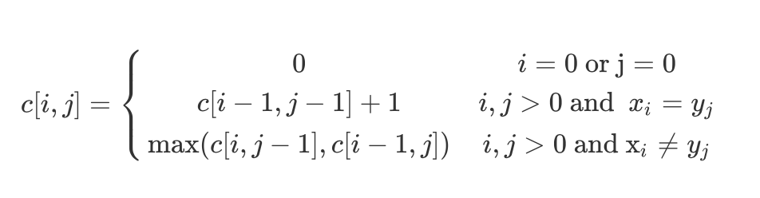
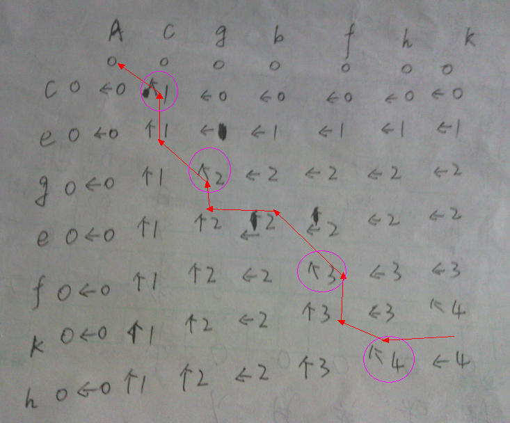
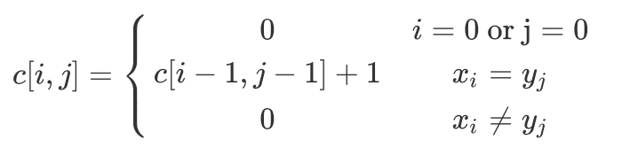

* content
{:toc}


# 初级算法

## 数组

[链接](https://leetcode-cn.com/leetbook/read/top-interview-questions-easy/x2i30g/)

### 删除排序数组中的重复项

给定一个排序数组，你需要在 原地 删除重复出现的元素，使得每个元素只出现一次，返回移除后数组的新长度。

不要使用额外的数组空间，你必须在 原地 修改输入数组 并在使用 O(1) 额外空间的条件下完成。

 

> 示例 1:
>
> 给定数组 nums = [1,1,2], 
>
> 函数应该返回新的长度 2, 并且原数组 nums 的前两个元素被修改为 1, 2。 
>
> 你不需要考虑数组中超出新长度后面的元素。
> 示例 2:
>
> 给定 nums = [0,0,1,1,1,2,2,3,3,4],
>
> 函数应该返回新的长度 5, 并且原数组 nums 的前五个元素被修改为 0, 1, 2, 3, 4。
>
> 你不需要考虑数组中超出新长度后面的元素。
>
>
> 说明:
>
> 为什么返回数值是整数，但输出的答案是数组呢?
>
> 请注意，输入数组是以「引用」方式传递的，这意味着在函数里修改输入数组对于调用者是可见的。
>
> 你可以想象内部操作如下:
>
> // nums 是以“引用”方式传递的。也就是说，不对实参做任何拷贝
> int len = removeDuplicates(nums);
>
> // 在函数里修改输入数组对于调用者是可见的。
> // 根据你的函数返回的长度, 它会打印出数组中该长度范围内的所有元素。
> for (int i = 0; i < len; i++) {
>     print(nums[i]);
> }

```python
# 快慢指针
class Solution:
    def removeDuplicates(self, nums: List[int]) -> int:
        i = 0
        for j in range(1,len(nums)):
            if nums[i] != nums[j]:
                nums[i+1] = nums[j]
                i += 1
        return i+1
# 笨方法：set -》 list -》 sort
    def removeDuplicates(self, nums: List[int]) -> int:
        nums[:] = set(nums)
      	nums.sort()
        return len(nums)
```

### 买卖股票的最佳时机 II

给定一个数组，它的第 i 个元素是一支给定股票第 i 天的价格。

设计一个算法来计算你所能获取的最大利润。你可以尽可能地完成更多的交易（多次买卖一支股票）。

注意：你不能同时参与多笔交易（你必须在再次购买前出售掉之前的股票）。

 

> 示例 1:
>
> 输入: [7,1,5,3,6,4]
> 输出: 7
> 解释: 在第 2 天（股票价格 = 1）的时候买入，在第 3 天（股票价格 = 5）的时候卖出, 这笔交易所能获得利润 = 5-1 = 4 。
>      随后，在第 4 天（股票价格 = 3）的时候买入，在第 5 天（股票价格 = 6）的时候卖出, 这笔交易所能获得利润 = 6-3 = 3 。
> 示例 2:
>
> 输入: [1,2,3,4,5]
> 输出: 4
> 解释: 在第 1 天（股票价格 = 1）的时候买入，在第 5 天 （股票价格 = 5）的时候卖出, 这笔交易所能获得利润 = 5-1 = 4 。
>      注意你不能在第 1 天和第 2 天接连购买股票，之后再将它们卖出。
>      因为这样属于同时参与了多笔交易，你必须在再次购买前出售掉之前的股票。
> 示例 3:
>
> 输入: [7,6,4,3,1]
> 输出: 0
> 解释: 在这种情况下, 没有交易完成, 所以最大利润为 0。
>
>
> 提示：
>
> 1 <= prices.length <= 3 * 10 ^ 4
> 0 <= prices[i] <= 10 ^ 4
>

```python
# 假设每天都买入，每天都卖出，计算两天差价是正值就加入最大利润，负值就跳过
class Solution:
    def maxProfit(self, prices: List[int]) -> int:
        max_profits = 0
        for i in range(len(prices)-1):
            if prices[i+1] - prices[i]>0:
                max_profits +=prices[i+1] - prices[i]
        return max_profits

```

### 旋转数组

给定一个数组，将数组中的元素向右移动 k 个位置，其中 k 是非负数。

> 示例 1:
>
> 输入: [1,2,3,4,5,6,7] 和 k = 3
> 输出: [5,6,7,1,2,3,4]
> 解释:
> 向右旋转 1 步: [7,1,2,3,4,5,6]
> 向右旋转 2 步: [6,7,1,2,3,4,5]
> 向右旋转 3 步: [5,6,7,1,2,3,4]
> 示例 2:
>
> 输入: [-1,-100,3,99] 和 k = 2
> 输出: [3,99,-1,-100]
> 解释: 
> 向右旋转 1 步: [99,-1,-100,3]
> 向右旋转 2 步: [3,99,-1,-100]
> 说明:
>
> 尽可能想出更多的解决方案，至少有三种不同的方法可以解决这个问题。
> 要求使用空间复杂度为 O(1) 的 原地 算法。

```python
class Solution:
    def rotate(self, nums: List[int], k: int) -> None:
        """
        Do not return anything, modify nums in-place instead.
        """
        nums_len = len(nums)
        
        # 列表拼接法
        # nums[:] = nums[nums_len-k:] + nums[:nums_len-k]

        # 迭代pop，insert法
        # while k:
        #     nums.insert(0,nums.pop())
        #     k -= 1
        
        #循环构建新数组替换法
        new_list = []
        for i in range(nums_len):
            target = (i + nums_len - k) % nums_len
            new_list.append(nums[target])
        nums[:] = new_list

```

### 存在重复元素

给定一个整数数组，判断是否存在重复元素。

如果任意一值在数组中出现至少两次，函数返回 true 。如果数组中每个元素都不相同，则返回 false 。

 

> 示例 1:
>
> 输入: [1,2,3,1]
> 输出: true
> 示例 2:
>
> 输入: [1,2,3,4]
> 输出: false
> 示例 3:
>
> 输入: [1,1,1,3,3,4,3,2,4,2]
> 输出: true
>

```python
class Solution:
    def containsDuplicate(self, nums: List[int]) -> bool:
        return len(nums) != len(set(nums))
```

### 只出现一次的数字

给定一个非空整数数组，除了某个元素只出现一次以外，其余每个元素均出现两次。找出那个只出现了一次的元素。

> 说明：
>
> 你的算法应该具有线性时间复杂度。 你可以不使用额外空间来实现吗？
>
> 示例 1:
>
> 输入: [2,2,1]
> 输出: 1
> 示例 2:
>
> 输入: [4,1,2,1,2]
> 输出: 4

```python
class Solution:
    def singleNumber(self, nums: List[int]) -> int:
        # Counter 计数法
        # from collections import Counter
        # s = Counter(nums)
        # return s.most_common()[-1][0]

        # 先排序，后比较
        # nums.sort()
        # for i in range(0,len(nums)-1,2):
        #     if nums[i] != nums[i+1]:
        #         return nums[i]

        # return nums[-1]

        # 异或
        return reduce(lambda x,y: x ^ y , nums)
```

### 两个数组的交集 II

给定两个数组，编写一个函数来计算它们的交集。

 

> 示例 1：
>
> 输入：nums1 = [1,2,2,1], nums2 = [2,2]
> 输出：[2,2]
> 示例 2:
>
> 输入：nums1 = [4,9,5], nums2 = [9,4,9,8,4]
> 输出：[4,9]
>
>
> 说明：
>
> 输出结果中每个元素出现的次数，应与元素在两个数组中出现次数的最小值一致。
> 我们可以不考虑输出结果的顺序。
> 进阶：
>
> 如果给定的数组已经排好序呢？你将如何优化你的算法？
> 如果 nums1 的大小比 nums2 小很多，哪种方法更优？
> 如果 nums2 的元素存储在磁盘上，内存是有限的，并且你不能一次加载所有的元素到内存中，你该怎么办？

```python
class Solution:
    def intersect(self, nums1: List[int], nums2: List[int]) -> List[int]:
        # 1. 先排序，后双指针比较
        # nums1.sort()
        # nums2.sort()
        # i = j =0
        # result = []
        # while i<len(nums1) and j <len(nums2):
        #     if nums1[i] == nums2[j]:
        #         result.append(nums1[i])
        #         i += 1
        #         j += 1
        #     elif nums1[i] > nums2[j]:
        #         j += 1
        #     else:
        #         i += 1
        # return result

        # 2. 遍历计数
        # if len(nums1) > len(nums2):
        #     return self.intersect(nums2,nums1)
        
        # counter = {}
        # result = []
        # for i in nums1:
        #     counter[i] = counter.get(i,0) + 1
        
        # for j in nums2:
        #     if (exist := counter.get(j,0) > 0):
        #         result.append(j)
        #         counter[j] -= 1

        #         if counter[j] == 0:
        #             counter.pop(j)
        # return result

        # 3 Counter
        from collections import Counter
        c1 = Counter(nums1)
        c2 = Counter(nums2)
        r = c1 & c2
        return list(r.elements())
```

### 加一

给定一个由整数组成的非空数组所表示的非负整数，在该数的基础上加一。

最高位数字存放在数组的首位， 数组中每个元素只存储单个数字。

你可以假设除了整数 0 之外，这个整数不会以零开头。

> 示例 1:
>
> 输入: [1,2,3]
> 输出: [1,2,4]
> 解释: 输入数组表示数字 123。
> 示例 2:
>
> 输入: [4,3,2,1]
> 输出: [4,3,2,2]
> 解释: 输入数组表示数字 4321。

```python
class Solution:
    def plusOne(self, digits: List[int]) -> List[int]:

        for i in range(len(digits)-1,-1,-1):
            if digits[i] == 9:
                digits[i] = 0
            else:
                digits[i] += 1
                return digits
        else:
            digits.insert(0,1)
        return digits
```

### 移动零

> 给定一个数组 nums，编写一个函数将所有 0 移动到数组的末尾，同时保持非零元素的相对顺序。
>
> 示例:
>
> 输入: [0,1,0,3,12]
> 输出: [1,3,12,0,0]
> 说明:
>
> 必须在原数组上操作，不能拷贝额外的数组。
> 尽量减少操作次数。
>

```python
class Solution:
    def moveZeroes(self, nums: List[int]) -> None:
        """
        Do not return anything, modify nums in-place instead.
        """
        zero_i = nums_j = 0
        len_nums = len(nums)
        while zero_i < len_nums and nums_j < len_nums:
            if nums[zero_i] != 0:
                zero_i += 1
                continue

            if nums[nums_j] == 0 or nums_j < zero_i:
                nums_j += 1
                continue
            nums[zero_i], nums[nums_j] = nums[nums_j] ,nums[zero_i]
```

### 两数之和

给定一个整数数组 nums 和一个目标值 target，请你在该数组中找出和为目标值的那 两个 整数，并返回他们的数组下标。

你可以假设每种输入只会对应一个答案。但是，数组中同一个元素不能使用两遍。

 

> 示例:
>
> 给定 nums = [2, 7, 11, 15], target = 9
>
> 因为 nums[0] + nums[1] = 2 + 7 = 9
> 所以返回 [0, 1]
>

```python
class Solution:
    def twoSum(self, nums: List[int], target: int) -> List[int]:
        # 1. 笨方法
        # for i in range(len(nums)):
        #     if (target - nums[i] ) in nums and nums.index(target-nums[i]) != i:
        #         return [i,nums.index(target-nums[i])]

        # 2. 双循环
        # for i in range(len(nums)):
        #     for j in range(i+1, len(nums)):
        #         if nums[i] + nums[j]  == target:
        #             return [i,j]
        # return []

        # 3. 哈希字典
        hash_dict = dict()
        for index,i in enumerate(nums):
            if (target - i ) in hash_dict.keys():
                return [hash_dict[target - i], index]
            hash_dict[i] = index
        return []

```

### 有效的数独

判断一个 9x9 的数独是否有效。只需要根据以下规则，验证已经填入的数字是否有效即可。

数字 1-9 在每一行只能出现一次。
数字 1-9 在每一列只能出现一次。
数字 1-9 在每一个以粗实线分隔的 3x3 宫内只能出现一次。


上图是一个部分填充的有效的数独。

数独部分空格内已填入了数字，空白格用 '.' 表示。

> 示例 1:
>
> 输入:
> [
>   ["5","3",".",".","7",".",".",".","."],
>   ["6",".",".","1","9","5",".",".","."],
>   [".","9","8",".",".",".",".","6","."],
>   ["8",".",".",".","6",".",".",".","3"],
>   ["4",".",".","8",".","3",".",".","1"],
>   ["7",".",".",".","2",".",".",".","6"],
>   [".","6",".",".",".",".","2","8","."],
>   [".",".",".","4","1","9",".",".","5"],
>   [".",".",".",".","8",".",".","7","9"]
> ]
> 输出: true
> 示例 2:
>
> 输入:
> [
>   ["8","3",".",".","7",".",".",".","."],
>   ["6",".",".","1","9","5",".",".","."],
>   [".","9","8",".",".",".",".","6","."],
>   ["8",".",".",".","6",".",".",".","3"],
>   ["4",".",".","8",".","3",".",".","1"],
>   ["7",".",".",".","2",".",".",".","6"],
>   [".","6",".",".",".",".","2","8","."],
>   [".",".",".","4","1","9",".",".","5"],
>   [".",".",".",".","8",".",".","7","9"]
> ]
> 输出: false
> 解释: 除了第一行的第一个数字从 5 改为 8 以外，空格内其他数字均与 示例1 相同。
>      但由于位于左上角的 3x3 宫内有两个 8 存在, 因此这个数独是无效的。
> 说明:
>
> 一个有效的数独（部分已被填充）不一定是可解的。
> 只需要根据以上规则，验证已经填入的数字是否有效即可。
> 给定数独序列只包含数字 1-9 和字符 '.' 。
> 给定数独永远是 9x9 形式的。
>

```python
class Solution:
    def isValidSudoku(self, board: List[List[str]]) -> bool:
        row_check_list = [{} for _ in range(9)]
        column_check_list = [{} for _ in range(9)]
        box_check_list = [{} for _ in range(9)]

        for i in range(9):
            for j in range(9):
                if board[i][j] != ".":
                    temp = int(board[i][j])
                    row_check_list[i][temp] = row_check_list[i].get(temp, 0) + 1
                    column_check_list[j][temp] = column_check_list[j].get(temp, 0) + 1
                    box_check_list[3 * (i // 3) + j // 3][temp] = box_check_list[3 * (i // 3) + j // 3].get(temp,0) + 1
                    
                    if any((row_check_list[i].get(temp) > 1 , column_check_list[j].get(temp) > 1 , box_check_list[3 * (i // 3) + j // 3].get(temp) > 1)):
                        return False
        return True


        # row_check_list = [[] for _ in range(9)]
        # column_check_list = [[] for _ in range(9)]
        # square_check_list = [[] for _ in range(9)]

        # for index_line, line in enumerate(board):
        #     for ele_index, ele in enumerate(line):
        #         if ele != ".":
        #             row_check_list[index_line].append(ele)
        #             column_check_list[ele_index].append(ele)
        #             square_check_list[3*(index_line // 3)  + ele_index // 3].append(ele)

        # def check_valid(*lists):
        #     for i in lists:
        #         for j in i:
        #             if len(j) != len(set(j)):
        #                 return False
        #     return True

        return check_valid(row_check_list,column_check_list,square_check_list)
```

### 旋转图像

给定一个 n × n 的二维矩阵表示一个图像。

将图像顺时针旋转 90 度。

说明：

你必须在原地旋转图像，这意味着你需要直接修改输入的二维矩阵。请不要使用另一个矩阵来旋转图像。

> 示例 1:
>
> 给定 matrix = 
> [
>   [1,2,3],
>   [4,5,6],
>   [7,8,9]
> ],
>
> 原地旋转输入矩阵，使其变为:
> [
>   [7,4,1],
>   [8,5,2],
>   [9,6,3]
> ]
> 示例 2:
>
> 给定 matrix =
> [
>   [ 5, 1, 9,11],
>   [ 2, 4, 8,10],
>   [13, 3, 6, 7],
>   [15,14,12,16]
> ], 
>
> 原地旋转输入矩阵，使其变为:
> [
>   [15,13, 2, 5],
>   [14, 3, 4, 1],
>   [12, 6, 8, 9],
>   [16, 7,10,11]
> ]

```python
class Solution:
    def rotate(self, matrix: List[List[int]]) -> None:
        """
        Do not return anything, modify matrix in-place instead.
        """
        # 1.会使用新的空间，但这答案真精髓!!!
        # matrix[:] = map(list,zip(*matrix[::-1]))

        # 2. 先转置矩阵，然后翻转每一行。这个简单的方法已经能达到最优的时间复杂度O(N^2)
        l_matrix = len(matrix)
        for i in range(l_matrix):
            for j in range(i, l_matrix):
                matrix[i][j], matrix[j][i] = matrix[j][i], matrix[i][j]
        
        for t in matrix:
            t.reverse()
```

## 字符串

### 反转字符串

编写一个函数，其作用是将输入的字符串反转过来。输入字符串以字符数组 char[] 的形式给出。

不要给另外的数组分配额外的空间，你必须原地修改输入数组、使用 O(1) 的额外空间解决这一问题。

你可以假设数组中的所有字符都是 ASCII 码表中的可打印字符。

 

> 示例 1：
>
> 输入：["h","e","l","l","o"]
> 输出：["o","l","l","e","h"]
> 示例 2：
>
> 输入：["H","a","n","n","a","h"]
> 输出：["h","a","n","n","a","H"]
>

```python
class Solution:
    def reverseString(self, s: List[str]) -> None:
        """
        Do not return anything, modify s in-place instead.
        """
        s[:] = s[::-1]
```

### 整数反转

给出一个 32 位的有符号整数，你需要将这个整数中每位上的数字进行反转。

> 示例 1:
>
> 输入: 123
> 输出: 321
>  示例 2:
>
> 输入: -123
> 输出: -321
> 示例 3:
>
> 输入: 120
> 输出: 21
> 注意:
>
> 假设我们的环境只能存储得下 32 位的有符号整数，则其数值范围为 [−2^31,  2^31 − 1]。请根据这个假设，如果反转后整数溢出那么就返回 0。
>

```python
class Solution:
    def reverse(self, x: int) -> int:
        result = int(str(x)[::-1]) if x >=0 else -1 * int(str(x)[1:][::-1])
        if result  < -2 ** 31  or result > 2 ** 31 -1:
            return 0
        else:
            return result
```

### 有效的字母异位词

给定两个字符串 s 和 t ，编写一个函数来判断 t 是否是 s 的字母异位词。

> 示例 1:
>
> 输入: s = "anagram", t = "nagaram"
> 输出: true
> 示例 2:
>
> 输入: s = "rat", t = "car"
> 输出: false
> 说明:
> 你可以假设字符串只包含小写字母。
>
> 进阶:
> 如果输入字符串包含 unicode 字符怎么办？你能否调整你的解法来应对这种情况？
>

```python
class Solution:
    def isAnagram(self, s: str, t: str) -> bool:
        # 1、Counter 大法好
        # from collections import Counter
        # c1 = Counter(s)
        # c2 = Counter(t)
        # return len(c1 - c2) == 0 and len(c2 - c1) == 0
        
        # 2、 sort 大法好
        #return sorted(s) == sorted(t)

				# 3、 哈希计数法
        if len(s) != len(t):
            return False
        result_dict = dict()
        for i in range(len(s)):
            result_dict[s[i]] = result_dict.get(s[i],0) + 1
            result_dict[t[i]] = result_dict.get(t[i],0) - 1
        for k,v in result_dict.items():
            if v != 0:
                return False
        return True
```

### 验证回文串

给定一个字符串，验证它是否是回文串，只考虑字母和数字字符，可以忽略字母的大小写。

说明：本题中，我们将空字符串定义为有效的回文串。

> 示例 1:
>
> 输入: "A man, a plan, a canal: Panama"
> 输出: true
> 示例 2:
>
> 输入: "race a car"
> 输出: false

```python
class Solution:
    def isPalindrome(self, s: str) -> bool:
        if len(s) <= 1:
            return True
        i = 0
        j = len(s)-1
        while i < j:
            while not s[i].isalnum():
                i += 1
                if i == j:
                    return True
            while not s[j].isalnum():
                j -= 1
                if i == j:
                    return True
            if s[i].lower() == s[j].lower():
                i += 1
                j -= 1
            else:
                return False
        return True
```

### 字符串转换整数 (atoi)

请你来实现一个 atoi 函数，使其能将字符串转换成整数。

首先，该函数会根据需要丢弃无用的开头空格字符，直到寻找到第一个非空格的字符为止。接下来的转化规则如下：

* 如果第一个非空字符为正或者负号时，则将该符号与之后面尽可能多的连续数字字符组合起来，形成一个有符号整数。

* 假如第一个非空字符是数字，则直接将其与之后连续的数字字符组合起来，形成一个整数。
* 该字符串在有效的整数部分之后也可能会存在多余的字符，那么这些字符可以被忽略，它们对函数不应该造成影响。
* 注意：假如该字符串中的第一个非空格字符不是一个有效整数字符、字符串为空或字符串仅包含空白字符时，则你的函数不需要进行转换，即无法进行有效转换。

* 在任何情况下，若函数不能进行有效的转换时，请返回 0 。

提示：

本题中的空白字符只包括空格字符 ' ' 。
假设我们的环境只能存储 32 位大小的有符号整数，那么其数值范围为 [−2^31,  2^31 − 1]。如果数值超过这个范围，请返回  INT_MAX (231 − 1) 或 INT_MIN (−231) 。

>
> 示例 1:
>
> 输入: "42"
> 输出: 42
> 示例 2:
>
> 输入: "   -42"
> 输出: -42
> 解释: 第一个非空白字符为 '-', 它是一个负号。
>      我们尽可能将负号与后面所有连续出现的数字组合起来，最后得到 -42 。
> 示例 3:
>
> 输入: "4193 with words"
> 输出: 4193
> 解释: 转换截止于数字 '3' ，因为它的下一个字符不为数字。
> 示例 4:
>
> 输入: "words and 987"
> 输出: 0
> 解释: 第一个非空字符是 'w', 但它不是数字或正、负号。
>      因此无法执行有效的转换。
> 示例 5:
>
> 输入: "-91283472332"
> 输出: -2147483648
> 解释: 数字 "-91283472332" 超过 32 位有符号整数范围。 
>      因此返回 INT_MIN (−231) 。
>

```python
class Solution:
    def myAtoi(self, s: str) -> int:
        new_s = s.lstrip()
        if not new_s:
            return 0

        flag = 1
        result = 0

        if new_s[0] in ["+","-"]:
            flag = -1 if new_s[0] == "-" else 1
            new_s = list(new_s)[1:]
        elif new_s[0].isdigit:
            pass
        else:
            return 0

        for i in new_s:
            if i.isdigit():
                result = result * 10 + int(i)
            else:
                break
        result =  flag  * result
        if result >= 2**31 -1:
            return 2**31 -1 
        elif result <= -1 * (2 ** 31):
            return -1 * (2 ** 31)
        else:
            return result
```

### 实现 strStr()

实现 strStr() 函数。

给定一个 haystack 字符串和一个 needle 字符串，在 haystack 字符串中找出 needle 字符串出现的第一个位置 (从0开始)。如果不存在，则返回  -1。

> 示例 1:
>
> 输入: haystack = "hello", needle = "ll"
> 输出: 2
> 示例 2:
>
> 输入: haystack = "aaaaa", needle = "bba"
> 输出: -1
> 说明:
>
> 当 needle 是空字符串时，我们应当返回什么值呢？这是一个在面试中很好的问题。
>
> 对于本题而言，当 needle 是空字符串时我们应当返回 0 。这与C语言的 strstr() 以及 Java的 indexOf() 定义相符。
>

```python
class Solution:
    def strStr(self, haystack: str, needle: str) -> int:
        if not needle:
            return 0
        # 1、暴力法
        # find_flag = False
        # for i in range(len(haystack)-len(needle)+1):
        #     t = i
        #     for j in needle:
        #         if t < len(haystack)  and haystack[t] == j:
        #             t += 1
        #             continue
        #         else:
        #             break
        #     else:
        #         find_flag = True
            
        #     if find_flag:
        #         return i
        # return -1

				# 2、切片暴力法
        l_h = len(haystack)
        l_n = len(needle)
        for i in range(l_h - l_n + 1):
            if haystack[i:i+l_n] == needle:
                return i
        return -1
```

### 外观数列

给定一个正整数 n ，输出外观数列的第 n 项。

「外观数列」是一个整数序列，从数字 1 开始，序列中的每一项都是对前一项的描述。

你可以将其视作是由递归公式定义的数字字符串序列：

countAndSay(1) = "1"
countAndSay(n) 是对 countAndSay(n-1) 的描述，然后转换成另一个数字字符串。
前五项如下：

1.     1
2.     11
3.     21
4.     1211
5.     111221
第一项是数字 1 
描述前一项，这个数是 1 即 “ 一 个 1 ”，记作 "11"
描述前一项，这个数是 11 即 “ 二 个 1 ” ，记作 "21"
描述前一项，这个数是 21 即 “ 一 个 2 + 一 个 1 ” ，记作 "1211"
描述前一项，这个数是 1211 即 “ 一 个 1 + 一 个 2 + 二 个 1 ” ，记作 "111221"
要 描述 一个数字字符串，首先要将字符串分割为 最小 数量的组，每个组都由连续的最多 相同字符 组成。然后对于每个组，先描述字符的数量，然后描述字符，形成一个描述组。要将描述转换为数字字符串，先将每组中的字符数量用数字替换，再将所有描述组连接起来。

例如，数字字符串 "3322251" 的描述如下图：


>
> 示例 1：
>
> 输入：n = 1
> 输出："1"
> 解释：这是一个基本样例。
> 示例 2：
>
> 输入：n = 4
> 输出："1211"
> 解释：
> countAndSay(1) = "1"
> countAndSay(2) = 读 "1" = 一 个 1 = "11"
> countAndSay(3) = 读 "11" = 二 个 1 = "21"
> countAndSay(4) = 读 "21" = 一 个 2 + 一 个 1 = "12" + "11" = "1211"
>
>
> 提示：
>
> 1 <= n <= 30

```python
class Solution:
    def countAndSay(self, n: int) -> str:
        def count_say(strs):
            result = []
            pre = None
            for i in strs:
                if i == pre:
                    result[-2] = str(int(result[-2]) + 1)
                else:
                    result.append("1")
                    result.append(i)
                    pre = i
            return "".join(result)  

        if n == 1:
            return "1"
        else:
            return count_say(self.countAndSay(n-1))

```


### 最长公共前缀

编写一个函数来查找字符串数组中的最长公共前缀。

如果不存在公共前缀，返回空字符串 ""。

> 示例 1:
>
> 输入: ["flower","flow","flight"]
> 输出: "fl"
> 示例 2:
>
> 输入: ["dog","racecar","car"]
> 输出: ""
> 解释: 输入不存在公共前缀。
> 说明:
>
> 所有输入只包含小写字母 a-z 。
>

```python
class Solution:
    def longestCommonPrefix(self, strs: List[str]) -> str:
      	# 1、暴力法
        # if len(strs) == 0:
        #     return ""
        # min_s = min(strs, key=lambda x: len(x))
        # result = ""
        # for i in min_s:
        #     result += i
        #     for item in strs:
        #         if not item.startswith(result):
        #             return result[:-1]
        # return result
				
        # 2.纵向比对
        if len(strs) == 0:
            return ""
        lenth, count = len(strs[0]), 0
        for i in range(lenth):
            c = strs[0][i]
            if any(i == len(j) or j[i] != c for j in strs[1:]):
                return strs[0][:i]
        return strs[0]
```

## 链表

### 删除链表中的节点

请编写一个函数，使其可以删除某个链表中给定的（非末尾）节点。传入函数的唯一参数为 要被删除的节点 

现有一个链表 -- head = [4,5,1,9]，它可以表示为:

示例 1：

输入：head = [4,5,1,9], node = 5
输出：[4,1,9]
解释：给定你链表中值为 5 的第二个节点，那么在调用了你的函数之后，该链表应变为 4 -> 1 -> 9.
示例 2：

输入：head = [4,5,1,9], node = 1
输出：[4,5,9]
解释：给定你链表中值为 1 的第三个节点，那么在调用了你的函数之后，该链表应变为 4 -> 5 -> 9.


提示：

链表至少包含两个节点。
链表中所有节点的值都是唯一的。
给定的节点为非末尾节点并且一定是链表中的一个有效节点。
不要从你的函数中返回任何结果。

```python
# Definition for singly-linked list.
# class ListNode:
#     def __init__(self, x):
#         self.val = x
#         self.next = None

class Solution:
    def deleteNode(self, node):
        """
        :type node: ListNode
        :rtype: void Do not return anything, modify node in-place instead.
        """
        node.val = node.next.val
        node.next = node.next.next
```

### 删除链表的倒数第N个节点

给定一个链表，删除链表的倒数第 n 个节点，并且返回链表的头结点。

示例：

给定一个链表: 1->2->3->4->5, 和 n = 2.

当删除了倒数第二个节点后，链表变为 1->2->3->5.
说明：

给定的 n 保证是有效的。

进阶：

你能尝试使用一趟扫描实现吗？

```python
# Definition for singly-linked list.
# class ListNode:
#     def __init__(self, val=0, next=None):
#         self.val = val
#         self.next = next
class Solution:
    def removeNthFromEnd(self, head: ListNode, n: int) -> ListNode:
        if head is None:
            return None
        
        fast = slow = head
        count = 0
        while fast.next:
            if count == n:
                slow = slow.next
                fast = fast.next
            else:
                count += 1
                fast = fast.next
        if fast == slow:
            return None
        elif count != n:
            return head.next
        else:
            slow.next = slow.next.next
            return head
```

### 合并两个有序链表

将两个升序链表合并为一个新的 升序 链表并返回。新链表是通过拼接给定的两个链表的所有节点组成的。 

 

示例：

输入：1->2->4, 1->3->4
输出：1->1->2->3->4->4

```python
# Definition for singly-linked list.
# class ListNode:
#     def __init__(self, val=0, next=None):
#         self.val = val
#         self.next = next
class Solution:
    def mergeTwoLists(self, l1: ListNode, l2: ListNode) -> ListNode:
        if l1 is None:
            return l2
        if l2 is None:
            return l1
        if l1.val > l2.val:
            l1, l2 = l2 ,l1
        start = l1
        while l1.next and l2:
            if l1.next.val <= l2.val:
                l1 = l1.next
            else:
                l1_next = l1.next
                cur_l2 = l2
                l2 = l2.next
                l1.next = cur_l2
                l1  = l1.next
                l1.next = l1_next
        if l2:
            l1.next = l2
        return start
```

### 回文链表

请判断一个链表是否为回文链表。

示例 1:

输入: 1->2
输出: false
示例 2:

输入: 1->2->2->1
输出: true
进阶：
你能否用 O(n) 时间复杂度和 O(1) 空间复杂度解决此题？

```PYTHON
# Definition for singly-linked list.
# class ListNode:
#     def __init__(self, x):
#         self.val = x
#         self.next = None

class Solution:
    def isPalindrome(self, head: ListNode) -> bool:
        # result = []
        # while head:
        #     result.append(head.val)
        #     head = head.next
        # return result == result[::-1]
        def get_half_node(head):
            slow = fast = head
            while fast and fast.next:
                fast = fast.next.next
                slow = slow.next
            return slow

        def reverse_link(head):
            pre = None
            while head:
                next_node = head.next
                head.next = pre
                pre = head
                head = next_node
            return pre
        
        start = head
        half_node = get_half_node(head)
        end = reverse_link(half_node)

        while start and end:
            if start.val != end.val:
                return False
            start = start.next
            end = end.next
        return True

```

### 环形链表

给定一个链表，判断链表中是否有环。

如果链表中有某个节点，可以通过连续跟踪 next 指针再次到达，则链表中存在环。 为了表示给定链表中的环，我们使用整数 pos 来表示链表尾连接到链表中的位置（索引从 0 开始）。 如果 pos 是 -1，则在该链表中没有环。注意：pos 不作为参数进行传递，仅仅是为了标识链表的实际情况。

如果链表中存在环，则返回 true 。 否则，返回 false 。

 

进阶：

你能用 O(1)（即，常量）内存解决此问题吗？

 

示例 1：


输入：head = [3,2,0,-4], pos = 1
输出：true
解释：链表中有一个环，其尾部连接到第二个节点。
示例 2：


输入：head = [1,2], pos = 0
输出：true
解释：链表中有一个环，其尾部连接到第一个节点。
示例 3：


输入：head = [1], pos = -1
输出：false
解释：链表中没有环。


提示：

链表中节点的数目范围是 [0, 104]
-105 <= Node.val <= 105
pos 为 -1 或者链表中的一个 有效索引 。

```python
# Definition for singly-linked list.
# class ListNode:
#     def __init__(self, x):
#         self.val = x
#         self.next = None

class Solution:
    def hasCycle(self, head: ListNode) -> bool:
        slow = fast = head
        while fast and fast.next:
            fast = fast.next.next
            slow = slow.next
            if slow == fast:
                return True
        return False
```


### 反转链表

反转一个单链表。

> 示例:
>
> 输入: 1->2->3->4->5->NULL
> 输出: 5->4->3->2->1->NULL
> 进阶:
> 你可以迭代或递归地反转链表。你能否用两种方法解决这道题？

```python
# Definition for singly-linked list.
# class ListNode:
#     def __init__(self, x):
#         self.val = x
#         self.next = None

class Solution:
    def reverseList(self, head: ListNode) -> ListNode:
        # 1.迭代
        # pre_node = None
        # while head:
        #     next_node = head.next
        #     head.next = pre_node
        #     pre_node = head
        #     head = next_node
        # return pre_node
				
        # 2.递归
        if head is None or head.next is None:
            return head
        p = self.reverseList(head.next)
        head.next.next = head
        head.next = None
        return p

```

## 树

### 二叉树的最大深度

给定一个二叉树，找出其最大深度。

二叉树的深度为根节点到最远叶子节点的最长路径上的节点数。

说明: 叶子节点是指没有子节点的节点。

示例：
给定二叉树 [3,9,20,null,null,15,7]，

    3
   / \
  9  20
    /  \
   15   7
返回它的最大深度 3 。

```python
# Definition for a binary tree node.
# class TreeNode:
#     def __init__(self, x):
#         self.val = x
#         self.left = None
#         self.right = None

class Solution:
    def maxDepth(self, root: TreeNode) -> int:
        if root is None:
            return 0
        return max(self.maxDepth(root.left)+1 , self.maxDepth(root.right) +1)
```


### 验证二叉搜索树

给定一个二叉树，判断其是否是一个有效的二叉搜索树。

假设一个二叉搜索树具有如下特征：

节点的左子树只包含小于当前节点的数。
节点的右子树只包含大于当前节点的数。
所有左子树和右子树自身必须也是二叉搜索树。
示例 1:

输入:
    2
   / \
  1   3
输出: true
示例 2:

输入:
    5
   / \
  1   4
     / \
    3   6
输出: false
解释: 输入为: [5,1,4,null,null,3,6]。
     根节点的值为 5 ，但是其右子节点值为 4 。

```python
# Definition for a binary tree node.
# class TreeNode:
#     def __init__(self, x):
#         self.val = x
#         self.left = None
#         self.right = None

class Solution:
    def isValidBST(self, root: TreeNode) -> bool:
        def helper(root, min_val, max_val):
            if root is None:
                return True
            if min_val< root.val < max_val:
                return helper(root.left, min_val, root.val) and helper(root.right, root.val, max_val)
            else:
                return False
        return helper(root, float(-inf), float(inf))

```

### 对称二叉树

给定一个二叉树，检查它是否是镜像对称的。

 

例如，二叉树 [1,2,2,3,4,4,3] 是对称的。

    1
   / \
  2   2
 / \ / \
3  4 4  3


但是下面这个 [1,2,2,null,3,null,3] 则不是镜像对称的:

    1
   / \
  2   2
   \   \
   3    3


进阶：

你可以运用递归和迭代两种方法解决这个问题吗？

```python
# Definition for a binary tree node.
# class TreeNode:
#     def __init__(self, x):
#         self.val = x
#         self.left = None
#         self.right = None

class Solution:
    def isSymmetric(self, root: TreeNode) -> bool:
        result = []
        temp = [root, root]
        while temp:
            n1 = temp.pop()
            n2 = temp.pop()
            if n1 is None and n2 is None:
                continue
            if n1 is None and n2:
                return False
            if n2 is None and n1:
                return False
            if n1 and n2 and n1.val != n2.val:
                return False
            temp.append(n1.left)
            temp.append(n2.right)
            temp.append(n1.right)
            temp.append(n2.left)
        return True


        # def is_mirror(node1, node2):
        #     if node1 is None and node2 is None:
        #         return True
        #     if node1 is None and node2:
        #         return False
        #     if node2 is None and node1:
        #         return False
            
        #     return node1.val == node2.val  and is_mirror(node1.left, node2.right) and is_mirror(node1.right, node2.left)
        
        # return is_mirror(root, root)


```

### 二叉树的层序遍历

给你一个二叉树，请你返回其按 层序遍历 得到的节点值。 （即逐层地，从左到右访问所有节点）。

 

示例：
二叉树：[3,9,20,null,null,15,7],

    3
   / \
  9  20
    /  \
   15   7
返回其层次遍历结果：

[
  [3],
  [9,20],
  [15,7]
]

```python
# Definition for a binary tree node.
# class TreeNode:
#     def __init__(self, x):
#         self.val = x
#         self.left = None
#         self.right = None
class Solution:
    def levelOrder(self, root: TreeNode) -> List[List[int]]:
        if root is None:
            return []
        result = []
        temp = [root]
        while temp:
            level_content = []
            val_content = []
            while temp:
                t = temp.pop(0)
                if t:
                    val_content.append(t.val)

                    if t.left:
                        level_content.append(t.left)
                    if t.right:
                        level_content.append(t.right)
            result.append(val_content)
            temp = level_content
        return result
```

### 将有序数组转换为二叉搜索树

将一个按照升序排列的有序数组，转换为一棵高度平衡二叉搜索树。

本题中，一个高度平衡二叉树是指一个二叉树每个节点 的左右两个子树的高度差的绝对值不超过 1。

示例:

给定有序数组: [-10,-3,0,5,9],

一个可能的答案是：[0,-3,9,-10,null,5]，它可以表示下面这个高度平衡二叉搜索树：

           0
          / \
        -3   9
       /   /
     -10  5
```python
# Definition for a binary tree node.
# class TreeNode:
#     def __init__(self, x):
#         self.val = x
#         self.left = None
#         self.right = None

class Solution:
    def sortedArrayToBST(self, nums: List[int]) -> TreeNode:
        l_nums = len(nums)
        if l_nums == 0:
            return None
        if l_nums == 1:
            return TreeNode(nums[0])
        mid = l_nums // 2
        root = TreeNode(nums[mid])
        root.left = self.sortedArrayToBST(nums[:mid])
        root.right = self.sortedArrayToBST(nums[mid+1:])
        return root
```

## 排序和搜索

### 合并两个有序数组

给你两个有序整数数组 nums1 和 nums2，请你将 nums2 合并到 nums1 中，使 nums1 成为一个有序数组。

 

说明：

初始化 nums1 和 nums2 的元素数量分别为 m 和 n 。
你可以假设 nums1 有足够的空间（空间大小大于或等于 m + n）来保存 nums2 中的元素。


示例：

输入：
nums1 = [1,2,3,0,0,0], m = 3
nums2 = [2,5,6],       n = 3

输出：[1,2,2,3,5,6]


提示：

-10^9 <= nums1[i], nums2[i] <= 10^9
nums1.length == m + n
nums2.length == n

```python
class Solution:
    def merge(self, nums1: List[int], m: int, nums2: List[int], n: int) -> None:
        """
        Do not return anything, modify nums1 in-place instead.
        """

        l_nums1 = len(nums1)
        l_nums2 = len(nums2)       
        i = m-1
        j = n-1
        cur = m + n -1

        while i > -1 and j > -1:
            if nums1[i] >= nums2[j]:
                nums1[cur] = nums1[i]
                cur -= 1
                i -= 1
            else:
                nums1[cur] = nums2[j]
                cur -= 1
                j -= 1
        if j > -1:
            nums1[:cur+1] = nums2[:j+1]

        return nums1
```

### 第一个错误的版本

你是产品经理，目前正在带领一个团队开发新的产品。不幸的是，你的产品的最新版本没有通过质量检测。由于每个版本都是基于之前的版本开发的，所以错误的版本之后的所有版本都是错的。

假设你有 n 个版本 [1, 2, ..., n]，你想找出导致之后所有版本出错的第一个错误的版本。

你可以通过调用 bool isBadVersion(version) 接口来判断版本号 version 是否在单元测试中出错。实现一个函数来查找第一个错误的版本。你应该尽量减少对调用 API 的次数。

示例:

给定 n = 5，并且 version = 4 是第一个错误的版本。

调用 isBadVersion(3) -> false
调用 isBadVersion(5) -> true
调用 isBadVersion(4) -> true

所以，4 是第一个错误的版本。 

```python
# The isBadVersion API is already defined for you.
# @param version, an integer
# @return an integer
# def isBadVersion(version):

class Solution:
    def firstBadVersion(self, n):
        """
        :type n: int
        :rtype: int
        """
        left = 1
        right = n
        while left < right:
            mid = (left + right) //2
            if isBadVersion(mid):
                right = mid
            else:
                left = mid + 1
        return left
```

## 动态规划

爬楼梯
假设你正在爬楼梯。需要 n 阶你才能到达楼顶。

每次你可以爬 1 或 2 个台阶。你有多少种不同的方法可以爬到楼顶呢？

注意：给定 n 是一个正整数。

示例 1：

输入： 2
输出： 2
解释： 有两种方法可以爬到楼顶。
1.  1 阶 + 1 阶
2.  2 阶
示例 2：

输入： 3
输出： 3
解释： 有三种方法可以爬到楼顶。
1.  1 阶 + 1 阶 + 1 阶
2.  1 阶 + 2 阶
3.  2 阶 + 1 阶

```python
class Solution:
    def climbStairs(self, n: int) -> int:
        result = {}
        result[1] = 1
        result[2] = 2
        for i in range(3, n+1):
            result[i] = result[i-1] + result[i-2]
        return result[n]
```

### 买卖股票的最佳时机

给定一个数组，它的第 i 个元素是一支给定股票第 i 天的价格。

如果你最多只允许完成一笔交易（即买入和卖出一支股票一次），设计一个算法来计算你所能获取的最大利润。

注意：你不能在买入股票前卖出股票。

 

示例 1:

输入: [7,1,5,3,6,4]
输出: 5
解释: 在第 2 天（股票价格 = 1）的时候买入，在第 5 天（股票价格 = 6）的时候卖出，最大利润 = 6-1 = 5 。
     注意利润不能是 7-1 = 6, 因为卖出价格需要大于买入价格；同时，你不能在买入前卖出股票。
示例 2:

输入: [7,6,4,3,1]
输出: 0
解释: 在这种情况下, 没有交易完成, 所以最大利润为 0。

```python
class Solution:
    def maxProfit(self, prices: List[int]) -> int:
        # max_pro = 0
        # for i in range(1,len(prices)):
        #     min_val = min(prices[:i])
        #     if max_pro < prices[i] - min_val:
        #         max_pro = prices[i] - min_val
        # return max_pro
        if not prices:
            return 0
        min_price = max(prices)
        max_pro = 0
        for i in prices:
            if i<min_price:
                min_price = i
            elif i - min_price > max_pro:
                max_pro = i - min_price
        return max_pro
```

### 最大子序和

给定一个整数数组 nums ，找到一个具有最大和的连续子数组（子数组最少包含一个元素），返回其最大和。

示例:

输入: [-2,1,-3,4,-1,2,1,-5,4]
输出: 6
解释: 连续子数组 [4,-1,2,1] 的和最大，为 6。
进阶:

如果你已经实现复杂度为 O(n) 的解法，尝试使用更为精妙的分治法求解。

```python
class Solution:
    def maxSubArray(self, nums: List[int]) -> int:
        if not nums:
            return 0
        l_nums = len(nums)
        dp = [0 for i in range(l_nums)]
        
        dp[0] = nums[0]
        for i in range(1,len(nums)):
            dp[i] = max(dp[i-1] + nums[i], nums[i])
        return max(dp)
```

### 打家劫舍

你是一个专业的小偷，计划偷窃沿街的房屋。每间房内都藏有一定的现金，影响你偷窃的唯一制约因素就是相邻的房屋装有相互连通的防盗系统，如果两间相邻的房屋在同一晚上被小偷闯入，系统会自动报警。

给定一个代表每个房屋存放金额的非负整数数组，计算你 不触动警报装置的情况下 ，一夜之内能够偷窃到的最高金额。

 

示例 1：

输入：[1,2,3,1]
输出：4
解释：偷窃 1 号房屋 (金额 = 1) ，然后偷窃 3 号房屋 (金额 = 3)。
     偷窃到的最高金额 = 1 + 3 = 4 。
示例 2：

输入：[2,7,9,3,1]
输出：12
解释：偷窃 1 号房屋 (金额 = 2), 偷窃 3 号房屋 (金额 = 9)，接着偷窃 5 号房屋 (金额 = 1)。
     偷窃到的最高金额 = 2 + 9 + 1 = 12 。


提示：

0 <= nums.length <= 100
0 <= nums[i] <= 400

```python
class Solution:
    def rob(self, nums: List[int]) -> int:
        if not nums:
            return 0
        if len(nums) == 1:
            return nums[0]
        l_nums = len(nums)
        dp = [0 for _ in range(l_nums)]
        dp[0] = nums[0]
        dp[1] = max(nums[0], nums[1])
        for i in range(2, l_nums):
            dp[i] = max(dp[i-1], dp[i-2] + nums[i])
        return dp[-1]
```

## 设计问题

### 打乱数组

给你一个整数数组 nums ，设计算法来打乱一个没有重复元素的数组。

实现 Solution class:

Solution(int[] nums) 使用整数数组 nums 初始化对象
int[] reset() 重设数组到它的初始状态并返回
int[] shuffle() 返回数组随机打乱后的结果


示例：

输入
["Solution", "shuffle", "reset", "shuffle"]
[[[1, 2, 3]], [], [], []]
输出
[null, [3, 1, 2], [1, 2, 3], [1, 3, 2]]

解释
Solution solution = new Solution([1, 2, 3]);
solution.shuffle();    // 打乱数组 [1,2,3] 并返回结果。任何 [1,2,3]的排列返回的概率应该相同。例如，返回 [3, 1, 2]
solution.reset();      // 重设数组到它的初始状态 [1, 2, 3] 。返回 [1, 2, 3]
solution.shuffle();    // 随机返回数组 [1, 2, 3] 打乱后的结果。例如，返回 [1, 3, 2]


提示：

1 <= nums.length <= 200
-106 <= nums[i] <= 106
nums 中的所有元素都是 唯一的
最多可以调用 5 * 104 次 reset 和 shuffle

```python
import random
class Solution:

    def __init__(self, nums: List[int]):
        self.array = nums
        self.origin = nums[:]
        

    def reset(self) -> List[int]:
        """
        Resets the array to its original configuration and return it.
        """
        self.array = self.origin[:]
        return self.array


    def shuffle(self) -> List[int]:
        """
        Returns a random shuffling of the array.
        """
        for i in range(len(self.array)):
            ran_index = random.randrange(i, len(self.array))
            self.array[i] ,self.array[ran_index] = self.array[ran_index], self.array[i]
        return self.array


# Your Solution object will be instantiated and called as such:
# obj = Solution(nums)
# param_1 = obj.reset()
# param_2 = obj.shuffle()
```

### 最小栈

设计一个支持 push ，pop ，top 操作，并能在常数时间内检索到最小元素的栈。

push(x) —— 将元素 x 推入栈中。
pop() —— 删除栈顶的元素。
top() —— 获取栈顶元素。
getMin() —— 检索栈中的最小元素。


示例:

输入：
["MinStack","push","push","push","getMin","pop","top","getMin"]
[[],[-2],[0],[-3],[],[],[],[]]

输出：
[null,null,null,null,-3,null,0,-2]

解释：
MinStack minStack = new MinStack();
minStack.push(-2);
minStack.push(0);
minStack.push(-3);
minStack.getMin();   --> 返回 -3.
minStack.pop();
minStack.top();      --> 返回 0.
minStack.getMin();   --> 返回 -2.


提示：

pop、top 和 getMin 操作总是在 非空栈 上调用。

```python
class MinStack:

    def __init__(self):
        """
        initialize your data structure here.
        """
        self.ele = []
        self.mins = []

    def push(self, x: int) -> None:
        self.ele.append(x)
        if len(self.mins) == 0:
            self.mins.append(x)
        else:
            self.mins.append( min(x, self.mins[-1]))


    def pop(self) -> None:
        self.ele.pop()
        self.mins.pop()


    def top(self) -> int:
        return self.ele[-1]


    def getMin(self) -> int:
        return self.mins[-1]


# Your MinStack object will be instantiated and called as such:
# obj = MinStack()
# obj.push(x)
# obj.pop()
# param_3 = obj.top()
# param_4 = obj.getMin()
```


## 数学

### Fizz Buzz

写一个程序，输出从 1 到 n 数字的字符串表示。

1. 如果 n 是3的倍数，输出“Fizz”；

2. 如果 n 是5的倍数，输出“Buzz”；

3.如果 n 同时是3和5的倍数，输出 “FizzBuzz”。

示例：

n = 15,

返回:
[
    "1",
    "2",
    "Fizz",
    "4",
    "Buzz",
    "Fizz",
    "7",
    "8",
    "Fizz",
    "Buzz",
    "11",
    "Fizz",
    "13",
    "14",
    "FizzBuzz"
]

```python
class Solution:
    def fizzBuzz(self, n: int) -> List[str]:
        result = []
        for i in range(1, n+1):
            if i % 3 == 0 and i % 5 == 0:
                result.append("FizzBuzz")
            elif i % 3 == 0:
                result.append("Fizz")
            elif i % 5 == 0:
                result.append("Buzz")
            else:
                result.append(str(i))
        return result
```


### 3的幂

给定一个整数，写一个函数来判断它是否是 3 的幂次方。如果是，返回 true ；否则，返回 false 。

整数 n 是 3 的幂次方需满足：存在整数 x 使得 n == 3x

示例 1：

输入：n = 27
输出：true
示例 2：

输入：n = 0
输出：false
示例 3：

输入：n = 9
输出：true
示例 4：

输入：n = 45
输出：false


提示：

-231 <= n <= 231 - 1

```python
class Solution:
    def isPowerOfThree(self, n: int) -> bool:
        if n == 0:
            return False
        
        while n % 3 == 0:
            n = n // 3

        return n == 1
```

### 计数质数

统计所有小于非负整数 n 的质数的数量。

 

示例 1：

输入：n = 10
输出：4
解释：小于 10 的质数一共有 4 个, 它们是 2, 3, 5, 7 。
示例 2：

输入：n = 0
输出：0
示例 3：

输入：n = 1
输出：0


提示：

0 <= n <= 5 * 106

```python
import math
class Solution:
    def countPrimes(self, n: int) -> int:
        import math
        if n < 3:
            return 0
        count = 1
        for i in range(3, n):
            if i % 2 == 0:
                continue
            for j in range(3,int(math.sqrt(i))+1,2):
                if i % j == 0:
                    break
            else:
                count += 1
        return count
```

### 罗马数字转整数

罗马数字包含以下七种字符: I， V， X， L，C，D 和 M。

字符          数值
I             1
V             5
X             10
L             50
C             100
D             500
M             1000
例如， 罗马数字 2 写做 II ，即为两个并列的 1。12 写做 XII ，即为 X + II 。 27 写做  XXVII, 即为 XX + V + II 。

通常情况下，罗马数字中小的数字在大的数字的右边。但也存在特例，例如 4 不写做 IIII，而是 IV。数字 1 在数字 5 的左边，所表示的数等于大数 5 减小数 1 得到的数值 4 。同样地，数字 9 表示为 IX。这个特殊的规则只适用于以下六种情况：

I 可以放在 V (5) 和 X (10) 的左边，来表示 4 和 9。
X 可以放在 L (50) 和 C (100) 的左边，来表示 40 和 90。 
C 可以放在 D (500) 和 M (1000) 的左边，来表示 400 和 900。
给定一个罗马数字，将其转换成整数。输入确保在 1 到 3999 的范围内。

 

示例 1:

输入: "III"
输出: 3
示例 2:

输入: "IV"
输出: 4
示例 3:

输入: "IX"
输出: 9
示例 4:

输入: "LVIII"
输出: 58
解释: L = 50, V= 5, III = 3.
示例 5:

输入: "MCMXCIV"
输出: 1994
解释: M = 1000, CM = 900, XC = 90, IV = 4.


提示：

题目所给测试用例皆符合罗马数字书写规则，不会出现跨位等情况。
IC 和 IM 这样的例子并不符合题目要求，49 应该写作 XLIX，999 应该写作 CMXCIX 。
关于罗马数字的详尽书写规则，可以参考 罗马数字 - Mathematics 。

```python
class Solution:
    def romanToInt(self, s: str) -> int:
        num_transfer = {"I":1,
        "V":5,
        "X":10,
        "L":50,
        "C":100,
        "D":500,
        "M":1000,
        "IV": 4,
        "IX": 9,
        "XL": 40,
        "XC": 90,
        "CD": 400,
        "CM": 900
        }
        result = 0
        index = 0
        for _ in range(len(s)):
            if index >= len(s):
                break
            if index + 1  == len(s):
                result += num_transfer[s[index]]
                index += 1
            else:
                if s[index:index+2] in num_transfer.keys():
                    result += num_transfer[s[index:index+2]]
                    index += 2
                else:
                    result += num_transfer[s[index]]
                    index += 1
        return result
```


## 其他

### 位1的个数

编写一个函数，输入是一个无符号整数（以二进制串的形式），返回其二进制表达式中数字位数为 '1' 的个数（也被称为汉明重量）。

 

提示：

请注意，在某些语言（如 Java）中，没有无符号整数类型。在这种情况下，输入和输出都将被指定为有符号整数类型，并且不应影响您的实现，因为无论整数是有符号的还是无符号的，其内部的二进制表示形式都是相同的。
在 Java 中，编译器使用二进制补码记法来表示有符号整数。因此，在上面的 示例 3 中，输入表示有符号整数 -3。


进阶：

如果多次调用这个函数，你将如何优化你的算法？


示例 1：

输入：00000000000000000000000000001011
输出：3
解释：输入的二进制串 00000000000000000000000000001011 中，共有三位为 '1'。
示例 2：

输入：00000000000000000000000010000000
输出：1
解释：输入的二进制串 00000000000000000000000010000000 中，共有一位为 '1'。
示例 3：

输入：11111111111111111111111111111101
输出：31
解释：输入的二进制串 11111111111111111111111111111101 中，共有 31 位为 '1'。


提示：

输入必须是长度为 32 的 二进制串 。

```python
class Solution:
    def hammingWeight(self, n: int) -> int:
        count = 0
        while n:
            if n & 1:
                count += 1
            n = n >> 1
        return count
```


### 汉明距离

两个整数之间的汉明距离指的是这两个数字对应二进制位不同的位置的数目。

给出两个整数 x 和 y，计算它们之间的汉明距离。

注意：
0 ≤ x, y < 231.

示例:

输入: x = 1, y = 4

输出: 2

解释:
1   (0 0 0 1)
4   (0 1 0 0)
       ↑   ↑

上面的箭头指出了对应二进制位不同的位置。

```PYTHON
class Solution:
    def hammingDistance(self, x: int, y: int) -> int:
        t = x ^ y
        count = 0
        while True:
            if t == 0 :
                return count
            if t == 1 :
                count += 1
                return count
            if t % 2 != 0:
                t = t >> 1
                count += 1
            else:
                t = t >> 1


        # xor = x ^ y
        # distance = 0
        # while xor:
        #     # mask out the rest bits
        #     if xor & 1:
        #         distance += 1
        #     xor = xor >> 1
        # return distance
```

### 颠倒二进制位

颠倒给定的 32 位无符号整数的二进制位。

 

示例 1：

输入: 00000010100101000001111010011100
输出: 00111001011110000010100101000000
解释: 输入的二进制串 00000010100101000001111010011100 表示无符号整数 43261596，
     因此返回 964176192，其二进制表示形式为 00111001011110000010100101000000。
示例 2：

输入：11111111111111111111111111111101
输出：10111111111111111111111111111111
解释：输入的二进制串 11111111111111111111111111111101 表示无符号整数 4294967293，
     因此返回 3221225471 其二进制表示形式为 10111111111111111111111111111111 。


提示：

请注意，在某些语言（如 Java）中，没有无符号整数类型。在这种情况下，输入和输出都将被指定为有符号整数类型，并且不应影响您的实现，因为无论整数是有符号的还是无符号的，其内部的二进制表示形式都是相同的。
在 Java 中，编译器使用二进制补码记法来表示有符号整数。因此，在上面的 示例 2 中，输入表示有符号整数 -3，输出表示有符号整数 -1073741825。


进阶:
如果多次调用这个函数，你将如何优化你的算法？

```python
class Solution:
    def reverseBits(self, n: int) -> int:
        result = 0 
        count = 31
        while n:
            result +=   (n &1)<<count
            n = n>>1
            count -= 1
        return result
```

### 缺失数字

给定一个包含 [0, n] 中 n 个数的数组 nums ，找出 [0, n] 这个范围内没有出现在数组中的那个数。

 

进阶：

你能否实现线性时间复杂度、仅使用额外常数空间的算法解决此问题?


示例 1：

输入：nums = [3,0,1]
输出：2
解释：n = 3，因为有 3 个数字，所以所有的数字都在范围 [0,3] 内。2 是丢失的数字，因为它没有出现在 nums 中。
示例 2：

输入：nums = [0,1]
输出：2
解释：n = 2，因为有 2 个数字，所以所有的数字都在范围 [0,2] 内。2 是丢失的数字，因为它没有出现在 nums 中。
示例 3：

输入：nums = [9,6,4,2,3,5,7,0,1]
输出：8
解释：n = 9，因为有 9 个数字，所以所有的数字都在范围 [0,9] 内。8 是丢失的数字，因为它没有出现在 nums 中。
示例 4：

输入：nums = [0]
输出：1
解释：n = 1，因为有 1 个数字，所以所有的数字都在范围 [0,1] 内。1 是丢失的数字，因为它没有出现在 nums 中。


提示：

n == nums.length
1 <= n <= 104
0 <= nums[i] <= n
nums 中的所有数字都 独一无二

```python
class Solution:
    def missingNumber(self, nums: List[int]) -> int:
        l_n =len(nums)
        # sum_n  =  l_n * (l_n +1) //2
        # for i in nums:
        #     sum_n -= i
        # return sum_n
        
        for i,n in enumerate(nums):
            l_n ^= i^n
        return l_n
```


### 杨辉三角

给定一个非负整数 numRows，生成杨辉三角的前 numRows 行。


在杨辉三角中，每个数是它左上方和右上方的数的和。

示例:

输入: 5
输出:
[
     [1],
    [1,1],
   [1,2,1],
  [1,3,3,1],
 [1,4,6,4,1]
]

```python
class Solution:
    def generate(self, numRows: int) -> List[List[int]]:
        result = []
        for i in range(1,numRows+1):
            temp = [1 for _ in range(i)]
            for j in range(1,i-1):
                temp[j] = result[i-2][j] + result[i-2][j-1]
            result.append(temp)
        return result
```


### 有效的括号

给定一个只包括 '('，')'，'{'，'}'，'['，']' 的字符串，判断字符串是否有效。

有效字符串需满足：

左括号必须用相同类型的右括号闭合。
左括号必须以正确的顺序闭合。
注意空字符串可被认为是有效字符串。

示例 1:

输入: "()"
输出: true
示例 2:

输入: "()[]{}"
输出: true
示例 3:

输入: "(]"
输出: false
示例 4:

输入: "([)]"
输出: false
示例 5:

输入: "{[]}"
输出: true

```python
class Solution:
    def isValid(self, s: str) -> bool:
        temp = {"}":"{", ")":"(", "]":"["}
        stacks = []
        for t in s:
            if t not in temp.keys():
                stacks.append(t)
            else:
                if not stacks or temp[t] != stacks.pop():
                    return False
        return len(stacks) == 0
```


### 判断IP

给定一组字符串输入一个ip地址判断是否是正确的ip，输出正确的ip

```python
def isIpv4(self, s):
  import re
  pattern = r"(\d|[1-9]\d|1\d\d|2[0-4]\d|25[0-5])(\.(\d|[1-9]\d|1\d\d|2[0-4]\d|25[0-5])){3}"
  if re.match(pattern, s):
    return True
  else:
    return False
```

# 算法面试题汇总

## [开始之前](https://leetcode-cn.com/leetbook/read/top-interview-questions/xm9q96/)

### 只出现一次的数字

给定一个非空整数数组，除了某个元素只出现一次以外，其余每个元素均出现两次。找出那个只出现了一次的元素。

说明：

你的算法应该具有线性时间复杂度。 你可以不使用额外空间来实现吗？

示例 1:

输入: [2,2,1]
输出: 1
示例 2:

输入: [4,1,2,1,2]
输出: 4

```python
class Solution:
    def singleNumber(self, nums: List[int]) -> int:
        res = 0
        for i in nums:
            res ^= i
        return res
```

### 多数元素

给定一个大小为 n 的数组，找到其中的多数元素。多数元素是指在数组中出现次数大于 ⌊ n/2 ⌋ 的元素。

你可以假设数组是非空的，并且给定的数组总是存在多数元素。

 

示例 1:

输入: [3,2,3]
输出: 3
示例 2:

输入: [2,2,1,1,1,2,2]
输出: 2

```python
class Solution:
    def majorityElement(self, nums: List[int]) -> int:
        res = {}
        for i in nums:
            res[i] = res.get(i,0) + 1
        max_count = 0
        max_key = None
        for k,v in res.items():
            if v > max_count:
                max_count = v
                max_key = k
        return max_key
```


# 牛客

### 最长公共子序列

题目描述

给定两个字符串str1和str2，输出连个字符串的最长公共子序列。如过最长公共子序列为空，则输出-1。

示例1

输入

```
"1A2C3D4B56","B1D23CA45B6A"
```

返回值

```
"123456"
```

说明

```
"123456"和“12C4B6”都是最长公共子序列，任意输出一个。
```






```python
#
# longest common subsequence
# @param s1 string字符串 the string
# @param s2 string字符串 the string
# @return string字符串
#
class Solution:
    def LCS(self, s1, s2):
        l_s1 = len(s1)
        l_s2 = len(s2)
        if l_s1 == 0 or l_s2 == 0:
            return -1

        matrix = [[0 for t in range(l_s1 + 1)] for t2 in range(l_s2 + 1)]
        for i in range(l_s1):
            for j in range(l_s2):
                if s1[i] == s2[j]:
                    matrix[j + 1][i + 1] = matrix[j][i] + 1
                else:
                    matrix[j+1][i + 1] = max(matrix[j][i + 1], matrix[j + 1][i])
        # matrix[-1][-1]为最大子序列长度
        if matrix[-1][-1] == 0:
            return -1
        result = []
        row,col = l_s2,l_s1
				# 求具体子序列
        while row and col:
            if s2[row-1] == s1[col-1]:
                result.append(s2[row-1])
                row -= 1
                col -= 1
            else:
                if matrix[row-1][col] >= matrix[row][col-1]:
                # if matrix[row-1][col] > matrix[row][col-1]:  # 可能是另一个符合条件的子序列
                    row -= 1
                else:
                    col -= 1
        return "".join(result[::-1])
            
```

[java题解，包含示例图](https://www.cnblogs.com/huangxincheng/archive/2012/11/11/2764625.html)

[参考博客：https://www.cnblogs.com/en-heng/p/3963803.html](https://www.cnblogs.com/en-heng/p/3963803.html)

### 最长公共子串

题目描述

给定两个字符串str1和str2,输出两个字符串的最长公共子串，如果最长公共子串为空，输出-1。


示例1

输入

```
"1AB2345CD","12345EF"
```

返回值

```
"2345"
```

备注:

```
1≤str1,str2≤5000
```

得到转移方程：




```python
#
# longest common substring
# @param str1 string字符串 the string
# @param str2 string字符串 the string
# @return string字符串
#
class Solution:
    def LCS(self , str1 , str2 ):
        # write code here
        if len(str1) > len(str2):
            str1, str2 = str2, str1
        
        max_len, res = 0, ''
        
        for i in range(len(str1)):
            if str1[i-max_len: i + 1] in str2:
                res = str1[i-max_len: i + 1]
                max_len += 1
        
        if not res:
            return '-1'
        else:
            return res
```

### 括号序列

题目描述

给出一个仅包含字符'(',')','{','}','['和']',的字符串，判断给出的字符串是否是合法的括号序列
括号必须以正确的顺序关闭，"()"和"()[]{}"都是合法的括号序列，但"(]"和"([)]"不合法。

示例1

输入

```
"["
```

返回值

```
false
```

示例2

输入

```
"[]"
```

返回值

```
true
```

```python
#
# 
# @param s string字符串 
# @return bool布尔型
#
class Solution:
    def isValid(self , s ):
        # write code here
        temp = {
            "]":"[",
            "}":"{",
            ")":"("
        }
        result = []
        for i in s:
            if i in temp:
                if len(result) == 0:
                    return False
                elif temp.get(i) != result.pop():
                    return False
            else:
                result.append(i)
        return len(result) == 0
```

### 合并有序链表

题目描述

将两个有序的链表合并为一个新链表，要求新的链表是通过拼接两个链表的节点来生成的。

示例1

输入

```
{1},{}
```

返回值

```
{1}
```

示例2

输入

```
{1},{1}
```

返回值

```
{1,1}
```

```python
# class ListNode:
#     def __init__(self, x):
#         self.val = x
#         self.next = None

#
# 
# @param l1 ListNode类 
# @param l2 ListNode类 
# @return ListNode类
#
class Solution:
    def mergeTwoLists(self , l1 , l2 ):
        # write code here
        if l1 is None:
            return l2
        if l2 is None:
            return l1

        if l1.val <= l2.val:
            start = l1
            cur = l1
            l1 = l1.next
        else:
            start = l2
            cur = l2
            l2 = l2.next
        while l1 and l2:

            if l1.val >= l2.val:
                cur.next = l2
                cur = cur.next
                l2 = l2.next
            else:
                cur.next = l1
                cur = cur.next
                l1 = l1.next
        if l1:
            cur.next = l1
        if l2:
            cur.next =l2
        return start
```

### 判断链表中是否有环

判断给定的链表中是否有环

```python
# class ListNode:
#     def __init__(self, x):
#         self.val = x
#         self.next = None

#
# 
# @param head ListNode类 
# @return bool布尔型
#
class Solution:
    def hasCycle(self , head ):
        # write code here
        if head is None:
            return False
        slow = head
        fast = head.next
        while slow and fast and fast.next:
            if slow != fast:
                slow = slow.next
                fast = fast.next.next
            else:
                return True
        return False
          
```

### 链表中环的入口节点

题目描述

对于一个给定的链表，返回环的入口节点，如果没有环，返回null

拓展：

你能给出不利用额外空间的解法么？

```python
# class ListNode:
#     def __init__(self, x):
#         self.val = x
#         self.next = None

#
# 
# @param head ListNode类 
# @return ListNode类
#
class Solution:
    def detectCycle(self , head ):
        # write code here
        if head is None:
            return None
        temp = []
        while head:
            if head not in temp:
                temp.append(head)
                head = head.next
            else:
                return head
```

### 岛屿数量

题目描述

给一个01矩阵，1代表是陆地，0代表海洋， 如果两个1相邻，那么这两个1属于同一个岛。我们只考虑上下左右为相邻。

岛屿: 相邻陆地可以组成一个岛屿（相邻:上下左右） 判断岛屿个数。


示例1

输入

```
[[1,1,0,0,0],[0,1,0,1,1],[0,0,0,1,1],[0,0,0,0,0],[0,0,1,1,1]]
```

返回值

```
3
```

备注:

```
01矩阵范围<=200*200
```

```python
#
# 判断岛屿数量
# @param grid char字符型二维数组 
# @return int整型
#
class Solution:
    def solve(self , grid ):
        # write code here
        l_r = len(grid)
        if l_r == 0:
            return 0
        l_c = len(grid[0])
        
        
        count = 0 
        temp = []
        for r in range(l_r):
            for c in range(l_c):
                if grid[r][c] == "1":
                    count += 1
                    temp.append((r,c))
                    while temp:
                        row,col = temp.pop()
                        grid[row][col] = 0
                        for i,j in [(row,col+1),(row,col-1),(row-1,col),(row+1,col)]:
                            if 0<=i<l_r and 0<=j<l_c and grid[i][j] == "1":
                                temp.append((i,j))
                                grid[i][j] = 0
        return count
```

### 链表中的节点每k个一组翻转

题目描述

将给出的链表中的节点每\ k *k* 个一组翻转，返回翻转后的链表
如果链表中的节点数不是\ k *k* 的倍数，将最后剩下的节点保持原样
你不能更改节点中的值，只能更改节点本身。
要求空间复杂度 \ O(1) *O*(1)

例如：

给定的链表是1\to2\to3\to4\to51→2→3→4→5

对于 \ k = 2 *k*=2, 你应该返回 2\to 1\to 4\to 3\to 52→1→4→3→5

对于 \ k = 3 *k*=3, 你应该返回 3\to2 \to1 \to 4\to 53→2→1→4→5

示例1

输入

```
{1,2,3,4,5},2
```

返回值

```
{2,1,4,3,5}
```

```python
# class ListNode:
#     def __init__(self, x):
#         self.val = x
#         self.next = None

#
# 
# @param head ListNode类 
# @param k int整型 
# @return ListNode类
#
class Solution:
    def reverseKGroup(self , head , k ):
        # write code here
        def reverse(a,b):
            pre = None
            cur = a
            while cur != b:
                next_node = cur.next
                cur.next = pre
                pre = cur
                cur = next_node
            return pre
        a, b = head, head
        for _ in range(k):
            if not b:
                return head
            b = b.next
        new_head = reverse(a,b)
        a.next = self.reverseKGroup(b, k)
        return new_head
```

### 验证IP地址

题目描述

编写一个函数来验证输入的字符串是否是有效的 IPv4 或 IPv6 地址

IPv4 地址由十进制数和点来表示，每个地址包含4个十进制数，其范围为 0 - 255， 用(".")分割。比如，172.16.254.1；
同时，IPv4 地址内的数不会以 0 开头。比如，地址 172.16.254.01 是不合法的。

IPv6 地址由8组16进制的数字来表示，每组表示 16 比特。这些组数字通过 (":")分割。比如, 2001:0db8:85a3:0000:0000:8a2e:0370:7334 是一个有效的地址。而且，我们可以加入一些以 0 开头的数字，字母可以使用大写，也可以是小写。所以， 2001:db8:85a3:0:0:8A2E:0370:7334 也是一个有效的 IPv6 address地址 (即，忽略 0 开头，忽略大小写)。

然而，我们不能因为某个组的值为 0，而使用一个空的组，以至于出现 (::) 的情况。 比如， 2001:0db8:85a3::8A2E:0370:7334 是无效的 IPv6 地址。
同时，在 IPv6 地址中，多余的 0 也是不被允许的。比如， 02001:0db8:85a3:0000:0000:8a2e:0370:7334 是无效的。

说明: 你可以认为给定的字符串里没有空格或者其他特殊字符。

示例1

输入

```
"172.16.254.1"
```

返回值

```
"IPv4"
```

说明

```
这是一个有效的 IPv4 地址, 所以返回 "IPv4"
```

示例2

输入

```
"2001:0db8:85a3:0:0:8A2E:0370:7334"
```

返回值

```
"IPv6"
```

说明

```
这是一个有效的 IPv6 地址, 所以返回 "IPv6"
```

示例3

输入

```
"256.256.256.256"
```

返回值

```
"Neither"
```

说明

```
这个地址既不是 IPv4 也不是 IPv6 地址
```

备注:

```
ip地址的类型，可能为
IPv4,   IPv6,   Neither
```

```python
#
# 验证IP地址
# @param IP string字符串 一个IP地址字符串
# @return string字符串
#
class Solution:

    def solve(self , IP ):
        # write code here
        def isIPv4(ip):
            import re
            pattern = r"([0-9]|[1-9][0-9]|1[0-9][0-9]|2[0-4][0-9]|25[0-5])(\.([0-9]|[1-9][0-9]|1[0-9][0-9]|2[0-4][0-9]|25[0-5])){3}"
            if re.match(pattern,ip):
                return True
            else:
                return False
        def isIPv6(ip):
            import re
            pattern = r"[0-9a-zA-Z]{1,4}(:[0-9a-zA-Z]{1,4}){7}"
            if re.match(pattern, ip):
                return True
            else:
                return False
        if isIPv4(IP):
            return "IPv4"
        elif isIPv6(IP):
            return "IPv6"
        else:
            return "Neither"
```

### 求平方根

题目描述

实现函数 int sqrt(int x).

计算并返回x的平方根

示例1

输入

```
2
```

返回值

```
1
```

```python
#
# 
# @param x int整型 
# @return int整型
#
class Solution:
    def sqrt(self , x ):
        # write code here
        if x<0:
            return None
        if 0<=x<1:
            return 0
        for i in range(x//2+2):
            if (i-1)*(i-1) <x and (i+1)*(i+1)>x:
                return i
```

### 加起来和为目标值的组合

### 删除链表的倒数第n个节点

题目描述

给定一个链表，删除链表的倒数第n个节点并返回链表的头指针
例如，

```
 给出的链表为:1->2->3->4->5, n= 2.
 删除了链表的倒数第n个节点之后,链表变为1->2->3->5.
```

备注：

题目保证n一定是有效的
请给出请给出时间复杂度为\ O(n) *O*(*n*)的算法

示例1

输入

```
{1,2},2
```

返回值

```
{2}
```

```python
class ListNode:
    def __init__(self, x):
        self.val = x
        self.next = None

#
# 
# @param head ListNode类 
# @param n int整型 
# @return ListNode类
#
class Solution:
    def removeNthFromEnd(self , head , n ):
        # write code here
        res = ListNode(0)
        slow = fast = res
        res.next = head
        for _ in range(n):
            fast = fast.next
        while fast.next:
            fast = fast.next
            slow = slow.next
        slow.next = slow.next.next
        return res.next
```

### 最长回文子串

题目描述

对于一个字符串，请设计一个高效算法，计算其中最长回文子串的长度。

给定字符串**A**以及它的长度**n**，请返回最长回文子串的长度。

示例1

输入

```
"abc1234321ab",12
```

返回值

```
7
```

```python
# -*- coding:utf-8 -*-

class Palindrome:
    def getLongestPalindrome(self, A, n):
        # write code here
        max_temp = 0
        for i in range(n):
            temp = 0
            while i-temp >= 0 and i + temp +1 <=n:
                if A[i-temp:i+1] == A[i:i+temp+1][::-1]:
                    max_temp = max(max_temp, 2*temp +1)
                    temp += 1
                    continue
                elif A[i-temp:i+1] == A[i+1:i+1 + temp+1][::-1]:
                    max_temp = max(max_temp,2* (temp+1) )
                    temp += 1
                    continue
                break;
        return max_temp
    
     def getLongestPalindrome2(self, A, n):
        max = 1
        for i in range(len(A)-2):
            if A[i] == A[i+1]:
                s = 0
                while i-s >= 0 and i+1+s <len(A):
                    if A[i-s] != A[i+1+s]:
                        break
                    s+=1
                if 2 * s > max:
                    max = 2 * s
            if A[i] == A[i+2]:
                s = 0
                while i-s >= 0 and i+2+s <len(A):
                    if A[i-s] != A[i+2+s]:
                        break
                    s+=1
                if 2*s + 1 > max:
                    max = 2 * s + 1
```

### 螺旋矩阵

题目描述

给定一个m x n大小的矩阵（m行，n列），按螺旋的顺序返回矩阵中的所有元素。

示例1

输入

```
[[1,2,3],[4,5,6],[7,8,9]]
```

返回值

```
[1,2,3,6,9,8,7,4,5]
```

```python
#
# 
# @param matrix int整型二维数组 
# @return int整型一维数组
#
class Solution:
    def spiralOrder(self , matrix ):
        # write code here
        result = []
        rows = len(matrix)
        if rows == 0:
            return []
        if rows == 1:
            return matrix[0]
        cols = len(matrix[0])
        if cols == 0:
            return []
        if cols == 1:
            return [i[0] for i in matrix]
        result.extend(matrix[0])
        temp = matrix[1:]
        while temp:
            new_temp = list(zip(*temp))[::-1]
            result.extend(new_temp[0])
            temp = new_temp[1:]
        return result
    
#         result = []
#         rows = len(matrix)
#         if rows == 0:
#             return []
#         if rows == 1:
#             return matrix[0]
#         cols = len(matrix[0])
#         if cols == 0:
#             return []
#         left = 0
#         right = cols - 1
#         top = 0
#         bottom = rows - 1
#         while left <= right and top <= bottom:
#             for col in range(left, right + 1):
#                 result.append(matrix[top][col])
#             for row in range(top + 1, bottom + 1):
#                 result.append(matrix[row][right])
#             if left < right and top < bottom:
#                 for col in range(right - 1, left, -1):
#                     result.append(matrix[bottom][col])
#                 for row in range(bottom, top, -1):
#                     result.append(matrix[row][left])
#             left += 1
#             right -= 1
#             top += 1
#             bottom -= 1
#         return result

```

### 平衡二叉树

题目描述

输入一棵二叉树，判断该二叉树是否是平衡二叉树。

在这里，我们只需要考虑其平衡性，不需要考虑其是不是排序二叉树

示例1

输入

```
{1,2,3,4,5,6,7}
```

返回值

```
true
```

```python
# -*- coding:utf-8 -*-
# class TreeNode:
#     def __init__(self, x):
#         self.val = x
#         self.left = None
#         self.right = None
class Solution:
    def IsBalanced_Solution(self, pRoot):
        # write code here
        def height(pRoot):
            if pRoot is None:
                return 0
            return max(height(pRoot.left) , height(pRoot.right)) + 1
        
        if pRoot is None:
            return True
        
        return self.IsBalanced_Solution(pRoot.left) and \
    self.IsBalanced_Solution(pRoot.right) and \
    abs(height(pRoot.left) - height(pRoot.right)) <=1
            
```

