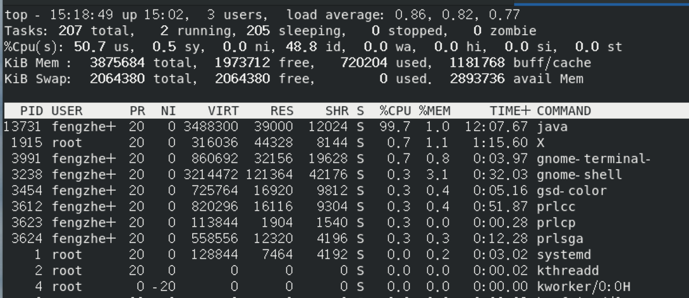
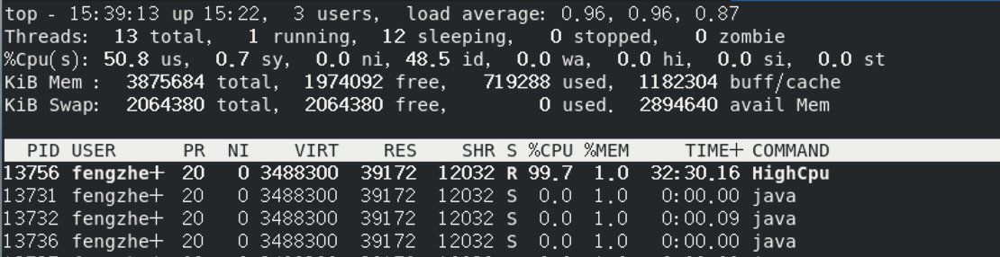
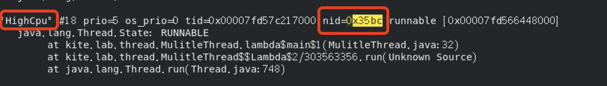
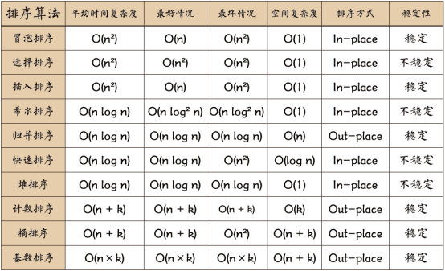
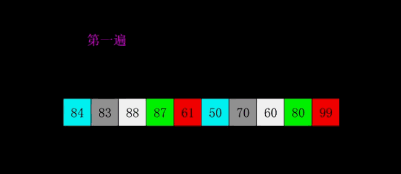

* content
{:toc}


# JAVA

## ==和equals

在Java中，equals和==都是用于检测两个字符串是否相等，返回类型也都是boolean值，但是二者内部处理却不一样。

1）对于==，比较的是值是否相等

​	如果作用于基本数据类型的变量，则直接比较其存储的 “值”是否相等；

​	如果作用于引用类型的变量，则比较的是所指向的对象的地址

2）对于equals方法，注意：equals方法不能作用于基本数据类型的变量，equals继承Object类，比较的是是否是同一个对象

​    如果没有对equals方法进行重写，则比较的是引用类型的变量所指向的对象的地址；

​	诸如String、Date等类对equals方法进行了重写的话，比较的是所指向的对象的内容。

## final、finally、finalize的区别

- final

  - java中的关键字，修饰符用于声明属性，方法和类，分别表示属性不可变，方法不可覆盖，类不可继承。

  > final：。
  > A).如果一个类被声明为final，就意味着它不能再派生出新的子类，不能作为父类被继承。因此，一个类不能同时被声明为abstract抽象类的和final的类。
  > B).如果将变量或者方法声明为final，可以保证它们在使用中不被改变.
  > 　　1)被声明为final的变量必须在声明时给定初值，而在以后的引用中只能读取，不可修改。
  > 　　2)被声明final的方法只能使用，不能重载。

- finally

  - 是异常处理语句结构的一部分，表示总是执行。

  > finally：java的一种异常处理机制。
  >
  > finally是对Java异常处理模型的最佳补充。finally结构使代码总会执行，而不管无异常发生。使用finally可以维护对象的内部状态，并可以清理非内存资源。特别是在关闭数据库连接这方面，如果程序员把数据库连接的close()方法放到finally中，就会大大降低程序出错的几率。

- finalize

  - 是Object类的一个方法，在垃圾收集器执行的时候会调用被回收对象的此方法，供垃圾收集时的其他资源回收，例如关闭文件等。

  > finalize：Java中的一个方法名。
  > Java技术使用finalize()方法在垃圾收集器将对象从内存中清除出去前，做必要的清理工作。这个方法是由垃圾收集器在确定这个对象没被引用时对这个对象调用的。它是在Object类中定义的，因此所的类都继承了它。子类覆盖finalize()方法以整理系统资源或者执行其他清理工作。finalize()方法是在垃圾收集器删除对象之前对这个对象调用的。

## 多线程的创建方式

1. 继成java.lang.Thread, 重写run()方法

```java
public class Main {
    public static void main(String[] args) {
        new MyThread().start();
    }
}

class MyThread extends Thread {
    @Override
    public void run() {
        System.out.println(Thread.currentThread().getName() + "\t" + Thread.currentThread().getId());
    }
}
```

2. 实现java.lang.Runnable接口，重写run()方法，然后使用Thread类来包装

```java
public class Main {
    public static void main(String[] args) {
    	 // 将Runnable实现类作为Thread的构造参数传递到Thread类中，然后启动Thread类
        MyRunnable runnable = new MyRunnable();
        new Thread(runnable).start();
    }
}

class MyRunnable implements Runnable {
    @Override
    public void run() {
        System.out.println(Thread.currentThread().getName() + "\t" + Thread.currentThread().getId());
    }
}
```

## 抽象类和接口的区别

**区别**

(一) 继承方面：
    (1) 抽象类只能单继承；接口可以多实现
(二) 成员属性方面：
    (1) 抽象类中可以有普通属性，也可以有常量
    (2) 接口中的成员变量全部默认是常量，使用public static final修饰，这个可以省略不写
(三) 代码块方面：
    (1) 抽象类可以含初始化块；接口不能含初始化块
(四) 构造函数方面：
    (1) 抽象类可以有构函数，但是这里的构造函数不是用来创建对象的，而且用来被实现类调用进行初始化操作的

​    (2) 接口不能有构造函数

(五) 方法方面：
    (1) 抽象类里面可以定义静态方法；接口里面不能定义静态方法
    (2) 抽象类里面可以有抽象方法也可以有普通方法；接口里面只能是抽象方法

**相同**

1) 接口与抽象类都不能被实例化，需要被其他进行实现或继承
(2) 接口与抽象类里面都能包含抽象方法，实现接口或继承抽象类的子类都必须实现这些抽象方法

## Volatile和ThreadLocal的理解及其作用

tobe

## HashMap、hashTable、ConCurrentHashMap区别原理

to be

## String，StringBuilder，StringBuffer

tobe		

## int和integer的区别

## 重写和重载的区别

# PYTHON

## 基本类型区别

一、列表

**1.任意对象的有序集合** 
列表是一组任意类型的值，按照一定顺序组合而成的 
**2.通过偏移读取** 
组成列表的值叫做元素(Elements)。每一个元素被标识一个索引，第一个索引是0，序列的功能都能实现 
**3.可变长度，异构以及任意嵌套** 
列表中的元素可以是任意类型，甚至是列表类型，也就是说列表可以嵌套 
**4.可变的序列** 
支持索引、切片、合并、删除等等操作，它们都是在原处进行修改列表 
**5.对象引用数组** 
列表可以当成普通的数组，每当用到引用时，Python总是会将这个引用指向一个对象，所以程序只需处理对象的操作。当把一个对象赋给一个数据结构元素或变量名时，Python总是会存储对象的引用，而不是对象的一个拷贝

 

二、元组

**1.任意对象的有序集合** 
与列表相同 
**2.通过偏移存取** 
与列表相同 
**3.属于不可变序列类型** 
类似于字符串，但元组是不可变的，不支持在列表中任何原处修改操作，不支持任何方法调用 
**4.固定长度、异构、任意嵌套** 
固定长度即元组不可变，在不被拷贝的情况下长度固定，其他同列表 
**5.对象引用的数组** 
与列表相似，元祖是对象引用的数组

**和list相比** 
1.比列表操作速度快 
2.对数据“写保护“ 
3.可用于字符串格式化中 
4.可作为字典的key

 

三、字典

1. 通过键而不是偏移量来读取
   字典就是一个关联数组，是一个通过关键字索引的对象的集合，使用键-值（key-value）进行存储，查找速度快 
2. 任意对象的无序集合
   字典中的项没有特定顺序，以“键”为象征 
3. 可变长、异构、任意嵌套
   同列表，嵌套可以包含列表和其他的字典等 
4. 属于可变映射类型
   因为是无序，故不能进行序列操作，但可以在远处修改，通过键映射到值。字典是唯一内置的映射类型（键映射到值的对象） 
5. 对象引用表
   字典存储的是对象引用，不是拷贝，和列表一样。字典的key是不能变的，list不能作为key，字符串、元祖、整数等都可以

**和list比较，dict有以下几个特点：** 
1.查找和插入的速度极快，不会随着key的增加而增加 
2.需要占用大量的内存，内存浪费多 
**而list相反：** 
1.查找和插入的时间随着元素的增加而增加 
2.占用空间小，浪费内存很少 
所以，dict是用空间来换取时间的一种方法

 

四、集合

**1.是一组key的集合，但不存储value，并且key不能重复** 
创建一个set，需要提供一个list作为输入集合,s = set([1,2,3]),注意，传入的参数 [1, 2, 3] 是一个list，而显示的 set([1, 2, 3]) 只是告诉你这个set内部有1，2，3这3个元素，显示的[ ]不表示这是一个list 
**2.重复元素在set中自动被过滤** 
set可以看成数学意义上的无序和无重复元素的集合，因此，两个set可以做数学意义上的交集、并集等操作

**还有一种集合是forzenset( )，是冻结的集合，它是不可变的，存在哈希值，好处是它可以作为字典的key，也可以作为其它集合的元素。缺点是一旦创建便不能更改，没有add，remove方法**

**和dict对比** 
1.set和dict的唯一区别仅在于没有存储对应的value 
2.set的原理和dict一样，同样不可以放入可变对象，因为无法判断两个可变对象是否相等，也就无法保证set内部“不会有重复元素”

## 字典合并

1. 使用 update() 方法，第二个参数合并第一个参数

   ```python
   def Merge(dict1, dict2): 
       return(dict2.update(dict1)) 
         
   # 两个字典
   dict1 = {'a': 10, 'b': 8} 
   dict2 = {'d': 6, 'c': 4} 
     
   # 返回  None 
   print(Merge(dict1, dict2)) 
     
   # dict2 合并了 dict1
   print(dict2)
   #None
   #{'d': 6, 'c': 4, 'a': 10, 'b': 8}
   ```

   

2. 使用 **，函数将参数以字典的形式导入

   ```python
   def Merge(dict1, dict2): 
       res = {**dict1, **dict2} 
       return res 
         
   # 两个字典
   dict1 = {'a': 10, 'b': 8} 
   dict2 = {'d': 6, 'c': 4} 
   dict3 = Merge(dict1, dict2) 
   print(dict3)
   
   #{'a': 10, 'b': 8, 'd': 6, 'c': 4}
   ```

## 元组

list 是可变的对象，元组 tuple 是不可变的对象！

tuple 放弃了对元素的增删（内存结构设计上变的更精简），换取的是性能上的提升：创建 tuple 比 list 要快，存储空间比 list 占用更小

* **tuple**

  * 如果要创建的元组中只有一个元素，要在它的后面加上一个逗号‘，’。

  * 使用场景：

    * 函数返回（return）多个值

    * 字符串格式化拼接

    * 交换两个数的值

    * 多值函数传参

      ```python
      def demo(*args):
      	print(args)
       
      
      demo((1,2,3,4,5))
      ((1, 2, 3, 4, 5),)
      
      demo(1,2,3,4,5)
      (1, 2, 3, 4, 5)
      ```

    * 其他常用函数

      * 在socket模块，ip与端口号通常作为一个元组传递，并且recv（），recvfrom（），accept（），都返回一个元组
      * 在多线程，进程中，args=（）以元组进行参数的传递

  * 更新和删除元组：

    > 直接在同一个元组上更新是不可行的，但是可以通过拷贝现有的元组片段构造一个新的元组的方式解决。
    > 通过分片的方法让元组拆分成两部分，然后再使用连接操作符（+）合并成一个新元组，最后将原来的变量名（temp）指向连接好的新元组。在这里就要注意了，逗号是必须的，小括号也是必须的！
    >
    > ```python
    > temp = ("龙猫","泰迪","叮当猫")
    > temp = temp[:2] + ("小猪佩奇",)+temp[2:]
    > print(temp)
    > """
    > ('龙猫', '泰迪', '小猪佩奇', '叮当猫')
    > ```

## 多线程与多进程

* 进程：资源单位

  1. 申请内存空间  耗资源
  2. 拷贝代码      耗资源

  * 实现
    * multiprocessing.Process()方法
    * 继承Process类，实现run方法

* 线程：执行单位

  * 一个进程可以开多个线程，在同一个进程内开多个线程无需再次申请内存空间操作
  * 开线程的开销要远小于开进程的开销
  * 同一个进程下的多个线程数据是共享的
  * 实现
    * threading.Thread()方法   
    * 继承Thread类，实现run方法

## 装饰器

```python
def wrapper(func):
    def inner(*args, **kwargs):
        ret = func(*args, **kwargs)
        return ret
    return inner
@wrapper
functions(a,b,c)

# 带参数的装饰器
def out(*args1, **kwargs1):
  def wrapper(func):
    def inner(*args2, **kwargs2):
        ret = func(*args2, **kwargs2)
        return ret
    return inner
  return wrapper

@out(args1=1,args2=2)
function(a,b,c)
```


# APP

## activity的生命周期

onCreate -> onStart -> onResume -> onPause -> onStop -> onDestroy

## 安卓4大组件

* activity 
* contentprovider 
* service 
* broadcastReceiver


# DB

## innodb引擎和MYISAM引擎的区别

> ### InnoDB存储引擎
>
> InnoDB是一个事务型的存储引擎，设计目标是处理大数量数据时提供高性能的服务，它在运行时会在内存中建立缓冲池，用于缓冲数据和索引。
>
> #### InnoDB优点
>
> **1.支持事务处理、ACID事务特性；**
>
> **2.实现了SQL标准的四种隔离级别；**
>
> **3.支持行级锁和外键约束；**
>
> **4.可以利用事务日志进行数据恢复。**
>
> #### InnoDB缺点
>
> **1.不支持FULLTEXT类型的索引，因为它没有保存表的行数，当使用COUNT统计时会扫描全表。**
>
> #### InnoDB适用场景
>
> **1.需要事务的操作；**
>
> **2.更新数据需要使用行级锁；**
>
> **3.大数据量读写；**
>
> **4.大型互联网应用。**
>
> ### MyISAM存储引擎
>
> MyISAM是MySQL默认的引擎，它的设计目标是快速读取。
>
> #### MyISAM优点
>
> **1.高性能读取；**
>
> **2.因为它保存了表的行数，当使用COUNT统计时不会扫描全表；**
>
> #### MyISAM缺点
>
> **1.不支持数据库事务；**
>
> **2.不支持行级锁和外键；**
>
> **3.INSERT和UPDATE操作需要锁定整个表；**
>
> **4.不支持故障恢复；**
>
> #### MyISAM适用场景
>
> **1.不需要事务的操作；**
>
> **2.插入、更新少，读取频繁；**
>
> **3.频繁的统计计算。**


## 数据库索引

1. **索引**

索引是快速搜索的关键。在数据库表中，对字段建立索引可以大大提高查询速度。

* 普通索引

  * ```
    CREATE INDEX indexName ON mytable(username(length)); 
    ```

* 唯一索引

  * ```
    CREATE UNIQUE INDEX indexName ON mytable(username(length)) 
    ```

* 主键索引

  * 它是一种特殊的唯一索引，不允许有空值。一般是在建表的时候同时创建主键索引

  * ```
    CREATE TABLE mytable(  
     
    ID INT NOT NULL,   
     
    username VARCHAR(16) NOT NULL,  
     
    PRIMARY KEY(ID)  
     
    ); 
    ```

* 联合索引

  * ```
    ALTER TABLE mytable ADD INDEX name_city_age (name(10),city,age); 
    ```

2. **不足**：

* 虽然索引大大提高了查询速度，同时却会降低更新表的速度，如对表进行INSERT、UPDATE和DELETE。因为更新表时，MySQL不仅要保存数据，还要保存一下索引文件。

* 建立索引会占用磁盘空间的索引文件。一般情况这个问题不太严重，但如果你在一个大表上创建了多种组合索引，索引文件的会膨胀很快。

3. **使用事项：**

* 索引不会包含有NULL值的列

只要列中包含有NULL值都将不会被包含在索引中，复合索引中只要有一列含有NULL值，那么这一列对于此复合索引就是无效的。所以我们在数据库设计时不要让字段的默认值为NULL。

* 使用短索引

对串列进行索引，如果可能应该指定一个前缀长度。例如，如果有一个CHAR(255)的列，如果在前10个或20个字符内，多数值是惟一的，那么就不要对整个列进行索引。短索引不仅可以提高查询速度而且可以节省磁盘空间和I/O操作。

* 索引列排序

MySQL查询只使用一个索引，因此如果where子句中已经使用了索引的话，那么order by中的列是不会使用索引的。因此数据库默认排序可以符合要求的情况下不要使用排序操作；尽量不要包含多个列的排序，如果需要最好给这些列创建复合索引。

* like语句操作

一般情况下不鼓励使用like操作，如果非使用不可，如何使用也是一个问题。like “%aaa%” 不会使用索引而like “aaa%”可以使用索引。

* 不要在列上进行运算

  将在每个行上进行运算，这将导致索引失效而进行全表扫描

4. **索引原理**：
   * B+树
   * O(logn)

## 事务以及特性

事务：是数据库操作的最小工作单元，是作为单个逻辑工作单元执行的一系列操作；这些操作作为一个整体一起向系统提交，要么都执行、要么都不执行；事务是一组不可再分割的操作集合（工作逻辑单元）。

* **四大特性：**

1. 原子性 （Atomicity）
   原子性是指事务包含的所有操作要么全部成功，要么全部失败回滚。

   因此事务的操作如果成功就必须要完全应用到数据库，如果操作失败则不能对数据库有任何影响。

2. 一致性 （Consistency）

   一致性是指事务必须使数据库从一个一致性状态变换到另一个一致性状态，也就是说一个事务执行之前和执行之后都必须处于一致性状态。

3. 隔离性 （Isolation）
   一个事务的执行不能其它事务干扰。即一个事务内部的操作及使用的数据对其它并发事务是隔离的，并发执行的各个事务之间不能互相干扰。 

4. 持续性 （Durability）
   也称永久性，指一个事务一旦提交，它对数据库中的数据的改变就应该是永久性的。接下来的其它操作或故障不应该对其执行结果有任何影响。 

* 问题

  * 脏读
    * 脏读是指在一个事务处理过程里读取了另一个未提交的事务中的数据。
  * 不可重复读
    * 不可重复读是指在对于数据库中的某个数据，一个事务范围内多次查询却返回了不同的数据值，这是由于在查询间隔，被另一个事务修改并提交了。
  * 幻读
    * 一个事务在前后两次查询同一范围的时候，后一次查询看到了前一次查询没有看到的行。
    * 幻读专指新插入的行

  > 幻读和不可重复读都是读取了另一条已经提交的事务（这点就脏读不同），所不同的是不可重复读查询的都是同一个数据项，而幻读针对的是一批数据整体（比如数据的个数）。

* 四个隔离级别

  ​		① Serializable (串行化)：可避免脏读、不可重复读、幻读的发生。

  　　② Repeatable read (可重复读)：可避免脏读、不可重复读的发生。

  > mysql默认隔离级别

  　　③ Read committed (读已提交)：可避免脏读的发生。

  > oracle 默认隔离级别

  　　④ Read uncommitted (读未提交)：最低级别，任何情况都无法保证。

## 死锁以及死锁的条件

[死锁文章](https://www.cnblogs.com/ldcs/p/12001896.html)

* 死锁

  死锁是指两个或两个以上的进程（线程）在运行过程中因争夺资源而造成的一种僵局（Deadly-Embrace) ) ，若无外力作用，这些进程（线程）都将无法向前推进。

* 四个条件

  * 互斥条件：
    进程要求对所分配的资源（如打印机）进行排他性控制，即在一段时间内某资源仅为一个进程所占有。此时若有其他进程请求该资源，则请求进程只能等待。

  * 不可剥夺条件:
    进程所获得的资源在未使用完毕之前，不能被其他进程强行夺走，即只能由获得该资源的进程自己来释放（只能是主动释放)。

  * 请求与保持条件：
    进程已经保持了至少一个资源，但又提出了新的资源请求，而该资源已被其他进程占有，此时请求进程被阻塞，但对自己已获得的资源保持不放。

  * 循环等待条件:
    存在一种进程资源的循环等待链，链中每一个进程已获得的资源同时被 链中下一个进程所请求。即存在一个处于等待状态的进程集合{Pl, P2, …, pn}，其中Pi等 待的资源被P(i+1)占有（i=0, 1, …, n-1)，Pn等待的资源被P0占有。

* 处理死锁的方法

  * 预防死锁

    * 破坏“互斥”条件:

    就是在系统里取消互斥。若资源不被一个进程独占使用，那么死锁是肯定不会发生的。但一般来说在所列的四个条件中，“互斥”条件是无法破坏的。因此，在死锁预防里主要是破坏其他几个必要条件，而不去涉及破坏“互斥”条件。

    注意：互斥条件不能被破坏，否则会造成结果的不可再现性。

    * 破坏“占有并等待”条件:

    　　破坏“占有并等待”条件，就是在系统中不允许进程在已获得某种资源的情况下，申请其他资源。即要想出一个办法，阻止进程在持有资源的同时申请其他资源。
    　　方法一：创建进程时，要求它申请所需的全部资源，系统或满足其所有要求，或什么也不给它。这是所谓的 “ 一次性分配”方案。
    　　方法二：要求每个进程提出新的资源申请前，释放它所占有的资源。这样，一个进程在需要资源S时，须先把它先前占有的资源R释放掉，然后才能提出对S的申请，即使它可能很快又要用到资源R。

    * 破坏“不可抢占”条件：

    　　破坏“不可抢占”条件就是允许对资源实行抢夺。

    　　方法一：如果占有某些资源的一个进程进行进一步资源请求被拒绝，则该进程必须释放它最初占有的资源，如果有必要，可再次请求这些资源和另外的资源。
    　　方法二：如果一个进程请求当前被另一个进程占有的一个资源，则操作系统可以抢占另一个进程，要求它释放资源。只有在任意两个进程的优先级都不相同的条件下，方法二才能预防死锁。

    * 破坏“循环等待”条件：

    　　破坏“循环等待”条件的一种方法，是将系统中的所有资源统一编号，进程可在任何时刻提出资源申请，但所有申请必须按照资源的编号顺序（升序）提出。这样做就能保证系统不出现死锁。

  * 避免死锁

    * 常用避免死锁的方法
      * 有序资源分配法
      * 银行家算法
    * 常用避免死锁的技术
      * 加锁顺序（线程按照一定的顺序加锁）
      * 加锁时限（线程尝试获取锁的时候加上一定的时限，超过时限则放弃对该锁的请求，并释放自己占有的锁）
      * 死锁检测

  * 检测死锁

  *  解除死锁

## 乐观锁和悲观锁

* 悲观锁

  总是假设最坏的情况，每次去拿数据的时候都认为别人会修改，所以每次在拿数据的时候都会上锁，这样别人想拿这个数据就会阻塞直到它拿到锁（**共享资源每次只给一个线程使用，其它线程阻塞，用完后再把资源转让给其它线程**）。传统的关系型数据库里边就用到了很多这种锁机制，比如行锁，表锁等，读锁，写锁等，都是在做操作之前先上锁。Java中`synchronized`和`ReentrantLock`等独占锁就是悲观锁思想的实现。

  * 悲观锁的实现：

    传统的关系型数据库使用这种锁机制，比如行锁，表锁等，读锁，写锁等，都是在做操作之前先上锁。

    Java 里面的同步 synchronized关键字的实现。

  * 悲观锁主要分为共享锁和排他锁：
    * 共享锁【shared locks】又称为读锁，简称S锁。顾名思义，共享锁就是多个事务对于同一数据可以共享一把锁，都能访问到数据，但是只能读不能修改。
    * 排他锁【exclusive locks】又称为写锁，简称X锁。顾名思义，排他锁就是不能与其他锁并存，如果一个事务获取了一个数据行的排他锁，其他事务就不能再获取该行的其他锁，包括共享锁和排他锁，但是获取排他锁的事务是可以对数据行读取和修改。

* 乐观锁

  总是假设最好的情况，每次去拿数据的时候都认为别人不会修改，所以不会上锁，但是在更新的时候会判断一下在此期间别人有没有去更新这个数据，可以使用版本号机制和CAS算法实现。**乐观锁适用于多读的应用类型，这样可以提高吞吐量**，像数据库提供的类似于**write_condition机制**，其实都是提供的乐观锁。

  * CAS 实现：Java 中java.util.concurrent.atomic包下面的原子变量使用了乐观锁的一种 CAS 实现方式。

    * 即**compare and swap（比较与交换）**，是一种有名的**无锁算法**。无锁编程，即不使用锁的情况下实现多线程之间的变量同步，也就是在没有线程被阻塞的情况下实现变量的同步，所以也叫非阻塞同步（Non-blocking Synchronization）。

    * **CAS算法**涉及到三个操作数

      - 需要读写的内存值 V
      - 进行比较的值 A
      - 拟写入的新值 B

      当且仅当 V 的值等于 A时，CAS通过原子方式用新值B来更新V的值，否则不会执行任何操作（比较和替换是一个原子操作）。一般情况下是一个**自旋操作**，即**不断的重试**。

  * 版本号控制：一般是在数据表中加上一个数据版本号 version 字段，表示数据被修改的次数。当数据被修改时，version 值会+1。当线程A要更新数据值时，在读取数据的同时也会读取 version 值，在提交更新时，若刚才读取到的 version 值与当前数据库中的 version 值相等时才更新，否则重试更新操作，直到更新成功。
  * 乐观锁缺点：
    * ABA 问题
      * 如果一个变量V初次读取的时候是A值，并且在准备赋值的时候检查到它仍然是A值。在这段时间它的值可能被改为其他值，然后又改回A，那CAS操作就会误认为它从来没有被修改过。这个问题被称为CAS操作的 **"ABA"问题。**
    * 循环时间长开销大
      * 自旋CAS（也就是不成功就一直循环执行直到成功）如果长时间不成功，会给CPU带来非常大的执行开销。
    * 只能保证一个共享变量的原子操作
      * CAS 只对单个共享变量有效，当操作涉及跨多个共享变量时 CAS 无效。

## MySQL 行锁 表锁机制

[MySQL 行锁 表锁机制](https://www.cnblogs.com/itdragon/p/8194622.html)

* 行锁
  * 行锁的劣势：开销大；加锁慢；会出现死锁
  * 行锁的优势：锁的粒度小，发生锁冲突的概率低；处理并发的能力强
  * 加锁的方式：自动加锁。对于UPDATE、DELETE和INSERT语句，InnoDB会自动给涉及数据集加排他锁；对于普通SELECT语句，InnoDB不会加任何锁；当然我们也可以显示的加锁：
    * 共享锁：select * from tableName where ... + lock in share more
    * 排他锁：select * from tableName where ... + for update
  * InnoDB和MyISAM的最大不同点有两个：
    * 一，InnoDB支持事务(transaction)；
    * 二，默认采用行级锁。

* 表锁
  * 表锁的优势：开销小；加锁快；无死锁
  * 表锁的劣势：锁粒度大，发生锁冲突的概率高，并发处理能力低
  * 加锁的方式：自动加锁。查询操作（SELECT），会自动给涉及的所有表加读锁，更新操作（UPDATE、DELETE、INSERT），会自动给涉及的表加写锁。也可以显示加锁：
    * 共享读锁：lock table tableName read;
    * 独占写锁：lock table tableName write;
    * 批量解锁：unlock tables;

## left join right join

* 左连接
  * 表1左连接表2，以左为主，表示以表1为主，关联上表2的数据，查出来的结果显示左边的所有数据，然后右边显示的是和左边有交集部分的数据，如果无交集则返回空

* 右连接反过来
* Join
  * 其实就是“inner join”，为了简写才写成join，两个是表示一个的，内连接，表示以两个表的交集为主，查出来是两个表有交集的部分，其余没有关联就不额外显示出来

## 给一个sql从哪些方面考虑优化查询效率

to be

## SQL

* 查找平均分大于60的同学
  Student(stuId,stuName)
  Course(courseId,courseName)
  Score(stuId,courseId)

  ````python
  -- Student(stuId,stuName)
  -- Course(courseId,courseName)
  -- Score(stuId,courseId,scores)
  -- 
  -- create table my_student(
  -- stuId int,
  -- stuName varchar(15) 
  -- )
  -- 
  -- create table my_course(
  -- courseId int,
  -- courseName varchar(15) 
  -- )
  -- 
  -- create table my_score(
  -- stuId int,
  -- courseId int,
  -- scores varchar(15) 
  -- )
  
  
  
  -- 查找平均分大于60的同学
  -- select stuId from my_score group by stuId having avg(scores)>90
  select * from my_student where stuId in (select stuId from my_score group by stuId having avg(scores)>90)
  ````

  

# 操作系统

## CPU的调度算法

1. 先来先服务调度算法FCFS

就是先来先服务的调度算法，哪个任务先进来，就为哪个任务先服务。

> （1）按照作业提交，或进程变为就绪状态的先后次序分派CPU；
> （2）新作业只有当当前作业或进程执行完或阻塞才获得CPU运行
> （3）被唤醒的作业或进程不立即恢复执行，通常等到当前作业或进程出让CPU。（所以，默认即是非抢占方式）
> （4）有利于CPU繁忙型的作业，而不利于I/O繁忙的作业（进程）。

2. 短作业（进程）优先调度算法SJF（非抢占）/SPF（抢占）

（1）平均周转时间、平均带权周转时间都有明显改善。SJF/SPF调度算法能有效的降低作业的平均等待时间，提高系统吞吐量。
（2）未考虑作业的紧迫程度，因而不能保证紧迫性作业（进程）的及时处理、对长作业的不利、作业（进程）的长短含主观因素，不一定能真正做到短作业优先。

3. 高优先权优先调度算法HPF

4. 基于时间片的轮转调度算法RR

> （1）时间片轮转算法
> 过程：1、排成一个队列。2、每次调度时将CPU分派给队首进程。3、时间片结束时，发生时钟中断。4、暂停当前进程的执行，将其送到就绪队列的末尾，并通过上下文切换执行当前就绪的队首进程。
> 说明：1、进程阻塞情况发生时，未用完时间片也要出让CPU。2、能够及时响应，但没有考虑作业长短等问题。3、系统的处理能力和系统的负载状态影响时间片长度。
> （2）多级反馈队列算法FB
> 过程：1、准备调度：先将它放入第一个队列的末尾，按FCFS原则排队等待调度。2、IF时间片内完成，便可准备撤离系统。3、IF时间片内未能完成，调度程序便将该进程转入第二队列的末尾等待再次被调度执行。4、当第一队列中的进程都执行完，系统再按FCFS原则调度第二队列。在第二队列的稍放长些的时间片内仍未完成，再依次将它放入第三队列。5、依次降到第n队列后，在第n队列中便采取按时间片轮转的方式运行。
> 说明:1、设置多个就绪队列，各队列有不同的优先级,优先级从第一个队列依次降低。2、赋予各队列进程执行时间片大小不同, 优先权越高，时间片越短。3、仅当优先权高的队列（如第一队列）空闲时，调度程序才调度第二队列中的进程运行。4、高优先级抢占时，被抢占的进程放回原就绪队列末尾。


## 进程的各种状态

（1）新建态一一就绪态:当操作系统完成了进程创建的必要操作，并且当前系统的性能和内存的容量均允许。

（2）就绪态一一终止态:未在状态转换图中显示，但某些操作系统允许父进程终结子进程。

（3）运行态一一终止态:当1个进程到达了自然结束点，或是出现了无法克服的错误，或是被操作系统所终结，或是被其他有终止权的进程所终结。

（4）等待态一一终止态:未在状态转换图中显示，但某些操作系统允许父进程终结子进程。

（5）终止态一一NULL:完成善后操作。

> （1）运行态一一等待态：等待使用资源或某事件发生，如等待外设传输;等待人工干预。	
>
> （2）等待态一一就绪态：资源得到满足或某事件己经发生，如外设传输结束；人工干预完成。
>
> （3）运行态一一就绪态：运行时间片到，或出现有更高优先权进程。
>
> （4）就绪态一一运行态：CPU空闲时被调度选中一个就绪进程执行。


## 进程间怎么互相通信

进程间通信（IPC，InterProcess Communication）是指在不同进程之间传播或交换信息。

IPC的方式通常有管道（包括无名管道和命名管道）、消息队列、信号量、共享存储、Socket、Streams等。其中 Socket和Streams支持不同主机上的两个进程IPC。

> **总结**
>
> 1.管道：速度慢，容量有限，只有父子进程能通讯   
>
> 2.FIFO：任何进程间都能通讯，但速度慢   
>
> 3.消息队列：容量受到系统限制，且要注意第一次读的时候，要考虑上一次没有读完数据的问题   
>
> 4.信号量：不能传递复杂消息，只能用来同步   
>
> 5.共享内存区：能够很容易控制容量，速度快，但要保持同步，比如一个进程在写的时候，另一个进程要注意读写的问题，相当于线程中的线程安全，当然，共享内存区同样可以用作线程间通讯，不过没这个必要，线程间本来就已经共享了同一进程内的一块内存

1. 管道

   * 管道，通常指无名管道，是 UNIX 系统IPC最古老的形式。

   * 特点：
     * 它是半双工的（即数据只能在一个方向上流动），具有固定的读端和写端。
     * 它只能用于具有亲缘关系的进程之间的通信（也是父子进程或者兄弟进程之间）。
     * 它可以看成是一种特殊的文件，对于它的读写也可以使用普通的read、write 等函数。但是它不是普通的文件，并不属于其他任何文件系统，并且只存在于内存中。

2. FIFO

   * FIFO，也称为命名管道，它是一种文件类型。
   * 特点
     * FIFO可以在无关的进程之间交换数据，与无名管道不同。
     * FIFO有路径名与之相关联，它以一种特殊设备文件形式存在于文件系统中。

3. 消息队列

   * 消息队列，是消息的链接表，存放在内核中。一个消息队列由一个标识符（即队列ID）来标识。
   * 特点
     * 消息队列是面向记录的，其中的消息具有特定的格式以及特定的优先级。
     * 消息队列独立于发送与接收进程。进程终止时，消息队列及其内容并不会被删除。
     * 消息队列可以实现消息的随机查询,消息不一定要以先进先出的次序读取,也可以按消息的类型读取。

4. 信号量

   * 信号量（semaphore）与已经介绍过的 IPC 结构不同，它是一个计数器。信号量用于实现进程间的互斥与同步，而不是用于存储进程间通信数据。
   * 特点
     * 信号量用于进程间同步，若要在进程间传递数据需要结合共享内存。
     * 信号量基于操作系统的 PV 操作，程序对信号量的操作都是原子操作。
     * 每次对信号量的 PV 操作不仅限于对信号量值加 1 或减 1，而且可以加减任意正整数。
     * 支持信号量组。

5. 共享内存

   * 共享内存（Shared Memory），指两个或多个进程共享一个给定的存储区。

   * 特点
     * 共享内存是最快的一种 IPC，因为进程是直接对内存进行存取。
     * 因为多个进程可以同时操作，所以需要进行同步。
     * 信号量+共享内存通常结合在一起使用，信号量用来同步对共享内存的访问。

## 多线程的优点与缺点

- 优点:

能适当提高程序的执行效率

能适当提高资源利用率（CPU、内存利用率）

- 缺点:

开启线程需要占用一定的内存空间（默认情况下，主线程占用1M，子线程占用512KB），如果开启大量的线程，会占用大量的内存空间，降低程序的性能

线程越多，CPU在调度线程上的开销就越大

程序设计更加复杂：比如线程之间的通信、多线程的数据共享

## 进程和线程的区别

* 什么是进程？什么是线程？

进程是系统中正在运行的一个程序，程序一旦运行就是进程。

进程可以看成程序执行的一个实例。进程是系统资源分配的独立实体，每个进程都拥有独立的地址空间。一个进程无法访问另一个进程的变量和数据结构，如果想让一个进程访问另一个进程的资源，需要使用进程间通信，比如管道，文件，套接字等。

一个进程可以拥有多个线程，每个线程使用其所属进程的栈空间。线程与进程的一个主要区别是，统一进程内的一个主要区别是，同一进程内的多个线程会共享部分状态，多个线程可以读写同一块内存（一个进程无法直接访问另一进程的内存）。同时，每个线程还拥有自己的寄存器和栈，其他线程可以读写这些栈内存。

线程是进程的一个实体，是进程的一条执行路径。

线程是进程的一个特定执行路径。当一个线程修改了进程的资源，它的兄弟线程可以立即看到这种变化。

* 进程和线程的区别体现在以下几个方面：

1.地址空间和其他资源（如打开文件）：进程间相互独立，同一进程的各线程间共享。某进程内的线程在其他进程内不可见。

2.通信：进程间通信IPC（管道，信号量，共享内存，消息队列），线程间可以直接独写进程数据段（如全局变量）来进程通信——需要进程同步和互斥手段的辅助，以保证数据的一致性。

3.调度和切换：线程上下文切换比进程上下文切换快得多。

* 进程和线程的选择取决以下几点：

1.需要频繁创建销毁的优先使用线程；因为对进程来说创建和销毁一个进程的代价是很大的。

2.线程的切换速度快，所以在需要大量计算，切换频繁时使用线程，还有耗时的操作时用使用线程可提高应用程序的响应。

3.因为对CPU系统的效率使用上线程更占优势，所以可能要发展到多机分布的用进程，多核分布用线程。

4.并行操作时用线程，如C/S架构的服务器端并发线程响应用户的请求。

5.需要更稳定安全时，适合选择进程；需要速度时，选择线程更好。

## 多线程和多进程的区别是什么

| 维度           | 多进程                                                       | 多线程                                 | 总结     |
| -------------- | ------------------------------------------------------------ | -------------------------------------- | -------- |
| 数据共享、同步 | 数据是分开的:共享复杂，需要用IPC;同步简单                    | 多线程共享进程数据：共享简单；同步复杂 | 各有优势 |
| 内存、CPU      | 占用内存多，切换复杂，CPU利用率低                            | 占用内存少，切换简单，CPU利用率高      | 线程占优 |
| 创建销毁、切换 | 创建销毁、切换复杂，速度慢                                   | 创建销毁、切换简单，速度快             | 线程占优 |
| 编程调试       | 编程简单，调试简单                                           | 编程复杂，调试复杂                     | 进程占优 |
| 可靠性         | 进程间不会相互影响                                           | 一个线程挂掉将导致整个进程挂掉         | 进程占优 |
| 分布式         | 适应于多核、多机分布 ；如果一台机器不够，扩展到多台机器比较简单 | 适应于多核分布                         | 进程占优 |

## fork（）和多进程

在Unix/Linux中，创建进程的函数是fork()，创建线程可以使用pthread库。fork()函数具有一个很新奇的特性，即“一次调用，两次返回”。

fork()返回两次的奥秘在于，子进程复制了父进程的地址空间包括堆栈段，并共享父进程的代码段。复制完成后，由于栈相同，父子进程都运行在fork()函数内，对于父进程，fork()函数返回子进程的pid，子进程的fork()返回0。这类似于链表，父进程“指向”子进程，子进程指向NULL。如果因此，可以通过判断fork()的返回值来知道目前运行的是父进程还是子进程以执行不同的操作。

```python
import os  # 系统模块
from time import sleep

pid = os.fork()  # 创建新进程
if pid < 0:
  print("Create process failed")
  elif pid == 0:
    sleep(3)
    print("The new process")
    else:
      sleep(4)
      print("The old process")

      print("Fork test over")
    
#The new process
#Fork test over
#The old process
#Fork test over

```

## linux常用命令

**系统信息** 

uname -r 显示正在使用的内核版本 

date 显示系统日期 


**关机 (系统的关机、重启以及登出 )** 
shutdown -h now 关闭系统

shutdown -c 取消按预定时间关闭系统 
shutdown -r now 重启
reboot 重启
logout 注销 


**文件和目录** 

ln -s file1 lnk1 创建一个指向文件或目录的软链接 
ln file1 lnk1 创建一个指向文件或目录的物理链接 

**文件搜索**

find / -name file1 从 '/' 开始进入根文件系统搜索文件和目录 

find / -user user1 搜索属于用户 'user1' 的文件和目录 

find /home/user1 -name \*.bin 在目录 '/ home/user1' 中搜索带有'.bin' 结尾的文件 

find /usr/bin -type f -mtime -10 搜索在10天内被创建或者修改过的文件 

**磁盘空间** 

df -h 显示已经挂载的分区列表 

du -sh dir1 估算目录 'dir1' 已经使用的磁盘空间' 

**打包和压缩文件** 

tar -cvfz archive.tar.gz dir1 创建一个gzip格式的压缩包 

tar -zxvf archive.tar.gz 解压一个gzip格式的压缩包 

zip file1.zip file1 创建一个zip格式的压缩包 
zip -r file1.zip file1 file2 dir1 将几个文件和目录同时压缩成一个zip格式的压缩包 
unzip file1.zip 解压一个zip格式压缩包 

rar x file1.rar 解压rar包 
unrar x file1.rar 解压rar包 


**查看文件内容** 
cat file1 从第一个字节开始正向查看文件的内容 
more file1 查看一个长文件的内容 
less file1 类似于 'more' 命令，但是它允许在文件中和正向操作一样的反向操作 
head -2 file1 查看一个文件的前两行 
tail -2 file1 查看一个文件的最后两行 
tail -f /var/log/messages 实时查看被添加到一个文件中的内容 


**文本处理** 

```
cat file1 file2 ... | command <> file1_in.txt_or_file1_out.txt general syntax for text manipulation using PIPE, STDIN and STDOUT 
cat file1 | command( sed, grep, awk, grep, etc...) > result.txt 合并一个文件的详细说明文本，并将简介写入一个新文件中 
cat file1 | command( sed, grep, awk, grep, etc...) >> result.txt 合并一个文件的详细说明文本，并将简介写入一个已有的文件中 
grep Aug /var/log/messages 在文件 '/var/log/messages'中查找关键词"Aug" 
grep ^Aug /var/log/messages 在文件 '/var/log/messages'中查找以"Aug"开始的词汇 
grep [0-9] /var/log/messages 选择 '/var/log/messages' 文件中所有包含数字的行 
grep Aug -R /var/log/* 在目录 '/var/log' 及随后的目录中搜索字符串"Aug" 
sed 's/stringa1/stringa2/g' example.txt 将example.txt文件中的 "string1" 替换成 "string2" 
sed '/^$/d' example.txt 从example.txt文件中删除所有空白行 
sed '/ *#/d; /^$/d' example.txt 从example.txt文件中删除所有注释和空白行 
echo 'esempio' | tr '[:lower:]' '[:upper:]' 合并上下单元格内容 
sed -e '1d' result.txt 从文件example.txt 中排除第一行 
sed -n '/stringa1/p' 查看只包含词汇 "string1"的行 
sed -e 's/ *$//' example.txt 删除每一行最后的空白字符 
sed -e 's/stringa1//g' example.txt 从文档中只删除词汇 "string1" 并保留剩余全部 
sed -n '1,5p;5q' example.txt 查看从第一行到第5行内容 
sed -n '5p;5q' example.txt 查看第5行 
sed -e 's/00*/0/g' example.txt 用单个零替换多个零 
cat -n file1 标示文件的行数 
cat example.txt | awk 'NR%2==1' 删除example.txt文件中的所有偶数行 
echo a b c | awk '{print $1}' 查看一行第一栏 
echo a b c | awk '{print $1,$3}' 查看一行的第一和第三栏 
paste file1 file2 合并两个文件或两栏的内容 
paste -d '+' file1 file2 合并两个文件或两栏的内容，中间用"+"区分 
sort file1 file2 排序两个文件的内容 
sort file1 file2 | uniq 取出两个文件的并集(重复的行只保留一份) 
sort file1 file2 | uniq -u 删除交集，留下其他的行 
sort file1 file2 | uniq -d 取出两个文件的交集(只留下同时存在于两个文件中的文件) 
comm -1 file1 file2 比较两个文件的内容只删除 'file1' 所包含的内容 
comm -2 file1 file2 比较两个文件的内容只删除 'file2' 所包含的内容 
comm -3 file1 file2 比较两个文件的内容只删除两个文件共有的部分 
```

文件传输

```
#本地复制到远程
scp local_file remote_username@remote_ip:remote_folder 
scp -r local_folder remote_username@remote_ip:remote_folder 

# 远程复制到本地
scp root@www.runoob.com:/home/root/others/music /home/space/music/1.mp3 
scp -r www.runoob.com:/home/root/others/ /home/space/music/
```

权限

```
chmod [-cfvR] [--help] [--version] mode file...
u 表示该文件的拥有者，g 表示与该文件的拥有者属于同一个群体(group)者，o 表示其他以外的人，a 表示这三者皆是。
+ 表示增加权限、- 表示取消权限、= 表示唯一设定权限。
r 表示可读取，w 表示可写入，x 表示可执行，X 表示只有当该文件是个子目录或者该文件已经被设定过为可执行。
所有者的权限用数字表达：属主的那三个权限位的数字加起来的总和。如 rwx ，也就是 4+2+1 ，应该是 7。
用户组的权限用数字表达：属组的那个权限位数字的相加的总和。如 rw- ，也就是 4+2+0 ，应该是 6。
其它用户的权限数字表达：其它用户权限位的数字相加的总和。如 r-x ，也就是 4+0+1 ，应该是 5。


chmod ugo+r file1.txt  #将文件 file1.txt 设为所有人皆可读取 
chmod a+r file1.txt  #chmod a+r file1.txt
chmod u+x ex1.py #将 ex1.py 设定为只有该文件拥有者可以执行
chmod ug+w,o-w file1.txt file2.txt   #将文件 file1.txt 与 file2.txt 设为该文件拥有者，与其所属同一个群体者可写入，但其他以外的人则不可写入 
chmod 664 file	对file的所有者和用户组设置读写权限, 为其其他用户设置读权限
chmod 777 file 
```

| 7    | 读 + 写 + 执行 | rwx  | 111  |
| ---- | -------------- | ---- | ---- |
| 6    | 读 + 写        | rw-  | 110  |
| 5    | 读 + 执行      | r-x  | 101  |
| 4    | 只读           | r--  | 100  |
| 3    | 写 + 执行      | -wx  | 011  |
| 2    | 只写           | -w-  | 010  |
| 1    | 只执行         | --x  | 001  |
| 0    | 无             | ---  | 000  |


# To be

# 网络

## 7层结构和4层结构


四层是tcp/ip模型，七层是osi模型
其中tcp/ip的第一层是osi的第一第二层
tcp/ip的第二层是osi的第三层
tcp/ip的第三层是osi的第四层
tcp/ip的第四层是osi的第五第六第七层
osi的层名字是物理，数据链路，网络，传输，会话，表示，应用

## 套接字

Socket是应用层与TCP/IP协议族通信的中间软件抽象层，它是一组接口，在设计模式中，Socket其实就是一个门面模式，它把复杂的TCP/IP协议族隐藏在Socket接口后面。

## TCP是如何保证可靠传输的

[TCP是如何保证可靠传输的](https://www.cnblogs.com/huajiezh/p/6593425.html)

1、确认和重传：接收方收到报文就会确认，发送方发送一段时间后没有收到确认就重传。

2、数据校验

3、数据合理分片和排序：

　　UDP：IP数据报大于1500字节,大于MTU.这个时候发送方IP层就需要分片(fragmentation).把数据报分成若干片,使每一片都小于MTU.而接收方IP层则需要进行数据报的重组.这样就会多做许多事情,而更严重的是,由于UDP的特性,当某一片数据传送中丢失时,接收方便无法重组数据报.将导致丢弃整个UDP数据报.

　　tcp会按MTU合理分片，接收方会缓存未按序到达的数据，重新排序后再交给应用层。

4、流量控制：当接收方来不及处理发送方的数据，能提示发送方降低发送的速率，防止包丢失。

5、拥塞控制：当网络拥塞时，减少数据的发送。


## tcp的三次握手和四次挥手

# to be

1. 客户端通过向服务器端发送一个SYN来创建一个主动打开，作为三路握手的一部分。客户端把这段连接的序号设定为随机数 A。

2. 服务器端应当为一个合法的SYN回送一个SYN/ACK。ACK 的确认码应为 A+1，SYN/ACK 包本身又有一个随机序号 B。

3. 最后，客户端再发送一个ACK。当服务端受到这个ACK的时候，就完成了三路握手，并进入了连接创建状态。此时包序号被设定为收到的确认号 A+1，而响应则为 B+1。

   

TCP区别于UDP最重要的特点是TCP必须建立在可靠的连接之上，连接的建立和释放就是握手和挥手的过程。

三次握手为连接的建立过程，握手失败则连接建立失败。

四次挥手为连接的**完整**释放过程，也会发生某个消息丢失或者超时的情况，有一方主动发送**FIN**消息即表示连接即将释放。


## http长连接和短连接

1. **长连接**

长连接，也叫持久连接，在TCP层握手成功后，**不立即**断开连接，并在此连接的基础上进行多次消息（包括心跳）交互，直至连接的任意一方（客户端OR服务端）主动断开连接，此过程称为一次完整的长连接。HTTP 1.1相对于1.0最重要的新特性就是引入了长连接。

2. **短连接**

短连接，顾名思义，与长连接的区别就是，客户端收到服务端的响应后，**立刻发送FIN消息**，主动释放连接。也有服务端主动断连的情况，凡是在一次消息交互（发请求-收响应）之后立刻断开连接的情况都称为短连接。

> 注：短连接是建立在TCP协议上的，有完整的握手挥手流程，区别于UDP协议

3. **如何快速区分当前连接使用的是长连接还是短连接**

1、凡是在一次完整的消息交互（发请求-收响应）之后，立刻断开连接（有一方发送FIN消息）的情况都称为短连接；

2、长连接的一个明显特征是会有心跳消息（也有没有心跳的情况），且一般心跳间隔都在30S或者1MIN左右，用wireshark抓包可以看到有规律的心跳消息交互（可能会存在毫秒级别的误差）。

4. **什么时候用长连接，短连接？**

1、需要**频繁交互**的场景使用长连接，如即时通信工具（微信/QQ，QQ也有UDP），相反则使用短连接，比如普通的web网站，只有当浏览器发起请求时才会建立连接，服务器返回相应后，连接立即断开。

2、**维持长连接**会有一定的系统开销，用户量少不容易看出系统瓶颈，一旦用户量上去了，就很有可能把服务器资源（内存/CPU/网卡）耗尽，所以使用需谨慎。


## https |http

1. **区别**

1、https协议需要到ca申请证书，一般免费证书较少，因而需要一定费用。

2、http是超文本传输协议，信息是明文传输，https则是具有安全性的ssl加密传输协议。

3、http和https使用的是完全不同的连接方式，用的端口也不一样，前者是80，后者是443。

4、http的连接很简单，是无状态的；HTTPS协议是由SSL+HTTP协议构建的可进行加密传输、身份认证的网络协议，比http协议安全。

2. **https过程**

客户端在使用HTTPS方式与Web服务器通信时有以下几个步骤，如图所示。

　　（1）客户使用https的URL访问Web服务器，要求与Web服务器建立SSL连接。

　　（2）Web服务器收到客户端请求后，会将网站的证书信息（证书中包含公钥）传送一份给客户端。

　　（3）客户端的浏览器与Web服务器开始协商SSL连接的安全等级，也就是信息加密的等级。

　　（4）客户端的浏览器根据双方同意的安全等级，建立会话密钥，然后利用网站的公钥将会话密钥加密，并传送给网站。

　　（5）Web服务器利用自己的私钥解密出会话密钥。

　　（6）Web服务器利用会话密钥加密与客户端之间的通信。


3. **HTTPS的优点**

　　尽管HTTPS并非绝对安全，掌握根证书的机构、掌握加密算法的组织同样可以进行中间人形式的攻击，但HTTPS仍是现行架构下最安全的解决方案，主要有以下几个好处：

　　（1）使用HTTPS协议可认证用户和服务器，确保数据发送到正确的客户机和服务器；

　　（2）HTTPS协议是由SSL+HTTP协议构建的可进行加密传输、身份认证的网络协议，要比http协议安全，可防止数据在传输过程中不被窃取、改变，确保数据的完整性。

　　（3）HTTPS是现行架构下最安全的解决方案，虽然不是绝对安全，但它大幅增加了中间人攻击的成本。

　　（4）谷歌曾在2014年8月份调整搜索引擎算法，并称“比起同等HTTP网站，采用HTTPS加密的网站在搜索结果中的排名将会更高”。

4. **HTTPS的缺点**

　　虽然说HTTPS有很大的优势，但其相对来说，还是存在不足之处的：

　　（1）HTTPS协议握手阶段比较费时，会使页面的加载时间延长近50%，增加10%到20%的耗电；

　　（2）HTTPS连接缓存不如HTTP高效，会增加数据开销和功耗，甚至已有的安全措施也会因此而受到影响；

　　（3）SSL证书需要钱，功能越强大的证书费用越高，个人网站、小网站没有必要一般不会用。

　  （4）SSL证书通常需要绑定IP，不能在同一IP上绑定多个域名，IPv4资源不可能支撑这个消耗。

　　（5）HTTPS协议的加密范围也比较有限，在黑客攻击、拒绝服务攻击、服务器劫持等方面几乎起不到什么作用。最关键的，SSL证书的信用链体系并不安全，特别是在某些国家可以控制CA根证书的情况下，中间人攻击一样可行。

## 加密

- **对称加密：**加密和解密都是用同一个密钥的算法，称作对称加密。
  - 甲方选择某一种加密规则，对信息进行加密
  - 乙方使用另一种规则，对信息进行解密
- **非对称加密：**加密和解密需要不同的密钥（RSA)
  - 乙方生成两把密钥（公钥和私钥）。公钥是公开的，任何人都可以获得，私钥则是保密的
  - 甲方获得乙方的公钥，然后用它对信息加密
  - 乙方获得加密的信息后，用私钥解密

## cookie和session的机制和区别

由于HTTP协议是无状态的协议，所以服务端需要记录用户的状态时，就需要用某种机制来识具体的用户，这个机制就是Session.

cookie机制采用的是在客户端保持状态的方案，而session机制采用的是在服务器端保持状态的方案。由于在服务器端保持状态的方案在客户端也需要保存一个标识，所以session机制可能需要借助于cookie机制来达到保存标识的目的。

1，session 在服务器端，cookie 在客户端（浏览器）
 2，session 存在在服务器的文件、内存、db、缓存数据库里，而cookie存在客户端文件里
 3，session 的运行依赖 session id，而 session id 是存在 cookie 中的，也就是说，如果浏览器禁用了 cookie ，同时 session 也会失效（但是可以通过其它方式实现，比如在 url 中传递 session_id）


session 是一个抽象概念，开发者为了实现中断和继续等操作，将 user agent 和 server 之间一对一的交互，抽象为“会话”，进而衍生出“会话状态”，也就是 session 的概念。

 而 cookie 是一个实际存在的东西，http 协议中定义在 header 中的字段。可以认为是 session 的一种后端无状态实现。


## get和post的区别

> GET 请求只能 URL 编码，而 POST 支持多种编码方式
>
> GET 请求只接受 ASCII 字符的参数，而 POST 则没有限制GET 请求的参数通过 URL 传送，而 POST 放在 Request Body 中
>
> GET 相对于 POST 更不安全，因为参数直接暴露在 URL 中
>
> GET 请求会被浏览器主动缓存，而 POST 不会（除非自己手动设置）
>
> GET 请求在 URL 传参有长度限制，而 POST 则没有限制
>
> GET 产生的 URL 地址可以被收藏，而 POST 不可以
>
> GET 请求的参数会被完整的保留在浏览器的历史记录里，而 POST 的参数则不会
>
> GET 在浏览器回退时是无害的，而 POST 会再次提交请求


## 网络的浏览器输入网址

1. 输入一个url地址
2. 浏览器查找域名的ip地址
3. 建立链接
4. 浏览器给web服务器发送一个HTTP请求
5. 服务器“处理”请求
6. 服务器发回一个HTML响应
7. 关闭TCP连接
8. 浏览器开始显示HTML
9. 浏览器发送获取嵌入在HTML中的对象
10. 构建渲染树
11. 浏览器布局渲染
    - 布局 - 根据渲染树布局
    - 绘制 - 在屏幕上绘制每个点

## DNS具体如何解析出ip地址

dns协议（基于UDP + TCP：用户到服务器用UDP，DNS服务器之间通信用TCP）

* 递归  + 迭代
  * 浏览器DNS缓存->本地系统DNS缓存->本地计算机HOSTS文件->本地域名服务器 DNS缓存->迭代搜索（..根域名服务器）


## CSRF和XSS

* CSRF(Cross-site request forgery)跨站请求伪造
  * 验证 HTTP Referer
  * 在请求地址中添加 token 并验证
  * 在 HTTP 头中自定义属性并验证
* XSS(Cross Site Scripting)跨站脚本攻击
  CSRF重点在请求,XSS重点在脚本

## 幂等 Idempotence

幂等： get delete  put
非幂等： post 

## HTTP1.0和HTTP1.1

1. **缓存处理**，在HTTP1.0中主要使用header里的If-Modified-Since,Expires来做为缓存判断的标准，HTTP1.1则引入了更多的缓存控制策略例如Entity tag，If-Unmodified-Since, If-Match, If-None-Match等更多可供选择的缓存头来控制缓存策略。
2. **带宽优化及网络连接的使用**，HTTP1.0中，存在一些浪费带宽的现象，例如客户端只是需要某个对象的一部分，而服务器却将整个对象送过来了，并且不支持断点续传功能，HTTP1.1则在请求头引入了range头域，它允许只请求资源的某个部分，即返回码是206（Partial Content），这样就方便了开发者自由的选择以便于充分利用带宽和连接。
3. **错误通知的管理**，在HTTP1.1中新增了24个错误状态响应码，如409（Conflict）表示请求的资源与资源的当前状态发生冲突；410（Gone）表示服务器上的某个资源被永久性的删除。
4. **Host头处理**，在HTTP1.0中认为每台服务器都绑定一个唯一的IP地址，因此，请求消息中的URL并没有传递主机名（hostname）。但随着虚拟主机技术的发展，在一台物理服务器上可以存在多个虚拟主机（Multi-homed Web Servers），并且它们共享一个IP地址。HTTP1.1的请求消息和响应消息都应支持Host头域，且请求消息中如果没有Host头域会报告一个错误（400 Bad Request）。
5. **长连接**，HTTP 1.1支持长连接（PersistentConnection）和请求的流水线（Pipelining）处理，在一个TCP连接上可以传送多个HTTP请求和响应，减少了建立和关闭连接的消耗和延迟，在HTTP1.1中默认开启Connection： keep-alive，一定程度上弥补了HTTP1.0每次请求都要创建连接的缺点。

# 测试框架

## robotframework常用库

常用库：Builtin（关键字） Collections（列表/字典）DateTime json 正则匹配
扩展库：HTTP library (Requests)

## robotframework的底层是用什么实现的

to be

## selenium

### selenium中如何判断元素是否存在？

selenium中没有提供原生的方法判断元素是否存在，一般我们可以通过定位元素+异常捕获的方式判断。

```python
# 判断元素是否存在
try:
	dr.find_element_by_id('none')
except NoSuchElementException:
	print 'element does not exist'
```

### selenium中hidden或者是display ＝ none的元素是否可以定位到？

不可以，selenium不能定位不可见的元素。`display=none`的元素实际上是不可见元素。

### selenium中如何保证操作元素的成功率？也就是说如何保证我点击的元素一定是可以点击的？

- 当网速不好的情况下，使用合适的等待时间
- 被点击的元素一定要占一定的空间，因为selenium默认会去点这个元素的中心点，不占空间的元素算不出来中心点;
- 被点击的元素不能被其他元素遮挡;
- 被点击的元素不能在viewport之外，也就是说如果元素必须是可见的或者通过滚动条操作使得元素可见;
- 判断元素是否是可以被点击的

### 如何提高selenium脚本的执行速度？

- 使用更高配置的电脑和选择更快的网络环境
- 使用效率更高的语言，比如java执行速度就快过python
- 优化代码
- 不要盲目的加`sleep`，尽量使用显式等待
- 对于firefox，考虑使用测试专用的profile，因为每次启动浏览器的时候firefox会创建1个新的profile，对于这个新的profile，所有的静态资源都是从服务器直接下载，而不是从缓存里加载，这就导致网络不好的时候用例运行速度特别慢的问题
- chrome浏览器和safari浏览器的执行速度看上去是最快的
- 可以考虑分布式执行或者使用selenium grid

###  用例在运行过程中经常会出现不稳定的情况，也就是说这次可以通过，下次就没办法通过了，如何去提升用例的稳定性？

- 测试专属profile，尽量让静态资源缓存
- 尽量使用显式等待
- 尽量使用测试专用环境，避免其他类型的测试同时进行，对数据造成干扰

### 自动化测试的时候是不是需要连接数据库做数据校验？

  一般不需要，因为这是单元测试层做的事情，在自动化测试层尽量不要为单元测试层没做的工作还债。

### id,name,clas,xpath, css selector这些属性，你最偏爱哪一种，为什么？

xpath和css最为灵活，所以其他的答案都不够完美。

### 如何去定位页面上动态加载的元素？

显式等待

### 如何去定位属性动态变化的元素？

找出属性动态变化的规律，然后根据上下文生成动态属性。

### selenium的原理是什么？

selenium的原理涉及到3个部分，分别是

- 浏览器
- driver: 一般我们都会下载driver
- client: 也就是我们写的代码

client其实并不知道浏览器是怎么工作的，但是driver知道，在selenium启动以后，driver其实充当了服务器的角色，跟client和浏览器通信，client根据webdriver协议发送请求给driver，driver解析请求，并在浏览器上执行相应的操作，并把执行结果返回给client。这就是selenium工作的大致原理。

### webdriver的协议是什么？

client与driver之间的约定，无论client是使用java实现还是c#实现，只要通过这个约定，client就可以准确的告诉drier它要做什么以及怎么做。

webdriver协议本身是http协议，数据传输使用json。

### 启动浏览器的时候用到的是哪个webdriver协议？

[New Session](https://www.w3.org/TR/webdriver/#new-session)，如果创建成功，返回sessionId和[capabilities](https://www.w3.org/TR/webdriver/#capabilities)。

### 什么是page object设计模式？

### 怎样去选择一个下拉框中的value＝xx的option？

使用select类，具体看[这里](http://www.testclass.net/selenium_python/select/)


### 什么是page factory?

[Page Factory](https://github.com/SeleniumHQ/selenium/wiki/PageFactory)实际上是官方给出的java page object的工厂模式实现。

### 如何在定位元素后高亮元素（以调试为目的）？

使用javascript将元素的border或者背景改成黄色就可以了。

### 什么是断言？

可以简单理解为检查点，就是预期和实际的比较

- 如果预期等于实际，断言通过，测试报告上记录pass
- 如果预期不等于实际，断言失败，测试报告上记录fail

### page object设置模式中，是否需要在page里定位的方法中加上断言？

一般不要，除非是要判断页面是否正确加载。

### page object设计模式中，如何实现页面的跳转？

返回另一个页面的实例可以代表页面跳转。

```java
// The login page allows the user to submit the login form
public HomePage submitLogin() {
    // This is the only place that submits the login form and expects the destination to be the home page.
    // A seperate method should be created for the instance of clicking login whilst expecting a login failure.
    driver.findElement(loginButtonLocator).submit();

    // Return a new page object representing the destination. Should the login page ever
    // go somewhere else (for example, a legal disclaimer) then changing the method signature
    // for this method will mean that all tests that rely on this behaviour won't compile.
    return new HomePage(driver);
}
```

 **什么是页面加载超时**

 

Selenium中有一个 Page Load wait的方法，有时候，我们执行脚本的速度太快，但是网页程序还有一部分页面没有完全加载出来，就会遇到元素不可见或者元素找不到的异常。为了解决问题，让脚本流畅的运行，我们可以通过设置页面加载超时时间。具体代码是这个：driver.manage().timeouts().pageLoadTimeout(10,TimeUnit.SECONDS); 

这行作用就是，如果页面加载超过10秒还没有完成，就抛出页面加载超时的异常。

**在Selenium中如何实现截图，如何实现用例执行失败才截图**

 

在Selenium中提供了一个TakeScreenShot这么一个接口，这个接口提供了一个getScreenshotAs（）方法可以实现全屏截图。然后我们通过java中的FileUtils来实现把这个截图拷贝到保存截图的路径。

 

代码举例：

File src=((TakesScreenshot)driver).getScreenshotAs(OutputType.FILE);
try {
// 拷贝到我们实际保存图片的路径

FileUtils.copyFile(src,new File("C:/selenium/error.png"));
}
catch (IOException e)
{
System.out.println(e.getMessage());
}

 

   如果要实现执行用例发现失败就自动截图，那么我们需要把这个截图方法进行封装。然后在测试代码中的catch代码块去调用这个截图方法。这个我们在POM的框架中一般是把截图方法封装到BasePage这个文件中。

 

**在Selenium中如何实现拖拽滚动条？**

 

   在Selenium中通过元素定位会自动帮你拖拽到对应位置，所以是没有自带的scoll方法。但是这个是有限制，例如当前页面高度太长，默认是页上半部分，你定位的元素在页尾，这个时候可能就会报元素不可见的异常。我们就需要利用javaScript来实现拖拽页面滚动条。

 

我们一般可以两个方法去拖拽，一个是根据拖拽的坐标（像素单位），另外一个是根据拖拽到一个参考元素附件。

 

代码举例（根据元素坐标拖拽）：

JavascriptExecutor jse= (JavascriptExecutor)driver;
jse.executeScript("window.scrollBy(0,250)", "");

 **如何实现文件上传？**

 

我们在web页面实现文件上传过程中，可以直接把文件在磁盘完整路径，通过sendKeys方法实现上传。如果这种方法不能实现上传，我们就可能需要借助第三方工具，我用过一个第三方工具叫autoIT.

**如何处理“不受信任的证书”的问题？**

 

例如，在登录12306网站的时候，如果你没有下载和安装过这个网站的根证书，那么你就会遇到打开12306网站提示证书不受信任的拦截页面。

 

下面举例火狐和谷歌上处理这个问题的基本代码

 

火狐：

// 创建firefoxprofile
FirefoxProfile profile=new FirefoxProfile();
// 点击继续浏览不安全的网站
profile.setAcceptUntrustedCertificates(true);
// 使用带条件的profile去创建一个driver对象
WebDriver driver=new FirefoxDriver(profile);

 

 

Chrome：

// 创建类DesiredCapabilities的对象
DesiredCapabilities cap=DesiredCapabilities.chrome();
// 设置ACCEPT_SSL_CERTS 变量值为true
cap.setCapability(CapabilityType.ACCEPT_SSL_CERTS, true);
// 新建一个带capability的chromedriver对象
WebDriver driver=new ChromeDriver(cap);

**什么是JavaScript Executor，你什么时候会用到这个？**

 

JavaScript Executor是一个接口，给driver对象提供一个执行javaScript并访问和修改前端元素属性和值。

 

还是有比较多的场景，我们可能或者需要借助javaScript来实现：

1.元素通过现有定位表达式不能够实现点击

2.前端页面试用了ck-editor这个插件

3.处理时间日期插件（可能）

4.生成一个alert弹窗

5.拖拽滚动条

 

基本语法：

JavascriptExecutor js =(JavascriptExecutor) driver;
js.executeScript(Script,Arguments);

**如何实现鼠标悬停，键盘事件和拖拽动作？**

 

在Webdriver中，处理键盘事件和鼠标事件，一般使用Actions类提供的方法，包括鼠标悬停，拖拽和组合键输入。

 

这里介绍几个方法

 

方法：clickAndHold()

使用场景：找到一个元素，点击鼠标左键，不放手。自己可以点击鼠标不松开试试这个场景。

 

方法：contentClick()

使用场景：模拟鼠标右键点击，一般右键会带出菜单来。

 

方法：doubelClick()

使用场景：模拟鼠标双击

 

方法：dragAndDrop(source,target)

使用场景：模拟从source这个位置，拖拽一个元素到target位置

 

键盘事件方法:keyDown(keys.ALT), keyUp(keys.SHIFT)

使用场景：点击键盘事件，分为两个动作，一个点击键盘，第二个动作是释放点击（松开）

## 底层原理：requests

### 请说一下urllib和requests的区别？

1. urllib是python内置的包，不需要单独安装；requests是第三方库，需要单独安装（pip install requests）
2.  requests库是在urllib的基础上封装的，比urllib更加好用&语义化
3. requests可以直接构建常用的get、post请求并发送；urllib需要先构建请求，然后再发起请求
4. 具体对比：

|          | urllib包                                                     | requests库                                                   |
| -------- | ------------------------------------------------------------ | ------------------------------------------------------------ |
| 构建参数 | 需要使用urllib的urlencode方法进行编码预处理                  | 不要进行编码预处理                                           |
| 请求头   | `urllib`的`reqeust`需要构造一个请求，再进行请求              | `requests`可以直接添加`headers`参数以设置请求头，因为请求头是在其内部已经构建了 |
| 请求方法 | 发送请求时，用urlopen方式发起                                | 发送请求时用requests.get方式发起，更佳清晰、明了和语义化     |
| 请求数据 | 按照url格式拼接URL请求字符串                                 | 顺序将请求的url和参数写好即可                                |
| 处理响应 | 处理头部消息：info（）响应码状态：getcode（）响应正文：read（） | 头部信息：head（）响应码状态：status_code（）响应正文：text（）、content（） |
| 连接方式 | 每次请求结束后都会关闭socket连接"connection":"close"         | 采用urllib3长连接方式，多次请求使用同一个socket，消耗资源更少"connection":"keep-alive" |
| 编码方式 | requests库的编码方式Accept-Encoding更全                      |                                                              |

## jmeter

### 1.解释什么是jmeter?

　　jmeter是一款java开源工具，用于性能负载测试。它旨在分析和衡量web应用程序和各种服务的性能和负载功能行为。

### 2.说明jmeter的工作原理？

　　jmeter就像一群将请求发送到目标服务器的用户一样。它收集来自目标服务器的响应以及其他统计数据，这些统计数据通过图形或表格显示应用程序或服务器的性能。

### 3.说明可以在哪里使用函数和变量？

　　变量和函数可以写入任何测试组件的任何字段。

### 4.提到jmeter中的正则表达式是什么？

　　根据模式（patterns），使用正则表达式搜索和操作文本。jmeter可用于解释在整个jmeter测试计划中使用的正则表达式或模式的形式。

### 5.解释什么是采样器（Samplers）和线程组（Thread group）?

　　线程组：对于任何测试计划，线程组元件都是JMeter的开始部分。这是JMeter的重要元件，你可以在其中设置多个用户和时间来加载线程组中给出的所有用户。
　　采样器：采样器生成一个或多个采样结果；这些采样结果具有许多属性，例如经过时间、数据大小等。采样器允许JMeter通过采样器将特定类型的请求发送到服务器，线程组决定需要发出的请求类型。一些有用的采样器包括HTTP请求、FTP请求、JDBC请求等等。

 

### 6、使用JMeter构建的测试计划是否依赖于操作系统？

　　通常，测试计划以XML格式保存，因此与任何特定的操作系统都没有关系。它可以在JMeter可以运行的任何操作系统上运行。

### 7、提到JMeter中处理器的类型是什么？

　　JMeter中的处理器类型为：①预处理器；②后处理器。

### 8、解释什么是预置处理器元件？列出一些预处理器元件？

　　预置处理器是在采样器执行之前发生的事情。为了在执行采样请求之前对其进行配置，或者用于更新未从响应文本中提取的变量，需要使用预处理器元件。
一些预处理器元件是：

- HTTP URL重写修饰符
- HTTP用户参数修饰符
- HTML链接解析器
- BeanShell PreProcessor

### 9、是否提到测试元件的执行顺序？

　　测试计划元件的执行顺序为：
　　配置元件 -> 前置处理器 -> 计时器 -> 取样器 -> 后置处理器 -> 断言 -> 监听器

### 10、正则表达式中的“包含”和“匹配”表示什么？

　　在正则表达式中，contains表示正则表达式与目标的至少一部分匹配。匹配表示正则表达式匹配整个目标。如“alphabet”与“al.*t”匹配。

### 11、解释什么是配置元件？

　　配置元件与采样器并行工作。要设置默认值和变量以供采样器以后使用，可以使用配置元件。在合并范围的开始，将先处理这些元件，然后再处理同一合并范围中的任何采样器。

### 12、说明JMeter中的计时器是什么，计时器的类型是什么？

　　默认情况下，JMeter线程将连续发送请求而不会暂停。为了在请求之间暂停，使用了计时器。使用的一些计时器包括恒定计时器，高斯随机计时器，同步计时器，均匀随机计时器等。

### 13、解释什么是测试片段？

　　测试片段也是一种元件，例如“线程组”元件。唯一的区别是，除非模块控制器或包含控制器引用了测试片段，否则不会实现测试片段。

### 14、解释什么是JMeter中的断言？断言的类型有哪些？

　　断言有助于验证被测服务器是否返回了预期结果。
　　JMeter中一些常用的断言是：

- 响应断言
- 持续时间断言
- 大小断言（Size Assertion）
- XML断言
- HTML断言

### 15、说明如何减少JMeter中的资源需求？

　　①使用非GUI模式执行测试，如 jmeter –n –t test.jmx –l test.jtl
　　②在加载期间，测试不使用“查看结果树”或“查看表中的结果”监听器，仅在脚本编写阶段使用它们；
　　③不要使用功能模式；
　　④与其使用大量相似的采样器，不如在循环中使用相同的采样器，并使用变量来改变采样；

### 16、解释如何在JMeter中执行尖峰测试（Spike testing）？

　　通过同步，可以实现计时器JMeter尖峰测试。同步计时器将阻塞线程，直到阻塞了特定数量的线程，然后将它们全部释放，从而产生了巨大的瞬时负载。
小贴士：尖峰测试 也可以称为冲击测试，反复冲击服务器。指的是在某一瞬间或者多个频次下用户数和压力陡然增加的场景。

### 17、解释如何在JMeter中捕获身份验证窗口的脚本？

　　通常，可以通过录制来捕获脚本：
　　首先，必须在Testplan（测试计划）中使用 Threadgroup，然后在 Workbench（工作台） 中使用HTTP代理服务器；
　　之后，在“全局设置”框中设置端口号（如8911），然后在 IE高级选项>连接>局域网设置中 开启 代理设置，并将地址修改为localhost，端口改为8911。
然后，HTTP代理服务器中选择 目标控制器 Testplan>Threadgroup，然后启动HTTP代理服务器并运行应用进行登录。

### 18）列出几个JMeter监听器？

　　一些JMeter监听器是：

- 集合报告
- 汇总报告
- 查看结果树
- 用表格查看结果
- 图形结果
- BeanShell Listener
- 摘要报告等

### 19、什么是分布式负载测试？如何实现？

　　分布式负载测试是整个系统可以用来模拟大量用户负载的过程。通过使用主从配置，JMeter可以进行分布式负载测试。

### 20、在JMeter中是否有必要显式调用嵌入式资源？

　　你可以消除所有嵌入式资源的显式调用。请求底部有一个复选框，显示“检索嵌入式资源（retrieve embedded resources.）”。它会捕获所有CSS、JPG等。这是在Web应用中查找资源和断开链接的绝妙方法。

### 21、解释计时器（Timer）在JMeter中的作用是什么？

　　在计时器的帮助下，JMeter可以延迟线程发出的每个请求之间的时间。它可以解决服务器的过载问题。

### 22、解释什么是后置处理器？

　　要在发出请求后执行任何操作，则使用后处理器。例如，如果JMeter向Web服务器发送HTTP请求，并且如果你希望JMeter在Web服务器显示错误时停止发送请求，那么你将使用后处理器执行此操作。

### 23、JMeter为性能测试提供什么好处？

　　JMeter提供性能测试方面的优势，例如：

- - 它可以用于测试静态资源和动态资源的性能；
  - 它可用于测试网站最大并发用户数，从而分析定位网站瓶颈；
  - 它提供了性能报告的图形化分析；

## 底层原理：pytest

## 底层原理：junit

# GIT

##### 1. 列举工作中常用的几个git命令？

新增文件的命令：git add file或者git add .
提交文件的命令：git commit –m或者git commit –a
查看工作区状况：git status –s
拉取合并远程分支的操作：git fetch/git merge或者git pull
查看提交记录命令：git reflog

##### 2. 提交时发生冲突，你能解释冲突是如何产生的吗？你是如何解决的？

开发过程中，我们都有自己的特性分支，所以冲突发生的并不多，但也碰到过。诸如公共类的公共方法，我和别人同时修改同一个文件，他提交后我再提交就会报冲突的错误。
发生冲突，在IDE里面一般都是对比本地文件和远程分支的文件，然后把远程分支上文件的内容手工修改到本地文件，然后再提交冲突的文件使其保证与远程分支的文件一致，这样才会消除冲突，然后再提交自己修改的部分。特别要注意下，修改本地冲突文件使其与远程仓库的文件保持一致后，需要提交后才能消除冲突，否则无法继续提交。必要时可与同事交流，消除冲突。
发生冲突，也可以使用命令。

- 通过git stash命令，把工作区的修改提交到栈区，目的是保存工作区的修改；
- 通过git pull命令，拉取远程分支上的代码并合并到本地分支，目的是消除冲突；
- 通过git stash pop命令，把保存在栈区的修改部分合并到最新的工作空间中；

##### 3. 如果本次提交误操作，如何撤销？

如果想撤销提交到索引区的文件，可以通过**git reset HEAD file**；如果想撤销提交到本地仓库的文件，可以通过**git reset –soft HEAD^n**恢复当前分支的版本库至上一次提交的状态，索引区和工作空间不变更；可以通过**git reset –mixed HEAD^n**恢复当前分支的版本库和索引区至上一次提交的状态，工作区不变更；可以通过**git reset –hard HEAD^n**恢复当前分支的版本库、索引区和工作空间至上一次提交的状态。

##### 4. 如果我想修改提交的历史信息，应该用什么命令？

如果修改最近一次提交的历史记录，就可以用**git commit –amend**命令；vim编辑的方式；
如果修改之前提交的历史记录，就需要按照下面的步骤：
**第一步**：首先查看前三次的提交历史记录：

```java
$ git log -3
commit a762fcafecbd92bbde088054644e1b0586589c4b (HEAD -> slave)
Author: 18073638 <18073638@cnsuning.com>
Date:   Sat Mar 30 10:58:44 2019 +0800

    four commit

commit eedbc93d58780f63dd47f8388f8217892096e89a
Author: 18073638 <18073638@cnsuning.com>
Date:   Thu Mar 28 17:19:52 2019 +0800

    third commit third commit

commit 05396135eba85140602107e01e5c211d74f6c739
Author: 18073638 <18073638@cnsuning.com>
Date:   Thu Mar 28 16:56:19 2019 +0800

    second commit1234567891011121314151617
```

注意：这里我们想把053961的committer对象信息修改为“second commit second commit”.

**第二步**：执行命令git rebase –i HEAD~3，会把前3次的提交记录按照倒叙列出来；

```java
pick 0539613 second commit
pick eedbc93 third commit third commit
pick a762fca four commit

# Rebase c8d7ad7..a762fca onto c8d7ad7 (3 commands)
#
# Commands:
# p, pick <commit> = use commit
# r, reword <commit> = use commit, but edit the commit message
# e, edit <commit> = use commit, but stop for amending
# s, squash <commit> = use commit, but meld into previous commit
# f, fixup <commit> = like "squash", but discard this commit's log message
# x, exec <command> = run command (the rest of the line) using shell
# b, break = stop here (continue rebase later with 'git rebase --continue')
# d, drop <commit> = remove commit
# l, label <label> = label current HEAD with a name
# t, reset <label> = reset HEAD to a label
# m, merge [-C <commit> | -c <commit>] <label> [# <oneline>]
# .       create a merge commit using the original merge commit's
# .       message (or the oneline, if no original merge commit was
# .       specified). Use -c <commit> to reword the commit message.
#
# These lines can be re-ordered; they are executed from top to bottom.
#
# If you remove a line here THAT COMMIT WILL BE LOST.
#
# However, if you remove everything, the rebase will be aborted.
#
# Note that empty commits are commented out12345678910111213141516171819202122232425262728
```

这里把第一行的‘pick’修改为‘edit’，然后esc + :wq退出vim编辑器；

```java
$ git rebase -i HEAD~3
Stopped at 0539613...  second commit
You can amend the commit now, with

  git commit --amend

Once you are satisfied with your changes, run

  git rebase --continue12345678
```

**第三步**：根据提示，执行git commit –amend命令，进入vim编辑器并修改提交信息。

```java
$ git commit --amend
[detached HEAD 20fe643] second commit second commit
 Date: Thu Mar 28 16:56:19 2019 +0800
 1 file changed, 1 insertion(+)123
```

**第四步**：然后执行git rebase –continue命令

```java
$ git rebase --continue
Successfully rebased and updated refs/heads/slave.1
```

查看修改结果

```java
$ git log -3
commit 9024049ef990e79fa61295d5c2b64d70017cf412 (HEAD -> slave)
Author: 18073638 <18073638@cnsuning.com>
Date:   Sat Mar 30 10:58:44 2019 +0800

    four commit

commit 79cb4e26dd300591e6352d0488802f43b65c8ba2
Author: 18073638 <18073638@cnsuning.com>
Date:   Thu Mar 28 17:19:52 2019 +0800

    third commit third commit

commit 20fe643cbf80cdcc649d732065e8ebf4caf773c7
Author: 18073638 <18073638@cnsuning.com>
Date:   Thu Mar 28 16:56:19 2019 +0800

    second commit second commit1234567891011121314151617
```

修改成功。

##### 5. 你使用过git stash命令吗？你一般什么情况下会使用它？

命令git stash是把工作区修改的内容存储在栈区。
以下几种情况会使用到它：

- 解决冲突文件时，会先执行git stash，然后解决冲突；
- 遇到紧急开发任务但目前任务不能提交时，会先执行git stash，然后进行紧急任务的开发，然后通过git stash pop取出栈区的内容继续开发；
- 切换分支时，当前工作空间内容不能提交时，会先执行git stash再进行分支切换；

##### 6. 如何查看分支提交的历史记录？查看某个文件的历史记录呢？

查看分支的提交历史记录：

- 命令git log –number：表示查看当前分支前number个详细的提交历史记录；
- 命令git log –number –pretty=oneline：在上个命令的基础上进行简化，只显示sha-1码和提交信息；
- 命令git reflog –number: 表示查看所有分支前number个简化的提交历史记录；
- 命令git reflog –number –pretty=oneline：显示简化的信息历史信息；
  如果要查看某文件的提交历史记录，直接在上面命令后面加上文件名即可。
  注意：如果没有number则显示全部提交次数。

##### 7. 能不能说一下git fetch和git pull命令之间的区别？

简单来说：git fetch branch是把名为branch的远程分支拉取到本地；而git pull branch是在fetch的基础上，把branch分支与当前分支进行merge；因此pull = fetch + merge。

##### 8. 使用过git merge和git rebase吗？它们之间有什么区别？

简单的说，git merge和git rebase都是合并分支的命令。
git merge branch会把branch分支的差异内容pull到本地，然后与本地分支的内容一并形成一个committer对象提交到主分支上，合并后的分支与主分支一致；
git rebase branch会把branch分支优先合并到主分支，然后把本地分支的commit放到主分支后面，合并后的分支就好像从合并后主分支又拉了一个分支一样，本地分支本身不会保留提交历史。

##### 9. 能说一下git系统中HEAD、工作树和索引之间的区别吗？

**HEAD文件**包含当前分支的引用（指针）；
**工作树**是把当前分支检出到工作空间后形成的目录树，一般的开发工作都会基于工作树进行；
**索引index文件**是对工作树进行代码修改后，通过add命令更新索引文件；GIT系统通过索引index文件生成tree对象；

##### 10. 之前项目中是使用的GitFlow工作流程吗？它有什么好处？

GitFlow可以用来管理分支。GitFlow工作流中常用的分支有下面几类：
\- **master分支**：最为稳定功能比较完整的随时可发布的代码，即代码开发完成，经过测试，没有明显的bug，才能合并到 master 中。请注意永远不要在 master 分支上直接开发和提交代码，以确保 master 上的代码一直可用；
\- **develop分支**；用作平时开发的主分支，并一直存在，永远是功能最新最全的分支，包含所有要发布 到下一个 release 的代码，主要用于合并其他分支，比如 feature 分支； 如果修改代码，新建 feature 分支修改完再合并到 develop 分支。所有的 feature、release 分支都是从 develop 分支上拉的。
\- **feature分支**；这个分支主要是用来开发新的功能，一旦开发完成，通过测试没问题（这个测试，测试新功能没问题），我们合并回develop 分支进入下一个 release
\- **release分支**；用于发布准备的专门分支。当开发进行到一定程度，或者说快到了既定的发布日，可以发布时，建立一个 release 分支并指定版本号(可以在 finish 的时候添加)。开发人员可以对 release 分支上的代码进行集中测试和修改bug。（这个测试，测试新功能与已有的功能是否有冲突，兼容性）全部完成经过测试没有问题后，将 release 分支上的代码合并到 master 分支和 develop 分支
\- **hotfix分支**；用于修复线上代码的bug。**从 master 分支上拉。**完成 hotfix 后，打上 tag 我们合并回 master 和 develop 分支。
GitFlow主要工作流程
\- 1.初始化项目为gitflow , 默认创建master分支 , 然后从master拉取第一个develop分支
\- 2.从develop拉取feature分支进行编码开发(多个开发人员拉取多个feature同时进行并行开发 , 互不影响)
\- 3.feature分支完成后 , 合并到develop(不推送 , feature功能完成还未提测 , 推送后会影响其他功能分支的开发)；合并feature到develop , 可以选择删除当前feature , 也可以不删除。但当前feature就不可更改了，必须从release分支继续编码修改

- 4.从develop拉取release分支进行提测 , 提测过程中在release分支上修改BUG
- 5.release分支上线后 , 合并release分支到develop/master并推送；合并之后，可选删除当前release分支，若不删除，则当前release不可修改。线上有问题也必须从master拉取hotfix分支进行修改；
- 6.上线之后若发现线上BUG , 从master拉取hotfix进行BUG修改；
- 7.hotfix通过测试上线后，合并hotfix分支到develop/master并推送；合并之后，可选删除当前hotfix ，若不删除，则当前hotfix不可修改，若补丁未修复，需要从master拉取新的hotfix继续修改；
- 8.当进行一个feature时 , 若develop分支有变动 , 如其他开发人员完成功能并上线 , 则需要将完成的功能合并到自己分支上，即合并develop到当前feature分支；
- 9.当进行一个release分支时 , 若develop分支有变动 , 如其他开发人员完成功能并上线 , 则需要将完成的功能合并到自己分支上，即合并develop到当前release分支 (!!! 因为当前release分支通过测试后会发布到线上 , 如果不合并最新的develop分支 , 就会发生丢代码的情况)；
  GitFlow的好处
  为不同的分支分配一个明确的角色，并定义分支之间如何交互以及什么时间交互；可以帮助大型项目理清分支之间的关系，简化分支的复杂度。

##### 11. 使用过git cherry-pick，有什么作用？

命令git cherry-pick可以把branch A的commit复制到branch B上。
在branch B上进行命令操作：

- 复制单个提交：git cherry-pick commitId
- 复制多个提交：git cherry-pick commitId1…commitId3
  注意：复制多个提交的命令不包含commitId1.

##### 12. git跟其他版本控制器有啥区别？

GIT是分布式版本控制系统，其他类似于SVN是集中式版本控制系统。
分布式区别于集中式在于：每个节点的地位都是平等，拥有自己的版本库，在没有网络的情况下，对工作空间内代码的修改可以提交到本地仓库，此时的本地仓库相当于集中式的远程仓库，可以基于本地仓库进行提交、撤销等常规操作，从而方便日常开发。

##### 13. 我们在本地工程常会修改一些配置文件，这些文件不需要被提交，而我们又不想每次执行git status时都让这些文件显示出来，我们该如何操作？

首先利用命令touch .gitignore新建文件

```java
$ touch .gitignore
```

然后往文件中添加需要忽略哪些文件夹下的什么类型的文件

```java
$ vim .gitignore
$ cat .gitignore
/target/class
.settings
.imp
*.ini12345
```

注意：忽略/target/class文件夹下所有后缀名为.settings，.imp的文件，忽略所有后缀名为.ini的文件。

##### 14. 如何把本地仓库的内容推向一个空的远程仓库？

首先确保本地仓库与远程之间是连同的。如果提交失败，则需要进行下面的命令进行连通：

```java
git remote add origin XXXX
```

注意：XXXX是你的远程仓库地址。
如果是第一次推送，则进行下面命令：

```java
git push -u origin master
```

注意：-u 是指定origin为默认主分支
之后的提交，只需要下面的命令：

```java
git push origin master
```

# 经验

# 线上Java程序占用 CPU 过高，请说一下排查方法？

## 排查步骤

### 第一步，使用 top 找到占用 CPU 最高的 Java 进程

在真实环境中，首先要确认是不是 Java 程序造成的，如果有系统监控工具，可能会直接在预警信息里告诉你是有哪个进程造成的，但也有可能不知道，需要我们手动排查。

如果是在面试场景中，这个问题可能不需要确认，毕竟 Java 面试，面试官可能直接就告诉你是 Java 占用的 CPU 过高。

这一步也非常简单，就是一个 `top`命令而已，基本上所有同学都用过这个命令吧。



使用 `top`命令发现占用 CPU 99.7% 的线程是 Java 进程，进程 PID 为 `13731`。

### 第二步，用 `top -Hp` 命令查看占用 CPU 最高的线程

上一步用 `top`命令找到了那个 Java 进程。那一个进程中有那么多线程，不可能所有线程都一直占着 CPU 不放，这一步要做的就是揪出这个罪魁祸首，当然有可能不止一个。

执行`top -Hp pid`命令，pid 就是前面的 Java 进程，我这个例子中就是 `13731` ，完整命令为：

`top -Hp 13731`，执行之后的效果如下



可以看到占用 CPU 最高的那个线程 PID 为 `13756`。

然后将 `13756`转换为 16 进制的，后面会用到，可以用在线进制转换的网站直接转换，转换结果为 `0x35bc`

### 第三步，保存线程栈信息

当前 Java 程序的所有线程信息都可以通过 `jstack`命令查看，我们用`jstack`命令将第一步找到的 Java 进程的线程栈保存下来。

```shell
jstack 13731 > thread_stack.log
复制代码
```

### 第四步，在线程栈中查找最贵祸首的线程

第二步已经找到了这个罪魁祸首的线程 PID，并把它转换成了 16 进制的，第三步保存下来的线程栈中有所有线程的 PID 16 进制信息，我们在线程栈中查找这个16进制的线程 id （`0x35bc`）。



怎么样，现在一目了然了，线程名称、线程状态、以及哪行代码消耗了最多的 CPU 都很清楚了。


# 算法

## 八大排序



### 冒泡

它重复地走访过要排序的数列，一次比较两个元素，如果他们的顺序错误就把他们交换过来。


**步骤**

冒泡排序算法的运作如下：

1. 比较相邻的元素。如果第一个比第二个大，就交换他们两个。
2. 对每一对相邻元素作同样的工作，从开始第一对到结尾的最后一对。这步做完后，最后的元素会是最大的数。
3. 针对所有的元素重复以上的步骤，除了最后一个。
4. 持续每次对越来越少的元素重复上面的步骤，直到没有任何一对数字需要比较。

```python
def bubble_sort(list):
    length = len(list)
    # 第一级遍历
    for index in range(length):
        # 第二级遍历
        for j in range(1, length - index):
            if list[j - 1] > list[j]:
                # 交换两者数据，这里没用temp是因为python 特性元组。
                list[j - 1], list[j] = list[j], list[j - 1]
    return list
这种排序其实还可以稍微优化一下，添加一个标记，在排序已完成时，停止排序。

def bubble_sort_flag(list):
    length = len(list)
    for index in range(length):
        # 标志位
        flag = True
        for j in range(1, length - index):
            if list[j - 1] > list[j]:
                list[j - 1], list[j] = list[j], list[j - 1]
                flag = False
        if flag:
            # 没有发生交换，直接返回list
            return list
    return list
```


### 选择

选择排序（Selection sort）是一种简单直观的排序算法。它的工作原理大致是将后面的元素最小元素一个个取出然后按顺序放置。


**步骤**

1. 在未排序序列中找到最小（大）元素，存放到排序序列的起始位置，
2. 再从剩余未排序元素中继续寻找最小（大）元素，然后放到已排序序列的末尾。
3. 重复第二步，直到所有元素均排序完毕。

```python
def selection_sort(list):
    n=len(list)
    for i in range (0,n):
        min = i
        for j in range(i+1,n):
            if list[j]<list[min]:
                min=j
        list[min],list[i]=list[i],list[min]
    return list
```

### 插入

通过构建有序序列，对于未排序数据，在已排序序列中从后向前扫描，找到相应位置并插入。


**步骤**

1. 从第一个元素开始，该元素可以认为已经被排序
2. 取出下一个元素，在已经排序的元素序列中从后向前扫描
3. 如果该元素（已排序）大于新元素，将该元素移到下一位置
4. 重复步骤3，直到找到已排序的元素小于或者等于新元素的位置
5. 将新元素插入到该位置后
6. 重复步骤2~5

```python
def insert_sort(list):
    n = len(list)
    for i in range(1, n):
        # 后一个元素和前一个元素比较
        # 如果比前一个小
        if list[i] < list[i - 1]:
            # 将这个数取出
            temp = list[i]
            # 保存下标
            index = i
            # 从后往前依次比较每个元素
            for j in range(i - 1, -1, -1):
                # 和比取出元素大的元素交换
                if list[j] > temp:
                    list[j + 1] = list[j]
                    index = j
                else:
                    break
            # 插入元素
            list[index] = temp
    return list
```


### 希尔

希尔排序，也称递减增量排序算法，是插入排序的一种更高效的改进版本。希尔排序是非稳定排序算法。
希尔排序是基于插入排序的以下两点性质而提出改进方法的：
插入排序在对几乎已经排好序的数据操作时，效率高，即可以达到线性排序的效率
但插入排序一般来说是低效的，因为插入排序每次只能将数据移动一位。



每次以一定步长(就是跳过等距的数)进行排序，直至步长为1.

```python
def shell_sort(list):
    n = len(list)
    # 初始步长
    gap = n // 2
    while gap > 0:
        for i in range(gap, n):
            # 每个步长进行插入排序
            temp = list[i]
            j = i
            # 插入排序
            while j >= gap and list[j - gap] > temp:
                list[j] = list[j - gap]
                j -= gap
            list[j] = temp
        # 得到新的步长
        gap = gap // 2
    return list
```


### 归并

归并操作(归并算法)，指的是将两个已经排序的序列合并成一个序列的操作。归并排序算法依赖归并操作。


**步骤**

1.迭代法

1. 申请空间，使其大小为两个已经排序序列之和，该空间用来存放合并后的序列
2. 设定两个指针，最初位置分别为两个已经排序序列的起始位置
   3.比较两个指针所指向的元素，选择相对小的元素放入到合并空间，并移动指针到下一位置
3. 重复步骤3直到某一指针到达序列尾
4. 将另一序列剩下的所有元素直接复制到合并序列尾

**递归法**

假设序列共有n个元素：

1. 将序列每相邻两个数字进行归并操作，形成 {\displaystyle floor(n/2)} floor(n/2)个序列，排序后每个序列包含两个元素
2. 将上述序列再次归并，形成 {\displaystyle floor(n/4)} floor(n/4)个序列，每个序列包含四个元素
3. 重复步骤2，直到所有元素排序完毕

```python
# 递归法
def merge_sort(list):
    # 认为长度不大于1的数列是有序的
    if len(list) <= 1:
        return list
    # 二分列表
    middle = len(list) // 2
    left = merge_sort(list[:middle])
    right = merge_sort(list[middle:])
    # 最后一次合并
    return merge(left, right)
# 合并
def merge(left, right):
    l,r=0,0
    result=[]
    while l<len(left) and r<len(right):
        if left[l] <right[r]:
            result.append(left[l])
            l+=1
        else:
            result.append(right[r])
            r +=1
    reslut +=left[l:]
    result+=right[r:]                
    return result
```


### 快速

快速排序使用分治法（Divide and conquer）策略来把一个序列（list）分为两个子序列（sub-lists）。


**步骤**

1. 从数列中挑出一个元素，称为”基准”（pivot），
2. 重新排序数列，所有元素比基准值小的摆放在基准前面，所有元素比基准值大的摆在基准的后面（相同的数可以到任一边）。在这个分区结束之后，该基准就处于数列的中间位置。这个称为分区（partition）操作。
3. 递归地（recursive）把小于基准值元素的子数列和大于基准值元素的子数列排序。

```python
def quick_sort(list):
    less = []
    pivotList = []
    more = []
    # 递归出口
    if len(list) <= 1:
        return list
    else:
        # 将第一个值做为基准
        pivot = list[0]
        for i in list:
            # 将比急转小的值放到less数列
            if i < pivot:
                less.append(i)
            # 将比基准打的值放到more数列
            elif i > pivot:
                more.append(i)
            # 将和基准相同的值保存在基准数列
            else:
                pivotList.append(i)
        # 对less数列和more数列继续进行排序
        less = quick_sort(less)
        more = quick_sort(more)
        return less + pivotList + more
      
      
# python cookbook版本
def qsort(arr):
    if len(arr) <= 1:
        return arr
    else:
        pivot = arr[0]
        less = [x for x in arr[1:] if x < pivot]
        greater = [x for x in arr[1:] if x >= pivot]
        return qsort(less) + [pivot] + qsort(greater)
```

### 堆排序

堆排序（Heapsort）是指利用堆这种数据结构所设计的一种排序算法。堆积是一个近似完全二叉树的结构，并同时满足堆积的性质：即子结点的键值或索引总是小于（或者大于）它的父节点。


**步骤**

1. 创建最大堆:将堆所有数据重新排序，使其成为最大堆
2. 最大堆调整:作用是保持最大堆的性质，是创建最大堆的核心子程序
3. 堆排序:移除位在第一个数据的根节点，并做最大堆调整的递归运算

```python
def heap_sort(list):
    # 创建最大堆
    for start in range((len(list) - 2) // 2, -1, -1):
        sift_down(list, start, len(list) - 1)

    # 堆排序
    for end in range(len(list) - 1, 0, -1):
        list[0], list[end] = list[end], list[0]
        sift_down(list, 0, end - 1)
    return list

# 最大堆调整
def sift_down(lst, start, end):
    root = start
    while True:
        child = 2 * root + 1
        if child > end:
            break
        if child + 1 <= end and lst[child] < lst[child + 1]:
            child += 1
        if lst[root] < lst[child]:
            lst[root], lst[child] = lst[child], lst[root]
            root = child
        else:
            break
```


## 二分查找

```python
def binary_chop(alist, data):
    """
    非递归解决二分查找
    """
    n = len(alist)
    first = 0
    last = n - 1
    while first <= last:
        mid = (last+first)//2
        if alist[mid] > data:
            last = mid - 1
        elif alist[mid] < data:
            first = mid + 1
        else:
            return True
    return False

def binary_chop2(alist, data):
    """
    递归解决二分查找
    """
    n = len(alist)
    if n < 1:
        return False
    mid = n // 2
    if alist[mid] > data:
        return binary_chop2(alist[0:mid], data)
    elif alist[mid] < data:
        return binary_chop2(alist[mid+1:], data)
    else:
        return True
```

## 找出第k大的数

## 括号匹配

```python
#
# 
# @param s string字符串 
# @return bool布尔型
#
class Solution:
    def isValid(self , s ):
        # write code here
        temp_dict = {"}":"{",
                    "]":"[",
                    ")":"("}
        result = []
        for i in s:
            if i not in temp_dict.keys():
                result.append(i)
            else:
                if len(result)> 0 and temp_dict.get(i) == result[-1]:
                    result.pop()
                else:
                    return False
        if len(result) == 0:
            return True
        else:
            return False
                    
```


## 链表反转


## 反转二叉树

```python
# class TreeNode:
#     def __init__(self, x):
#         self.val = x
#         self.left = None
#         self.right = None

#
# 
# @param pRoot TreeNode类 
# @return void
#
class Solution:
    def Mirror(self , pRoot ):
        # write code here
        if pRoot is None:
            return None
        pRoot.left, pRoot.right = self.Mirror(pRoot.right), self.Mirror(pRoot.left)
        return pRoot
```


## 判断链表是否有环

## 判断两个链表相交

## 二叉树的前序遍历

## 链表倒数第K个数