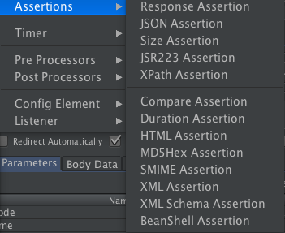

* content
{:toc}
# 起因

近日小伙伴在写jmeter脚本时，咨询了个问题，有一个按时间排序的接口，我该如何设置断言对时间字符串做校验？


# 思考

## 现有工具

jmeter的断言内容还是比较丰富的，简单列举几个常用的



* Response Assertion
  * 支持对请求头、请求体、响应头、响应体、响应码做断言
  * contain/match/equal/substring/not /or
* Size Assertion
  * 数据包字节大小断言
  * 判断响应结果是否包含正确数量的byte。可定义（=, !=, >, <, >=, <=）
* Duration Assertion
  * 持续时间断言
  * 判断是否在给定的时间内返回响应结果
* JSON Assertion
  * 支持JsonPath
  * 支持正则匹配

* XPath Assertion
  * 主要针对xml文件
* Compare Assertion
  * 比较断言
* BeanShelll Assertion
  * 自由断言

## 选型

1. 看名字首先考虑"比较断言"，但这个用的少，搜了下相关信息，只看到介绍，没看到使用实例，暂时摸不到头脑；

   > 这是一种比较特殊的断言元件，针对断言进行字符串替换时使用；
   >
   > 作用对象：需要替换的字符串
   >
   > 
   >
   > Select Comparison Operators:选择比较运算符
   >
   > Compare Content:可以选择比较的内容类型（true/false或者自定义，编辑）
   >
   > Compare Time：比较时间（可以设定比较的时间，单位为秒，默认为-1）
   >
   > Comparison Fitters:比较修改工具
   >
   > regular expression substitutions:替换正则表达式
   >
   > Regex String:要替换的字符串（可从断言结果中选择）
   >
   > substitutions：替换的字符串（替换结果）

2. 最后还是决定选用万能的BeanShell Assertion吧

## 回顾

复习下常用方法

JMeter在它的BeanShell中内置了变量，用户可以通过这些变量与JMeter进行交互，其中主要的变量及其使用方法如下:

* **log**：写入信息到jmeber.log文件，使用方法：log.info(“This is log info!”);

* **ctx**：该变量引用了当前线程的上下文，使用方法可参考：org.apache.jmeter.threads.JMeterContext。

* **vars** - (JMeterVariables)：操作jmeter变量，这个变量实际引用了JMeter线程中的局部变量容器（本质上是Map），它是测试用例与BeanShell交互的桥梁，常用方法：

　　　　a) vars.get(String key)：从jmeter中获得变量值

　　　　b) vars.put(String key，String value)：数据存到jmeter变量中

　　　　更多方法可参考：org.apache.jmeter.threads.JMeterVariables

* **props** - (JMeterProperties - class java.util.Properties)：操作jmeter属性，该变量引用了JMeter的配置信息，可以获取Jmeter的属性，它的使用方法与vars类似，但是只能put进去String类型的值，而不能是一个对象。对应于java.util.Properties。

　　　　a) props.get("START.HMS");　　注：START.HMS为属性名，在文件jmeter.properties中定义

　　　　b) props.put("PROP1","1234");

* **prev** - (SampleResult)：获取前面的sample返回的信息，常用方法：

　　　　a) **getResponseDataAsString()：获取响应信息**

　　　　b) **getResponseCode() ：获取响应code**

　　　　更多方法可参考：org.apache.jmeter.samplers.SampleResult

* **sampler** - (Sampler)：gives access to the current sampler

 

 在这里除了可以使用beanshell的内置变量外，主要通过 Failure 和 FailureMessage来设置断言结果。

> Failure = false;   //表示断言成功（不告警）
>
> ​             = true; // 表示断言失败（触发告警）
>
> FailureMessage = "..."  // 自定义的失败信息

# 实践

## 需求分析

* 已知：接口返回数据内容为字符串格式的ISODate，形如2020-11-11T11:11:11.000+0000
* 期望：按时间值比较两个字符串大小

## 思路

* 字符串转日期
* 比较日期
* 断言设置

## 结果

```java

String s1=vars.get("param1");  //"2020-11-11T11:11:11.000+0000"
String s2=vars.get("param2");  //"2020-11-11T11:11:12.000+0000"


SimpleDateFormat simpleDateFormat = new SimpleDateFormat("yyyy-MM-dd'T'HH:mm:ss.SSSZ");
Date d1 = simpleDateFormat.parse(s1);
Date d2 = simpleDateFormat.parse(s2);
if(d1.before(d2)){
	Failure = true;
	FailureMessage = "时间比较错误，Date1不应该早于Date2";
}
```

# 总结

BeanShell还是比较灵活的