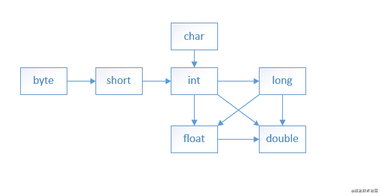
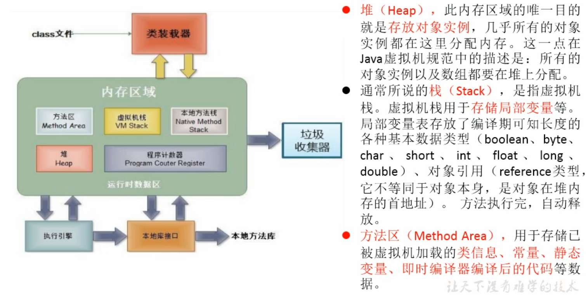
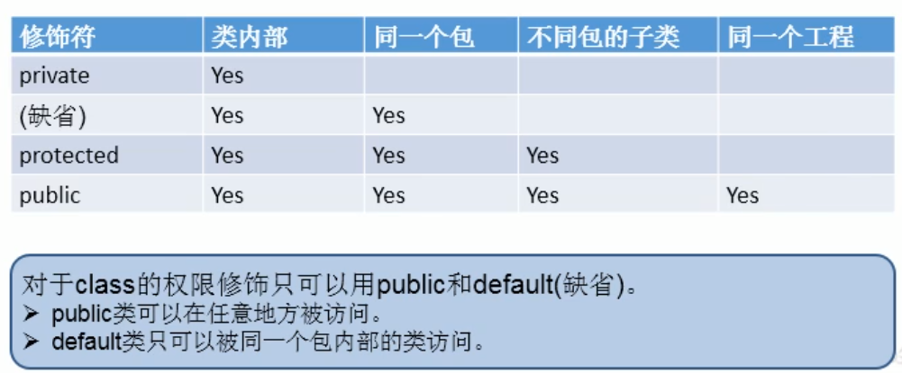
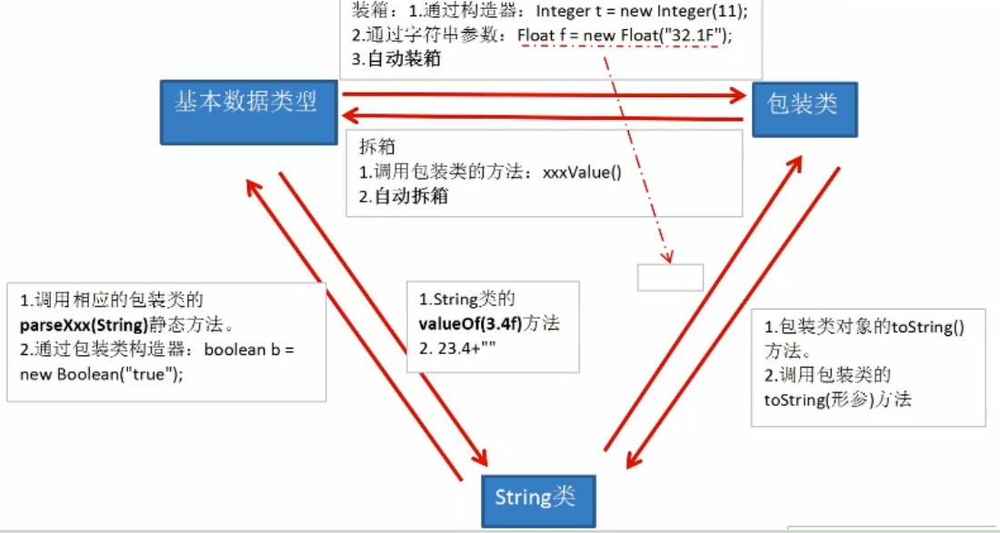

* content
{:toc}
# 基础语法

## 八大基本数据类型

  Java语言提供了8种基本数据类型。分别是 byte、short、int、long、float、double、boolean、char。

 **注**：String 是对象，不属于基本数据类型

  8种基本数据按类型分可以分为

- 4个 整数型：byte、short、int、long
- 2个浮点型：float、double
- 1个字符类型：char
- 1个布尔型：boolean

| 基本数据类型 | 默认值   | 大小（字节）                                        | 取值范围          | 示例             |
| ------------ | -------- | --------------------------------------------------- | ----------------- | ---------------- |
| byte         | 0        | 1                                                   | -2^7 ~ 2^7-1      | byte a= 10;      |
| boolean      | false    | 1                                                   | true/false        | boolean b=true;  |
| char         | '\u0000' | 2                                                   | 0 ~ 2^16-1        | char c='c';      |
| short        | 0        | 2                                                   | -2^15 ~ 2^15-1    | short d=10;      |
| int          | 0        | 4                                                   | -2^31 ~ 2^31-1    | int e=10;        |
| long         | 0        | 8                                                   | -2^63 ~ 2^63 -1   | long f = 10L;    |
| float        | 0.0f     | 4：1bit（符号位） 8bits（指数位） 23bits（尾数位）) | -2^128 ~ +2^127   | float g = 10.0F; |
| double       | 0.0d     | 8：1bit（符号位） 11bits（指数位） 52bits（尾数位） | -2^1024 ~ +2^1023 | double h = 10.0; |


  **注意：** （1） 基本数据类型 "==" 比较都是值。

​        （2）Boolean 《Java虚拟机规范》给出了4个字节,但还要看虚拟机实现是否按照规 范来，所以1个字节、4个字节都是有可能的。

### 类型转换和精度丢失问题

1. 自动类型提升

   * 不同类型的数据在运算的时候，会向高精度的数据类型转换。

   * byte/short/char运算时结果为int

   * double类型数值的计算经常会出现精度丢失，尤其是有小数点的情况下。

     因为计算机是通过二进制进行运算的，而计算机在表示小数的二进制是会有精度问题的。
     所以我们在运算高精度的数据的时候，可以使用 `java.math.BigDecimal` 类

   ```java
   byte a = 5;
   int b =2;
   float c  = 6f;
   double d =0.03;
   double d2 =300.03;
   System.out.println(a/b); // 2  a会转化为int类型
   System.out.println(b/c); // 0.33333334 b会转化为float类型  
   System.out.println(a+d+d2);//301.05999999999995 a会转化为double类型,但是结果理应是301.06
   short s1 = 5;
   char c1 = 'a'; //95
   int s2 = s1 + c1; //102  byte/short/char运算时结果为int
   
   // 编码情况
   // 整形默认为int类型
   //浮点型默认为double类型
   long l1 = 123123;   //未加L，整形默认为int类型，自动进行类型提升转化为long
   //long l2 = 123123123123123;  // 默认为int时不支持，编译报错！！！!!
   //float f2 = 12.3; //未加f，浮点型默认为double类型，double转float有丢失精度风险，所以编译报错；！！！！
   
   byte b1 = 12;
   //byte b2 = b1 + 1;     //编译失败，1为int
   //float f1 = b + 12.3;   //编译失败， 12.3位double
   ```

   

2. 强制类型转换

   * 需要使用强转符
   * 可能会导致精度损失

   ```java
   double d1 = 12.9;
   int i1 = (int)d1;
   System.out.println(i1); // 12 精度损失
   
   int i2 = 128;
   byte b = (byte)i2;
   System.out.println(b);   //-128   精度损失
   ```

   

### 拆箱和装箱问题

​     **1）拆箱和装箱概念**

装箱就是自动将基本数据类型转换为包装器类型；使用`Integer.valueOf`方法。

​       拆箱就是自动将包装器类型转换为基本数据类型；使用`Integer.intValue`方法。

​       举个例子：

```
Integer total = 99; 
//执行上面那句代码的时候，系统为我们执行了，即自动装箱
Integer total = Integer.valueOf(99);int totalprim = total; 
//执行上面那句代码的时候，系统为我们执行了，即自动拆箱
int totalprim = total.intValue();
复制代码
```

  **2）范围问题**

​      如下题目   

```
Integer i = 400; 
Integer j = 400; 
System.out.println(i==j);  //false
Integer o = 12; 
Integer k = 12;
System.out.println(o==12);  //true
复制代码
```

   上面提到，使用 `Integer`去创建数据，其实是一个`Integer.valueOf` 过程，`Integer.valueOf` 源码如下：  

```
public static Integer valueOf(int i) {    
  if (i >= IntegerCache.low && i <= IntegerCache.high) {    
    return IntegerCache.cache[i + (-IntegerCache.low); 
  }   
  return new Integer(i);
}
复制代码
```

分析：如果值的范围在-128到127之间，它就从高速缓存返回实例。否则 new 一个Integer对象。`new Integer` 就是一个装箱的过程了，装箱的过程会创建对应的对象，这个会消耗内存，所以装箱的过程会增加内存的消耗，影响性能。
 所以说最后是i 和 j 两个对象比较，内存地址不一样，结果就是false了。

  **3）==的值比较问题**

   例子如下：

```
int a =200;
Integer b = new Integer(200);
Integer c = 200;
System.out.println(a==b); //true
System.out.println(a==c); //true
System.out.println(b==c); //false
复制代码
```

分析： `a==b，a==c`，只要和基本数据类型（即 int）比较，Integer就会调用`value.intValue()`拆箱成基本数据类型，你也可以理解为：当有基本数据类型，只比较值`b==c`，这两个是永远不会相等的，拆箱装箱只是针对基本数据类型的比较才有，**Integer并不是基本数据类型**，b、c两者存放的内存地址不一样，所以不相等。

**总结：**

①、无论如何，Integer与new Integer不会相等。不会经历拆箱过程，因为它们存放内存的位置不一样。

②、两个都是非new出来的Integer，如果数在-128到127之间，则是true,否则为false。

③、两个都是new出来的，即两个new Integer比较，则为false。

④、int与Integer、new Integer()进行==比较时，结果永远为true，因为会把Integer自动拆箱为int，其实就是相当于两个int类型比较。

### int 和 Integer 

- Integer 继承了Object类，是对象类型，有自己的属性和方法，是 int 的包装类。int是java基本数据类型。
- Integer默认值null，int默认值 0。
- int 可以直接做运算，Integer 不能直接运算，拆箱转化为int才能进行运算。

### 默认值问题

   在java中：

- 整数的默认类型是 int。
- 浮点数默认类型是 double，否则需要 在后面加f、d

  浮点数如果不加`f`，默认就是double类型的，前面再用 float修饰，就会报错。可以使用两种方法解决: 1)末尾加f  2)使用float进行强转

### Integer.parseInt()和Integer.valueOf()的区别

parseInt() 和 valueOf() 都是Integer 对象的方法。入参都是一个String字符串。

 **parseInt**

   public static int parseInt(String s) throws NumberFormatException 将字符串参数作为带符号十进制整数来转换。如果无法转换，抛出 NumberFormatException。

 **valueOf** 

   public static Integer valueOf(String s) throws NumberFormatException 返回初始化为指定String值的新的Integer对象，如果无法转换，抛出 NumberFormatException。

```
String str = "-12";
int  num = Integer.parseInt(str);
System.out.println(num); // -12
Integer  num2 = Integer.valueOf(str);
System.out.println(num2); // -12
int num3 =Integer.parseInt("HaC"); //java.lang.NumberFormatException
复制代码
```

**int 与 Integer转换**

int a=A.intValue();

Integer A=Integer.valueOf(a);

注意： **Integer派别**：Integer、Short、Byte、Character、Long这几个类的valueOf方法的实现是类似的。

​     **Double派别**：Double、Float的valueOf方法的实现是类似的。**每次都返回不同的对象。**


### 进制转换

```java
int num1 = 0b110;   //2进制   0b123
int num2 = 110;    //10进制    123
int num3 = 0120;  // 8进制    0123
int num4 = 0x11A; // 16进制   0x123
System.out.println(num1); //6
System.out.println(num2); //110
System.out.println(num3); //80
System.out.println(num4);  //282
```

* 二进制：计算机底层是以补码的方式存储数据

  * 正数： 三码一致

  * 负数：

    * 原码：正数原码 + 符号位取1

    * 反码：除符号位，各个位取反

    * 补码：反码的基础上加1

### 留几个题目分析  

**1） 设有下面两个赋值语句**

```
a = Integer.parseInt("1024");
b = Integer.valueOf("1024").intValue();
复制代码
```

下述说法正确的是（）

A a是整数类型变量，b是整数类对象。
 B a是整数类对象，b是整数类型变量。
 C a和b都是整数类对象并且它们的值相等。
 D a和b都是整数类型变量并且它们的值相等。

答案是 **D**，intValue()是把Integer对象类型变成int的基础数据类型；


## 三个引用数据类型

### 类class

#### String

* String可以和8种基本数据类型变量做运算，且运算只能是连接运算： +

* 字符串与整数拼接问题

```java
String a = "1";
int b = 1;
int c = 2;
System.out.println(a + b + c); //112  a + b + c从左到右按顺序运算，a是String, a+b 的结果也是String的拼接是字符串11 ，然后再拼接 c，c也被强转String了，最后是 String，其值112
System.out.println(b + c + a); //31   b + c + a 从左到右按顺序运算，b + c 的结果是 3，是一个int ，然后拼接a，变成 String。
```

### 接口interface

### 数组array

## 运算符

### 逻辑运算符

* & 
  * && 短路与
* | 
  * || 短路或
* ^

### 位运算符

```java
<<  左移：空位补0，移除的高位丢弃；
>>  右移：高位是0时，补0； 高位是1时，补1；
>>> 无符号右移：高位无论是0,还是1，均补0
& 二进制与运算
| 二进制或运算
^ 二进制异或运算
~ 按补码取反（无论正数还是负数）

int i = -21;
System.out.println(i<<1);  //-42
System.out.println(i>>1);  //-11
int j = 21;
System.out.println(j<<1);  // 42
System.out.println(j>>1);  // 10
```

三元运算符

```
(条件表达式)？表达式1：表达式2
```

### Scanner

```
import java.util.Scanner;

Scanner scan = new Scanner(System.in);
String name = scan.next();
char first = name.charAt(0)
int age = scan.nextInt();

System.out.println(name);
```

## switch

* switch表达式中的值依次匹配各个case中的常量
* 表达式类型： byte/ short/ char/ int/ 枚举 (jdk 5.0 +)/ String （Jdk 7.0)
* case只能声明常量，不能声明范围

```java
int number =1;
switch(number){
    case 0:
        System.out.println("0");
        break;
    case 1:
        System.out.println("1");
        break;
    case 2:
    case 3:
        System.out.println("2 or 3");
    default:
        System.out.println("default");
}

// month月day日是该年的第几天
int day = 20;
int month = 8;
int days = 0;
switch (month) {
    case 12:
        days += 31;
    case 11:
        days += 30;
    case 10:
        days += 31;
        // 9,8,7,6,5,4,3,2
    case 1:
        days += day;
}
System.out.println(month + "月" + day + "日是当年的第" + days + "天");
```

## 循环

```java
        label:for (int i = 0; i < 10; i++) {
            for (int j = 0; j < 10; j++) {
                if(j % 4==0){
                    break;   // break 当层
                    //break label;  // break外层
                    //continue;  // continue 当层
                    //continue label; // continue 外层
                }
            }
            System.out.println(i);
        }
```

## 数组

* 特点：
  * 有序
  * 引用类型
  * 内存中是一块连续的空间
  * 长度一旦初始化时确定，不能修改
* 默认值：
  * 一维数组
    * 基本类型
      * 整型：0
      * 浮点：0.0
      * char："\u0000"  ， '0'
      * bool: fasle
    * 引用数据类型：null
      * 数组：null
  * 二维数组
    * 指定大小动态初始化或静态初始化 （new int[4\][3\])
      * 第一层初始值为地址空间
      * 第二层初始值为：同一维数组初始化相同
    * 未指定大小的动态初始化(new int[4\][\])
      * 第一层初始值为null
      * 第二层不存在，访问会报空指针
* 内存：
  * 栈：数组变量
  * 堆：数组对象（二维数组的第一层）
  * 方法区
    * 常量池
    * 静态空间

```java
int[] ids = new int[]{1, 2, 3, 4}; //静态初始化：数组的初始化和元素的赋值同时进行
String[] names = new String[5]; // 动态初始化：数组的初始化和元素赋值分开
String[] names2 = {"a","b","c"}; // 类型推断，可以不用显式创建
names[0] = "a";
for (int i = 0; i < names.length; i++) {
    System.out.println(names[i]);
}
for (String name : names) {
    System.out.println(name);
}
char[] c = new char[1];
System.out.println(c[0] == 0); //true

//二维数组
int[][] arr21 = new int[][]{ \{1,2,3},{4,5},{6,7,8\} };
String[][] arr22 = new String[3][2]; //动态初始化1,内存中第一层默认为地址值（[I@15db9742），第二层默认值为0
String[][] arr23 = new String[3][];  //动态初始化2,未指定第二层大小时不会创建，内存中第一层为null，第二层不存在，访问会空指针
String[] arr24[] = new String[][]{\{"a","b"},{"c","d","e"\}}; //内存中第一层为地址值([Ljava.lang.String;@7852e922)，第二层默认值为null
String[] arr25[] = {\{"a","b"},{"c","d","e"\}};
for (int i = 0; i < arr25.length; i++) {
    for (int j = 0; j < arr25[i].length; j++) {
        System.out.print(arr25[i][j] + " ");
    }
    System.out.println();

}
```

```java
String[] strings = new String[]{"a","b","c"};
System.out.println(strings);   //[Ljava.lang.String;@1540e19d  
char[] chars = new char[]{'a', 'b', 'c'};
System.out.println(chars);    //abc  println(char[])特殊处理，遍历输出内容
```


### Arrays 工具类

* equals 
* fill
* sort
  * quick sort
* toString
* binarySearch

```java
        int[] arr = new int[]{1, 5, 4, 2, 6, -1, 0, 9};
        boolean b = Arrays.equals(arr,arr);
        System.out.println(b);
//        Arrays.fill(arr,2);
        Arrays.sort(arr);
        System.out.println(Arrays.toString(arr));
        System.out.println(Arrays.binarySearch(arr, -1));
```

### 异常

* ArrayIndexOutOfBoundsException
* NullPointerException

# 面向对象

## 三大特性

* 封装
  * 通过四种权限修饰符实现
  * 隐藏内部实现，提供对外访问
    * 将类的属性私有化，提供公共的方法来获取和设置属性的值
    * 不对外暴露的私有方法
    * 单例模式（构造器私有化）
* 继承
  * 类单继承；接口多继承
* 多态
  * 父类引用指向子类对象
  * 属性：属性不适用多态
    * 编译和运行都是父类的属性，即使用父类的属性
  * 方法：调用父类的方法，子类有重写时优先使用子类重写后的方法
    * 虚拟方法调用：运行时行为
      * 编译期只能调用父类声明的方法：编译看左边
      * 运行期实际使用子类重写方法：运行看右边
      * 动态绑定

## 关键字

* package

* import

  * 导入
    * import 导入指定包下类或接口
    * import static 导致入定类或接口中的静态结构：属性或方法
  * 如果在源文件中实用了不同包下同名的类，需要使用全类名的形式导入

  > com.eqxiu.User user = new com.eqxiu.User()

* instanceof
  * a instanceof A 
    * 判断对象a是否是类A 或者 A父类的实例，返回boolean
  
* static

  * 属性
  * 方法
  * 代码块
  * 内部类

## 类

### 内存分布



### 属性：成员变量 vs 局部变量

相同点：

* 定义变量的格式： 数据类型  变量名 = 变量值；
* 先声明，后使用；
* 变量都有其对应作用域；

不同：

1. 声明位置不同
   * 成员变量：类内
   * 局部变量：方法内、方法形参、构造器内、构造器形参

2. 权限修饰符规则不同
   * 成员变量：private/public/缺省/protected （默认使用缺省）
   * 局部变量：不允许使用权限修饰符

3. 默认初始化值不同
   * 成员变量：根据其类型，都有默认初始化值；
     * 基本：0，0.0，false,0('\u0000')
     * 引用：null
   * 局部变量：无默认初始化值；

4. 内存中加载的位置不同
   * 成员变量：加载到堆空间（非static）
   * 局部变量：加载到栈空间

### 方法

> 权限修饰符  返回值类型  方法名（形参）{
>
> ​	方法体
>
> }
>

#### 匿名对象

* 创建的对象，没有显示的赋值给一个变量名，即为匿名对象
* 匿名对象只能使用一次

#### 方法重载

* 在一个类中，方法名相同，参数列表不同（参数个数 或 参数类型）

* 方法的权限修饰符、返回值类型、抛出不同异常 可以不相同，重载和这些无关

* 可变参数与普通参数之间也构成重载，可变参数和数组参数不构成重载

  ```java
  //1和2不构成重载，编译器认为是同一个方法
  // 1和3  或者 2 和3 构成重载
  public void show(String... strs) {
      System.out.println(1);
  }
  
  public void show(String[] strs) {
      System.out.println(2);
  }
  public void show(String s) {
      System.out.println(3);
  }
  ```

  

```java
public static void main(String[] args) {
        Main m = new Main();
        int a = 1;
        int b = 2;
        m.getSum(a,b);   // sout 2    变量自动提升
    }

//    public void getSum(int i, int j) {
//        System.out.println(1);
//    }

    public void getSum(double i, double j) {
        System.out.println(2);
    }
```

#### 方法重写

* 子类继承父类后，对父类中的同名参数的方法进行覆盖操作
* 重写后，默认调用子类的重写方法；
* 规则：
  * 重写方法的方法名和形参列表应与父类相同
  * 权限修饰符
    * 子类重写方法的权限修饰符应大于等于父类
    * 子类不能重写父类声明为private的方法
  * 返回值类型
    * 父类被重写的方法返回值类型是void，子类只能是void
    * 父类被重写的方法返回值类型是基本数据类型，子类必须是相同的基本数据类型
    * 父类被重写的方法返回值类型是A类型，子类可以是A类 或A类的子类
  * 异常
    * 父类被重写的方法返回值类型A，子类抛出的异常是A类或 A类的子类（大于等于子类重写方法）
  * 静态方法不允许被覆盖
    * 子类和父类中的同名同参数方法，要么都声明非static （考虑重写）
    * 要么都声明为static(不是重写)

#### 可变形参

* jdk5.0新增
  * 5.0之前   public static void test(int a, String[] books);
  * 5.0之后   public static void test(int a, String ...  books);
* 允许直接定义能和多个实参相匹配的形参，从而更简单的传递个数可变的实参。（0个或多个）
* 优先考虑精准匹配
* 在方法的声明中，只能声明在末尾
* 同一个方法，最多只能声明一个可变形参

```java
public class Main {
    public static void main(String[] args) {
        new Main().show("a", "b", "c");   // a b c 
        new Main().show();   // 空，也走可变形参
        new Main().show("a");   // 2 ，优先精准匹配
    }
    
    // 可以以  .show("a", "b", "c") 访问
    //也可以以  .show(new arr[]{"a","b","c"}) 访问'
    // 都会放在数组变量 strs中
    public void show(String... strs) {
        for(int i = 0; i < strs.length;i++){
            System.out.print(strs[i]+ " ");
        }
    }
    public void show(String s) {
        System.out.println(2);
    }
    public void show(int i, String... s) {
        System.out.println(2);
    }
}
```

#### 方法参数的值传递

* 变量赋值
  * 基本数据类型的变量，赋值的是变量所保存的数据值；
  * 引用数据类型的变量，赋值的是变量所保存的数据地址值；
* 形参传递机制
  * 形参是基本数据类型，将实参基本数据类型变量的“数据值”传递给形参
  * 形参是引用数据类型，将实参引用数据类型变量的“地址值”传递给形参

#### 权限修饰符

* 类
  * public
  * 缺省

* 类的内部结构：属性、方法、构造器、内部类
  * private
  * 缺省
  * protected
  * public

  

#### 向下转型

多态强制转换

* 可使用 instanceof 判断

### 构造器

* 没有显式定义类的构造器时，系统默认提供一个空参的构造器

* 一旦显示的定义了类的构造器，系统就不再提供空参构造器

* 一个类可以定义多个构造器，构成重载

* 默认构造器权限和类的权限相同

* 格式：   

  > 权限修饰符  类名（形参列表）{
  >
  > }

#### this

* 当前对象

  * this.属性  //形参和属性不一致时可省略

  * this.方法()  

  * this(...);   //构造器

    * 必须放在首行
    * 显式调用其他构造器，不能调用自己
    * 避免循环递归调用（编译不通过）

    ```java
        public Person(){
            System.out.println("init");
        }
    
    
        public Person(int age){
            this();  // 调用无参构造器
            this.age = age;
            System.out.println("init age " + age);
        }
    
        public Person(String name, int age) {
            this(age); //调用  (int age) 构造器
            this.name = name;
            System.out.println("init age and name");
        }
    ```

#### super

* 属性或方法
  * 在子类中显式的调用父类的属性或方法
    * super.属性
    * super.方法()
* 构造器
  * 调用父类指定构造器：
    * super(形参列表)
    * 在子类构造器的首行
    * 在类的构造器中， this 或者super 只能用一个
    * 在子类构造器首行没有显式调用super，则默认调用super()，即父类空构造器

### Object

* 无属性

* 空参构造器

* 方法

  * clone() ： 复制
    * 返回Object
  * equals(Object obj)
    * 返回boolean

  > 在Java中，equals和==都是用于检测两个字符串是否相等，返回类型也都是boolean值，但是二者内部处理却不一样。
  >
  > 1）对于==，比较的是值是否相等
  >
  > ​	如果作用于基本数据类型的变量，则直接比较其存储的 “值”是否相等；
  >
  > ​	如果作用于引用类型的变量，则比较的是所指向的对象的地址
  >
  > 2）对于equals方法，注意：equals方法不能作用于基本数据类型的变量，equals继承Object类，比较的是是否是同一个对象
  >
  > ​    如果没有对equals方法进行重写，则比较的是引用类型的变量所指向的对象的地址；
  >
  > ​	诸如String、Date等类对equals方法进行了重写的话，比较的是所指向的对象的内容。

  ```java
      @Override
      public boolean equals(Object o) {
          if (this == o) return true;
          if (o == null || getClass() != o.getClass()) return false;
          ManKind manKind = (ManKind) o;
          return sex == manKind.sex &&
                  salary == manKind.salary;
      }
  ```

  

  * hashCode
  * toString()
  * getClass()
  * finalize()
    * void
    * 对象在被回收前被调用
  * notify()
  * notifyAll()
  * wait()/   wait(long timeout)  /   wait(long  timeout, int nanos)

### 包装类

* 数值型包装类 均继承自 Number类

* 自动装箱与自动拆箱    jdk  5.0 +

  ```java
  int num2 = 10;
  Integer num3 = num2;   //自动装箱
  int num4 = num3;   // 自动拆箱
  ```

* 转化

  * Integer =   Integer.paserInt(String)
  * String =  String.valueOf(Integer)



* Integer

  * 内部有IntegerCache，保存了 [-128 , 127]的整数，范围内的数字可以直接使用数组内的元素，不会new

  ```java
  Integer i1 = 1;
  Integer i2 = 1;
  System.out.println(i1 == i2);   //true   IntegerCache，使用已有对象，地址空间一致
  
  
  Integer i3 = 128;
  Integer i4 = 128;
  System.out.println(i3 == i4);   // false    超过IntegerCache，新建对象
  
  
  Integer i5 = new Integer(1);
  Integer i6 = new Integer(1);  // false   新建对象，地址空间不一致
  
  public static Integer valueOf(int i) {
      if (i >= IntegerCache.low && i <= IntegerCache.high)
          return IntegerCache.cache[i + (-IntegerCache.low)];
      return new Integer(i);
  ```

  

